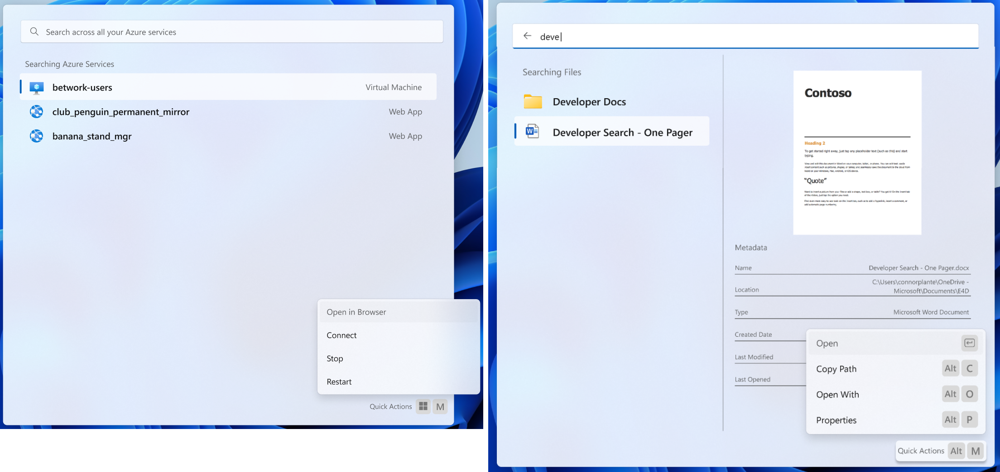
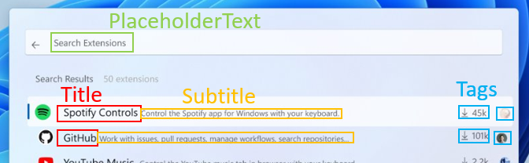
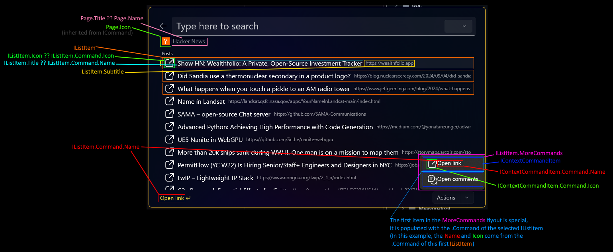
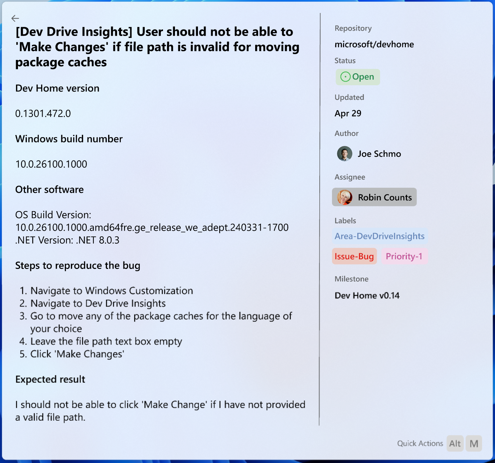
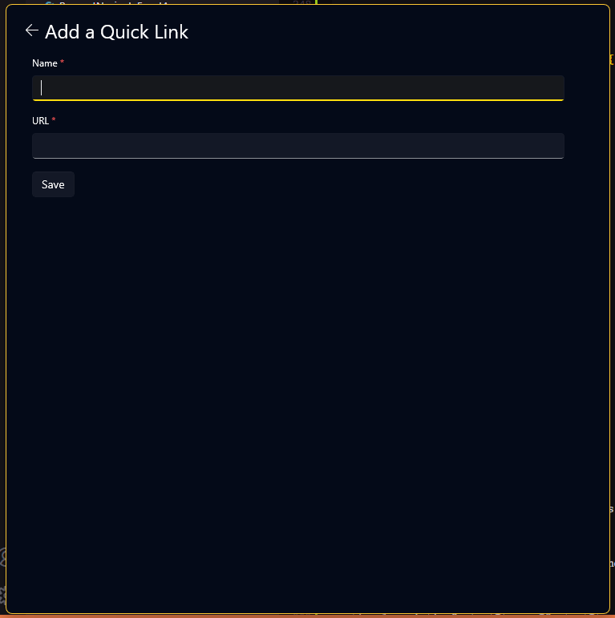
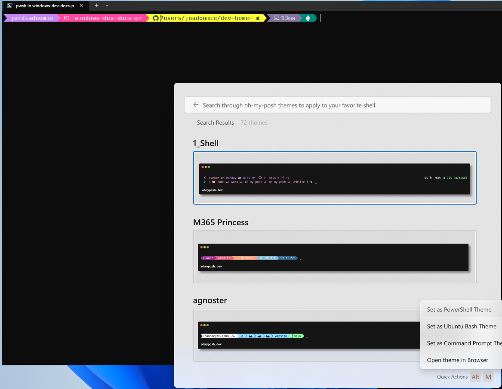
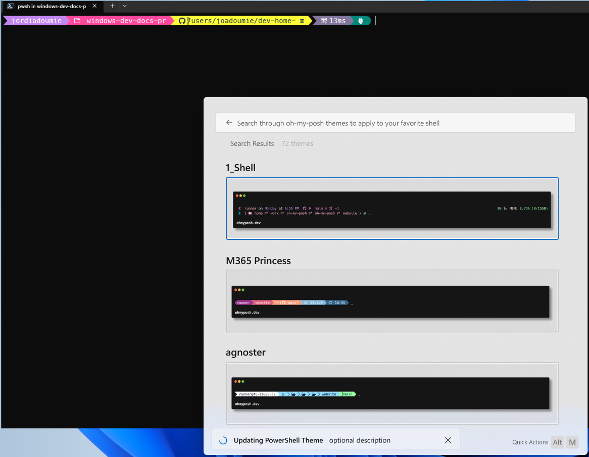
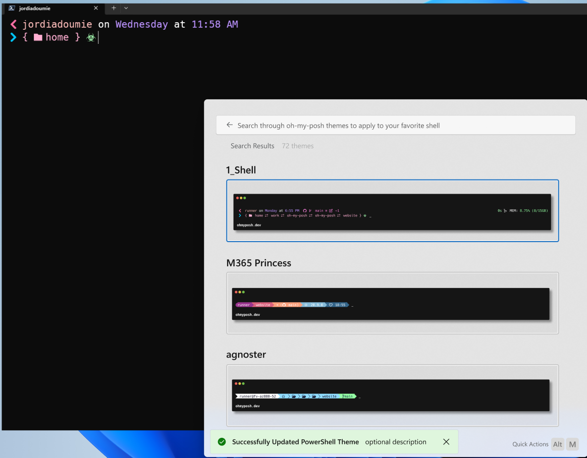
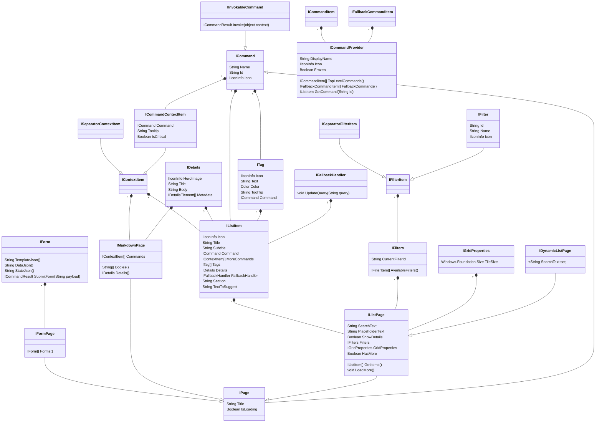

# Run v2 Extensions SDK

_aka "DevPal", "PT Run v2", "DevSearch", "Windows Command Palette", this thing has many names. I'll use "DevPal" throughout the doc_

> [NOTE!]
> Are you here to just see what the SDK looks like? Skip to the [Commands
> SDK details](#commands-sdk-details) section.

## Abstract

"DevPal" is "PowerToys Run v2" - the graduated form of PowerToys Run, ready for
ingestion as a Windows inbox app. DevPal enables the user to launch more than
just apps and search for files - it's a highly customizable surface that allows
users to "Start _anything_".

Most importantly, DevPal is highly extensible. By exposing a simple-to-use SDK,
DevPal enables 3p developers to quickly create plugins and extend it
functionality.

- [Run v2 Extensions SDK](#run-v2-extensions-sdk)
  - [Abstract](#abstract)
  - [Background](#background)
    - [Inspiration](#inspiration)
    - [User Stories](#user-stories)
    - [Elevator Pitch](#elevator-pitch)
  - [Business Justification](#business-justification)
  - [Scenario Details](#scenario-details)
    - [Extension basics](#extension-basics)
    - [Installed extension discovery](#installed-extension-discovery)
      - [Unpackaged extensions](#unpackaged-extensions)
    - [Extension lifecycle](#extension-lifecycle)
      - [Startup](#startup)
      - [Caching](#caching)
        - [Loading commands from stub items](#loading-commands-from-stub-items)
        - [Microwaved commands](#microwaved-commands)
      - [Disposing](#disposing)
  - [Installing extensions](#installing-extensions)
    - [From the Store](#from-the-store)
    - [From winget](#from-winget)
  - [Publishing extensions](#publishing-extensions)
  - [Built-in commands](#built-in-commands)
  - [SDK overview](#sdk-overview)
  - [Commands SDK details](#commands-sdk-details)
    - [Commands](#commands)
      - [Results](#results)
    - [Pages](#pages)
      - [List Pages](#list-pages)
        - [Updating the list](#updating-the-list)
        - [Empty content](#empty-content)
        - [Filtering the list](#filtering-the-list)
      - [Content Pages](#content-pages)
        - [Markdown Content](#markdown-content)
        - [Form Content](#form-content)
    - [Other types](#other-types)
      - [`ContextItem`s](#contextitems)
      - [Icons - `IconInfo` and `IconData`](#icons---iconinfo-and-icondata)
      - [`OptionalColor`](#optionalcolor)
      - [`Details`](#details)
      - [`INotifyPropChanged`](#inotifypropchanged)
      - [`ICommandProvider`](#icommandprovider)
      - [Fallback commands](#fallback-commands)
        - [`GetCommand`](#getcommand)
        - [Settings](#settings)
  - [Helper SDK Classes](#helper-sdk-classes)
    - [Default implementations](#default-implementations)
    - [Using the Clipboard](#using-the-clipboard)
    - [Settings helpers](#settings-helpers)
  - [Advanced scenarios](#advanced-scenarios)
    - [Status messages](#status-messages)
    - [Rendering of ICommandItems in Lists and Menus](#rendering-of-icommanditems-in-lists-and-menus)
  - [Class diagram](#class-diagram)
  - [Future considerations](#future-considerations)
    - [Arbitrary parameters and arguments](#arbitrary-parameters-and-arguments)
    - [URI activation](#uri-activation)
    - [Custom "empty list" messages](#custom-empty-list-messages)
  - [Footnotes](#footnotes)
    - [Generating the `.idl`](#generating-the-idl)
    - [Adding APIs](#adding-apis)


## Background

> [!NOTE]
> This is the spec specifically for the devpal SDK. For a more general overview of devpal, see the [this functional spec](https://microsoft.sharepoint-df.com/:w:/r/teams/windows/_layouts/15/Doc.aspx?sourcedoc=%7BB2D5260A-C01C-4F9E-BD58-0D69FC75FE0D%7D&file=Developer%20Search%20Functional%20Spec%20v2.docx&action=default&mobileredirect=true) (internal only).

### Inspiration

The largest inspiration for this extension SDK is the [Dev Home Extension]
model. They are the ones who pioneered the plumbing for registering COM classes
in the extension manifest, then using `CoCreateInstance` to create objects in
the host and use them as WinRT objects.

### User Stories

_(typically there'd be a long list of user stories here, but that felt better
suited for a more general DevPal dev spec, rather than the SDK doc)_

### Elevator Pitch

> "Start _anything_ here".

What if the Start Menu was more than just a launcher for apps? What if it could
be the start for all sorts of different workflows? One that apps could plug into
directly, and provide dedicated experiences for their users.

## Business Justification

It will delight ~developers~ all power users.

## Scenario Details

> [!NOTE]
>
> This document is largely concerned with the details for how 3p apps could plug
> into DevPal. However, much of the built-in devpal functionality will be built
> using the same interfaces. This will make sure that everything that we build
> keeps 3p use cases in mind. Built-in experiences, however, can be loaded
> in-proc, so they can skip pretty much all of this doc up till "[SDK
> overview](#sdk-overview)".

### Extension basics

In the simplest case, extensions for Dev Pal can register themselves using their `.appxmanifest`. As an example:

```xml
<Extensions>
    <com:Extension Category="windows.comServer">
        <com:ComServer>
            <com:ExeServer Executable="ExtensionName.exe" Arguments="-RegisterProcessAsComServer" DisplayName="Sample Extension">
                <com:Class Id="<Extension CLSID Here>" DisplayName="Sample Extension" />
            </com:ExeServer>
        </com:ComServer>
    </com:Extension>
    <uap3:Extension Category="windows.appExtension">
        <uap3:AppExtension Name="com.microsoft.commandpalette"
                           Id="YourApplicationUniqueId"
                           PublicFolder="Public"
                           DisplayName="Sample Extension"
                           Description="Sample Extension for Run">
            <uap3:Properties>
                <CmdPalProvider>
                    <Activation>
                        <CreateInstance ClassId="<Extension CLSID Here>" />
                    </Activation>
                    <SupportedInterfaces>
                        <Commands />
                    </SupportedInterfaces>
                </CmdPalProvider>
            </uap3:Properties>
        </uap3:AppExtension>
    </uap3:Extension>
</Extensions>
```

Notable elements:
* The application must specify a `Extensions.comExtension.ComServer` to host
  their COM class. This allows for the OS to register that GUID as a COM class
  we can instantiate.
  * Make sure that this CLSID is unique, and matches the one in your application
* The application must specify a `Extensions.uap3Extension.AppExtension` with
  the Name set to `com.microsoft.commandpalette`. This is the unique identifier which
  DevPal can use to find it's extensions.
* In the `Properties` of your `AppExtension`, you must specify a
  `CmdPalProvider` element. This is where you specify the CLSID of the COM class
  that DevPal will instantiate to interact with your extension. Also, you
  specify which interfaces you support.

Currently, only `Commands` is supported. If we need to add more
in the future, we can add them to the `SupportedInterfaces` element.

This is all exactly the same as the Dev Home Extension model, with a different
`Name` in the `AppExtension` element, and different `SupportedInterfaces`.

### Installed extension discovery

Fortunately for DevPal, it is quite trivial to enumerate installed packages that
have registered themselves as a `AppExtension` extensions. This is done by
querying the `AppExtensionCatalog` for all extensions with the `Name` set to
`com.microsoft.commandpalette`.

#### Unpackaged extensions

[Sparse packages](https://nicksnettravels.builttoroam.com/sparse-package/) are
always a simple solution for adding package identity to otherwise unpackaged
applications. However, there may be apps out there that (for whatever reason)
still don't have a package identity. We need a way to allow these apps to
register themselves as extensions.

We can't just ask the COM catalog for all CLSIDs that implement a particular
COM interface, unfortunately. This means we'll need another well-known location
in the registry for unpackaged apps to write their extension CLSID's into.

We'll create a registry key at
`HKLM\SOFTWARE\Microsoft\Windows\CurrentVersion\DevPal\Extensions` [TODO!api-review]: not this path. I think that's owned by the OS
with a subkey for each extension. The subkey should be the `Name` of the
extension, and the default value should be the CLSID of the COM class that
implements the extension. On startup, DevPal will enumerate these keys in
addition to the packaged ones. Apps should not write into both locations, unless
they have two separate extension classes to load.

On uninstall, apps should remove themselves from that registry key.

### Extension lifecycle

#### Startup

When an extension is installed, DevPal will find it in the
`AppExtensionCatalog`, and parse the `AppExtension.Properties`. It will then
instantiate the COM class specified in the `CreateInstance` element. It is
ultimately up to the extension app how it wants to serve that COM class. In the
simplest case (above), COM will create the `ExtensionName.exe` process to serve
the COM object.

A more elaborate use case would have an existing process that the COM object is
created in. This is useful for extensions that need to deeply tie into a running
application. One could imagine a Windows Terminal extension that produces a list
of all the open windows, tabs and panes. This extension would be best served by
the Terminal process itself, as it has all the context it needs to produce that
list.

When DevPal launches, it will enumerate all the extensions it knows about, and
create the `IExtension` object for each one. DevPal will then get the
`ICommandProvider` for apps that register as `Commands` providers in
`SupportedInterfaces`. Extension apps should have that COM object served
quickly, for performance. That is the first object that DevPal needs, to load
the top-level list of commands.

These commands will be loaded asynchronously, and the UI will be updated as they
are loaded on a cold launch. Subsequent launches will have devpal already
running in the background.

Each individual page will be loaded as the user navigates to it. This allows for
apps to lazily load their "UI content" as needed.

#### Caching

A key goal of DevPal is to have it start as fast as possible, and have the
footprint while it's running be minimal. If DevPal needed to instantiate every
extension just to get the top-level list of commands, the impact on startup
would grow as the user installed more extensions. Additionally, each extension
installed would result in another process starting and running for the lifetime
of DevPal.

To avoid this, DevPal can "cache" the toplevel commands for an extension. This
will allow DevPal to display these commands to the user on startup, without
needing to keep the extension process running.

Command Providers which can have their commands cached are called "**frozen**",
and have `Frozen=true` set in `ICommandProvider`. This is the _default_ for apps
using the helpers library. For the large majority of extensions, the list of
commands won't change over time. These extensions can be cached to save
resources.

Command providers can opt out of this behavior by setting `Frozen=false` in
their extension. We'll call these extensions "**fresh, never frozen**".

As some examples:
* The "Hacker News" extension, only has a single top-level command. Once we load
  that once, we don't need to `CreateProcess` just to find that command title.
  This is a **frozen** extension.
* Similarly for something like the GitHub extension - it's got multiple
  top-level commands (My issues, Issue search, Repo search, etc), but these
  top-level commands never change. This is a **frozen** extension.
* The "Quick Links" extension has a dynamic list of top-level commands.
  This is a **fresh** extension.[^3]
* The "Media Controls" extension only has a single top-level command, but it
  needs to be running to be able to update it's title and icon. So we can't just
  cache the state of it. This is a **fresh** extension.
* Similarly, any top-level `IFallbackHandler` need to be running to get
  real-time updates to their name. Any extension with a top-level
  `IFallbackHandler` will be treated as **fresh** extension.

How do we actually cache this frozen list?

Our goal is to make initial startup to be fast, even faster than hitting the
package catalog. To support this, DevPal will cache information about the
top-level commands it gets from extensions. With that cached information, DevPal
can create "stub" entries of those commands in the palette, without launching
the extension first.

The structure of the data DevPal caches will look something like the following:

```jsonc
{
    "extensions": [
        {
            "pfn": "TemplateExtension_0.0.1.0_x64__8wekyb3d8bbwe",
            "clsid": "{FFFFFFFF-FFFF-FFFF-FFFF-FFFFFFFFFFFF}",

            "displayName": "TemplateDisplayName",
            "frozen": true,
            "commands":
            [
                {
                    "id": "TemplateExtension.MyFirstCommand",
                    "icon": "",
                    "title": "",
                    "subtitle": "",
                    "name": "",
                    "moreCommands": [ /* Additional commands... */]
                }
            ]
        }
    ]

}
```

In this data you can see:
* We cache some basic info about each extension we've seen. This includes
  * the Package Family Name (a unique identifier per-app package),
  * the COM CLSID for that extension,
  * the display name for that extension,
  * and if that extension is frozen or not.
* We also cache the list of top-level commands for that extension. We'll store
  the basic amount of info we need to recreate that command in the top-level
  list.

On a cold launch, DevPal will do the following:

1. SLOW: First we start up WASDK and XAML. Unavoidable cost.
2. FAST: We load builtin extensions. These are just extensions in DLLs, so
   there's nothing to it.
3. FAST: We load our cache of extensions from disk, and note which are frozen vs fresh
   * We needs this to know which extensions have classes we need to instantiate
     (fresh), vs ones we can lazy-start (frozen)
   * We'll create stub extension objects here, with the CLSID ~and commandline~ stored.
     * note: we don't need the executable/commandline. Just the clsid. We still
       want to leave it to COM to deal with actually starting the COM server.
       That's not our job, and we don't need the package catalog loaded to get
       that - only the clsid.
4. FAST: With our extension & command cache, get the list of commands, and add
   those items as "stub" list items
   * These items don't have an actual _live_ extension object backing them.
     They're just the data we cached from the extension.
   * Stubs refer to the stub extension object we created in 3
   * When the user clicks on a stub item, we'll do what's outlined in [Loading commands from stub items](#loading-commands-from-stub-items) below.
5. SLOW: We open the package catalog for more commands
   * Extensions that we've seen before in our cache:
     * If it's fresh, we'll start it, and fill in commands from `TopLevelCommands` into the palette
     * If it's frozen, we'll leave it be. We've already got stubs for it.
   * Extensions we've never seen before:
     * Start it up.
     * Check if it's fresh or frozen.
     * Call `TopLevelCommands`, and put all of them in the list
     * Create a extension cache entry for that app.
     * If the provider is frozen: we can actually release the
       `ICommandProvider` instance at this point.
   * And of course, if we don't find all the packages we had cached, then delete
     entries for the missing ones. Those apps were uninstalled.
6. We start a package catalog change watcher to be notified by the OS for
   changes to the list of installed extensions

After 1, we can display the UI. It won't have any commands though, so maybe we should wait.
After 2, we'd have some commands, but nothing from extensions
After 4, the palette is ready to be used, with all the frozen extension commands. This is probably good enough for most use cases.

Most of the time, when the user "launches" devPal, we won't run through this
whole process. The slowest part of startup is standing up WASDK and WinUI. After
the first launch, we will keep our window will be hidden, running silently in
the background. When the user presses the global hotkey, or otherwise launches
the app, we'll just activate our existing process. This is a "warm launch".

On a warm launch, we already have all the stubs in memory. We're listening for
package installs/uninstalls already. So we're basically just in the post-step 5
state already.

##### Loading commands from stub items

<sup>_"reheating"_</sup>

When the user activates a top-level "stub" list item (referring to a frozen
command), we need to quickly load that app and get the command for it.

1. If this stub has already been reheated, just return out the `ICommand` we
   instantiated last time, and skip this whole process.
2. Get the extension stub out of that item
   * If that fails: display an error message.
3. Check if the extension is already in the warm extension cache. If it is, we
   recently reheated a command from this provider. We can skip step 4 and go
   straight to step 5
4. Use the CLSID from the cache to `CoCreateInstance` this extension, and get its `ICommandProvider`.
   * If that fails: display an error message.
5. Try to load the command from the provider. This is done in two steps:
   1. If the cached command had an `id`, try to look up the command with
      `ICommandProvider.GetCommand(id)`, passing the `id`. If that returns an
      item, we can move on to the next stem
   2. Otherwise (the command wasn't assigned an ID, or `GetCommand` returned
      null): all `TopLevelItems` on that `CommandProvider`.
      * Search through all the returned commands with the same `id` or
        `icon/title/subtitle/name`, and return that one.
6. If we found the command from the provider, navigate to it or invoke it.

##### Microwaved commands

DevPal will want to keep the last N extensions that were activated "warm", so
that they are ready to be re-activated again. Once a command provider is
reheated, we'll keep it around in a warm extension cache. Stubs that have been
activated by reheating them can then skip a `CommandProvider` lookup
(`GetCommand` or `TopLevelItems`).

We'll give the user options to control how many of the most recent commands we
keep warm at a given time. We'll probably also want to offer an option like
"always warm up {this command} / {all commands}", if the user doesn't care about
the memory usage as much.

> [WARNING!]
>
> If your command provider returns a `IFallbackCommandItem`s from
> `FallbackCommands`, and that provider is marked `frozen`, DevPal will always
> treat your provider as "fresh". Otherwise, devpal wouldn't be able to call
> into the extension to have the `IFallbackHandler` respond to the search query.
>
> The alternative would be to have DevPal just ignore the fallback handler from
> that provider. Silently doing nothing seemed less user friendly than silently
> doing What's Expected.

#### Disposing

As implied by the above section, all the extensions for DevPal won't be loaded
and running all at once. We'll only keep the "fresh never frozen" extensions
running, as well as the last N most recently used commands. Once we've exceeded
that limit of recent commands, we'll release our reference to the COM object for
that extension, and re-mark commands from it as "stubs". Upon the release of
that reference, the extension is free to clean itself up. For extensions that
use the helpers library, they can override  `CommandProvider.Dispose` to do
cleanup in there.

## Installing extensions

### From the Store

These are fairly straightforward. The user goes to the Store, finds an extension
app, and installs it. When they do that, the PackageCatalog will send us an
event which we can use to update our list of extensions.

At the time of writing, there's not an easy way to query the store for a list of
apps who's manifest specifies that they are an extension. We could launch
something like:

```
ms-windows-store://assoc/?Tags=AppExtension-com.microsoft.commandpalette
```

to open the store to a list of extensions. However, we can't list those
ourselves directly. Our friends in DevHome suggested it could be possible to
stand up a azure service which could query the store for us, and return a list
of extensions. This is not something that they currently have planned, nor would
it be cheap from an engineering standpoint.

### From winget

Winget on the other hand, does allow packages to specify arbitrary tags, and let
apps query them easily. We can use that as a system to load a list of packages
available via winget directly in DevPal. We'll specify a well-known tag that
developers can use in their winget package manifest to specify that their
package is an extension. We will then query winget for all packages with that
tag, to expose a list of possible extensions.

## Publishing extensions

As a part of DevPal, we'll ship a "Sample Project" template. We will use this to
be able to quickly generate a project that can be used to create a new
extension. This will include the `sln`, `csproj`, and `appxmanifest` files that
are needed to create a new extension, as well as plumbing to get it all ready.
All the developer will need to do is open up the project to the
`MyCommandProvider` class and start implementing their commands.

As a part of this project template, we'll include a `winget` GitHub Actions
workflow that will allow the developer to push their extension to winget with
the needed tags to be discoverable by DevPal. That way, developers won't need to
worry about the details of packaging, they can just push to main and let the
pipeline take care of the rest.

## Built-in commands

Certain commands are "built-in" to DevPal. These are commands that ship directly
in the DevPal package. These don't need to be loaded as out-of-proc COM
extensions like the third-party ones. However, they will still conform to the
same interface as third-party commands. This allows us to have a consistent
experience for the user. It also cements the ability for 3p extensions to do
anything that a 1p built-in can do.

## SDK overview

The SDK for DevPal is split into two namespaces:
* `Microsoft.CommandPalette.Extensions` - This namespace contains the interfaces that
  developers will implement to create extensions for DevPal.
* `Microsoft.CommandPalette.Extensions.Toolkit` - This namespace contains helper classes
  that developers can use to make creating extensions easier.

The first is highly abstract, and gives developers total control over the
implementation of their extension. The second contains a variety of default
implementations and helper classes that developers can use to make authoring
extensions simpler.

## Commands SDK details

Below details the SDK that developers can use to create extensions for the
DevPal. These interfaces are exposed through the `Microsoft.CommandPalette.Extensions`
namespace. We'll expose an SDK with helper classes and default implementations
in the `Microsoft.CommandPalette.Extensions` namespace.

> [NOTE!]
>
> In the following SDK details, `csharp` & `c#` code fences to show snippets of
> what the `Microsoft.CommandPalette.Extensions` interface will look like. This is roughly
> `midl` v3 in this spec, with one modification. I'm using the made up `async`
> keyword to indicate that a method is async. In the real `.idl`, these methods
> will be replaced with `IAsyncAction` for `async void` and `IAsyncOperation<T>`
> for `async T`.
>
> `cs` code fences will be used for samples of what an extension implementations
> may look like.

### Commands

Commands are the primary unit of functionality in the DevPal SDK. They represent
"a thing that a user can do". These can be something simple like open a URL in a
web browser. Or they can be more complex, with nested commands, custom arguments,
and more.

<!-- Note to editors:
Anything in `csharp` or `c#` code fences will be pulled into the .idl.
Use `cs` for samples.
"c#" blocks will get placed before "csharp" ones. -->

```c#
interface ICommand requires INotifyPropChanged{
    String Name{ get; };
    String Id{ get; };
    IIconInfo Icon{ get; };
}

enum CommandResultKind {
    Dismiss,    // Reset the palette to the main page and dismiss
    GoHome,     // Go back to the main page, but keep it open
    GoBack,     // Go back one level
    Hide,       // Keep this page open, but hide the palette.
    KeepOpen,   // Do nothing.
    GoToPage,   // Go to another page. GoToPageArgs will tell you where.
    ShowToast,  // Display a transient message to the user
    Confirm,    // Display a confirmation dialog
};

enum NavigationMode {
    Push,   // Push the target page onto the navigation stack
    GoBack, // Go back one page before navigating to the target page
    GoHome, // Go back to the home page before navigating to the target page
};

[uuid("f9d6423b-bd5e-44bb-a204-2f5c77a72396")]
interface ICommandResultArgs{};
interface ICommandResult {
    CommandResultKind Kind { get; };
    ICommandResultArgs Args { get; };
}
interface IGoToPageArgs requires ICommandResultArgs{
    String PageId { get; };
    NavigationMode NavigationMode { get; };
}
interface IToastArgs requires ICommandResultArgs{
    String Message { get; };
    ICommandResult Result { get; };
}
interface IConfirmationArgs requires ICommandResultArgs{
    String Title { get; };
    String Description { get; };
    ICommand PrimaryCommand { get; };
    Boolean IsPrimaryCommandCritical { get; };
}

// This is a "leaf" of the UI. This is something that can be "done" by the user.
// * A ListPage
// * the MoreCommands flyout of for a ListItem or a MarkdownPage
interface IInvokableCommand requires ICommand {
    ICommandResult Invoke(Object sender);
}

```

If a developer wants to add a simple command to DevPal, they can create a
class that implements `ICommand`, and implement the `Invoke` method. This
method will be called when the user selects the command in DevPal.

As a simple example[^1]:

```cs
class HackerNewsPage : Microsoft.CommandPalette.Extensions.Toolkit.InvokableCommand {
    public class HackerNewsPage()
    {
        Name = "Hacker News";
        Icon = "https://news.ycombinator.com/favicon.ico";
    }

    public ICommandResult Invoke() {
        Process.Start(new ProcessStartInfo("https://news.ycombinator.com/") { UseShellExecute = true });
        return CommandResult.Hide();
    }
}
```

This will create a single command in DevPal that, when selected, will open
Hacker News in the user's default web browser.

Commands can also be `Page`s, which represent additional "nested" pages within
DevPal. When the user selects an command that implements `IPage`, DevPal will
navigate to a page for that command, rather than calling `Invoke` on it. Skip
ahead to [Pages](#Pages) for more information on the different types of pages.

The `Id` property is optional. This can be set but the extension author to
support more efficient command lookup in
[`ICommandProvider.GetCommand()`, below](#getcommand).

When `Invoke` is called, the host app will pass in a `sender` object that
represents the context of where that command was invoked from. This can be
different types depending on where the command is being used:

* `TopLevelCommands` (and fallbacks)
  * Sender is the `ICommandItem` for the top-level command that was invoked
* `IListPage.GetItems`
  * Sender is the `IListItem` for the list item selected for that command
* `ICommandItem.MoreCommands` (context menus)
  * Sender is the `IListItem` which the command was attached to for a list page, or
  * the `ICommandItem` of the top-level command (if this is a context item on a top level command)
* `IContentPage.Commands`
  * Sender is the `IContentPage` itself

The helpers library also exposes a `Invoke()` method on `InvokableCommand` which
takes no parameters, as a convenience for developers who don't need the `sender`
object.

Using the `sender` parameter can be useful for big lists of items where the
actionable information for each item is practically the same. Consider a big
list of links. An extension developer can implement this as a single
`IInvokableCommand` that opens a URL based on the `sender` object passed in.
Then each list item would store the URL to open and the title of the link. This
creates less overhead for the extension and host to communicate.

#### Results

Commands can return a `CommandResult` to indicate what DevPal should do after
the command is executed. This allows for commands to control the flow of the
DevPal. For example, an action that opens a URL might return `Kind =
CommandResult.Dismiss` to close DevPal after the URL is opened.

Use cases for each `CommandResultKind`:

* `Dismiss` - Close DevPal after the action is executed. All current state
  is dismissed as well. On the next launch, DevPal will start from the main
  page with a blank query.
  * Ex: An action that opens an application. The Puser doesn't need DevPal
    open after the application is opened, nor do they need the query they used
    to find the action.
* `GoHome` - Navigate back to the main page of DevPal, but keep it open.
  This clears out the current stack of pages, but keeps DevPal open.
  * Note: if the action navigates to another application, DevPal's default
    behavior is to hide itself when it loses focus. That will behave the same as
    `Dismiss` in that case.
  * Ex: The "Add Quick Link" command is a form. After submitting the form, the
    user should be taken back to the main page, with the query cleared, leaving
    the window open.
* `GoBack` - Navigate to the previous page, and keep it open. Useful for
  submitting a form, then going back to the parent page of the form
* `KeepOpen` - Do nothing. This leaves the palette in its current state, with the
  current page stack and query.
  * Note: if the action navigates to another application, DevPal's default
    behavior is to hide itself when it loses focus. When the user next activates
    DevPal, it will be in the same state as when it was hidden.
  * Ex: An action that opens a URL in a new tab, like the Hacker News sample.
    The user might want to open multiple URLs in a row, so DevPal should
    stay in its current state.
* `GoToPage` - Navigate to a different page in DevPal. The `GoToPageArgs`
  will specify which page to navigate to.
  * `Push`: The new page gets added to the current navigation stack. Going back
    from the requested page will take you to the current page.
  * `GoBack`: Go back one level, then navigate to the page. Going back from the
    requested page will take you to the page before the current page.
  * `GoHome`: Clear the back stack, then navigate to the page. Going back from
    the requested page will take you to the home page (the L0).
* `ShowToast` - Display a transient desktop-level message to the user. This is
  especially useful for displaying confirmation that an action took place, when
  the palette will be closed. Consider the `CopyTextCommand` in the helpers -
  this command will show a toast with the text "Copied to clipboard", then
  dismiss the palette.
  * Once the message is displayed, the palette will then react to the `Result`.
    In the helpers library, the `ToastArgs`'s default `Result` value is
    `Dismiss`.
  * Only one toast can be displayed at a time. If a new toast is requested
    before the previous one is dismissed, the new toast will replace the old
    one. This includes if the `Result` of one `IToastArgs` is another
    `IToastArgs`.
* `Confirm`: Display a confirmation dialog to the user. This is useful for
  actions that are destructive or irreversible. The `ConfirmationArgs` will
  specify the title, and description for the dialog. The primary button of the
  dialog will activate the `Command`. If `IsPrimaryCommandCritical` is `true`,
  the primary button will be red, indicating that it is a destructive action.

### Pages

Pages represent individual views in the application. They are the primary unit
of navigation and interaction. Developers can author `Command`s as a page to
provide an additional page of functionality within the application. They are not
wholly responsible for their own rendering. Rather, they provide bits of
information that the host application will then use to render the page.

```csharp
interface IPage requires ICommand {
    String Title { get; };
    Boolean IsLoading { get; };

    OptionalColor AccentColor { get; };
}
```

When a user selects an action that implements `IPage`, DevPal will navigate
to that page, pushing it onto the UI stack.

Pages can be one of several types, each detailed below:
* [List](#List-Pages)
* [Content](#Content-Pages)

If a page returns a null or empty `Title`, DevPal will display the `Name` of the
`ICommand` instead.

Pages have a `Loading` property which they can use to indicate to DevPal that
the content is still loading. When `Loading` is `true`, DevPal will show an
indeterminate loading bar to the user. When `Loading` is `false`, DevPal will
hide the progress bar. This allows extensions which are displaying asynchronous
content to indicate that something is happening in the background.

Pages are `ICommands`, which means they also are observable via the
`INotifyPropChanged` interface. This allows the page to set `Loading` as needed
and change the value once the results are loaded.

Pages may also specify an `AccentColor`. DevPal will use this color to stylize
elements of the page with that color.

#### List Pages

Lists are the most common type of page. They represent a collection of items
which the user can quickly filter and search through.



Lists can be either "static" or "dynamic":
* A **static** list leaves devpal in charge of filtering the list of items,
  based on the query the user typed.
  * These are implementations of the default `IListPage`.
  * In this case, DevPal will use a fuzzy string match over the `Name` of the
    action, the `Subtitle`, and any `Text` on the `Tag`s.
* A **dynamic** list leaves the extension in charge of filtering the list of
  items.
  * These are implementations of the `IDynamicListPage` interface.
  * In this case, the host app will call the setter for `SearchText` on the
    `IDynamicListPage` when the user changes the query. The extension may then
    raise an `ItemsChanged` event afterwards, to let the host know it needs to
    fetch items again. Additionally, the host app won't do any filtering of the
    results - it's the extension's responsibility to filter them.
    * Ex: The GitHub extension may want to allow the user to type `is:issue
      is:open`, then return a list of open issues, without string matching on
      the text.


```csharp
[uuid("c78b9851-e76b-43ee-8f76-da5ba14e69a4")]
interface IContextItem {}

interface ICommandItem requires INotifyPropChanged {
    ICommand Command{ get; };
    IContextItem[] MoreCommands{ get; };
    IIconInfo Icon{ get; };
    String Title{ get; };
    String Subtitle{ get; };
}

interface ICommandContextItem requires ICommandItem, IContextItem {
    Boolean IsCritical { get; }; // READ: "make this red"
    KeyChord RequestedShortcut { get; };
}

[uuid("924a87fc-32fe-4471-9156-84b3b30275a6")]
interface ISeparatorContextItem requires IContextItem {}

interface IListItem requires ICommandItem {
    ITag[] Tags{ get; };
    IDetails Details{ get; };
    String Section { get; };
    String TextToSuggest { get; };
}

interface IGridProperties  {
    Windows.Foundation.Size TileSize { get; };
}

interface IListPage requires IPage, INotifyItemsChanged {
    // DevPal will be responsible for filtering the list of items, unless the
    // class implements IDynamicListPage
    String SearchText { get; };
    String PlaceholderText { get; };
    Boolean ShowDetails{ get; };
    IFilters Filters { get; };
    IGridProperties GridProperties { get; };
    Boolean HasMoreItems { get; };
    ICommandItem EmptyContent { get; };

    IListItem[] GetItems();
    void LoadMore();
}

interface IDynamicListPage requires IListPage {
    String SearchText { set; };
}
```



Lists are comprised of a collection of `IListItems`.




> NOTE: The above diagram is from before Nov 2024. It doesn't properly include the relationship between `ICommandItems` and list items.
> A more up-to-date explainer of the elements of the UI can be found in
> ["Rendering of ICommandItems in Lists and Menus"](#rendering-of-icommanditems-in-lists-and-menus)

Each ListItem has one default `Command`. This is the command that will be run
when the user selects the item. If the IListItem has a non-null `Icon`, that
icon will be displayed in the list. If the `Icon` is null, DevPal will display
the `Icon` of the list item's `Command` instead.

ListItems may also have a list of `MoreCommands`. These are additional commands
that the user can take on the item. These will be displayed to the user in the
"More commands" flyout when the user has that item selected. As the user moves
focus through the list to select different items, we will update the UI to show
the commands for the currently selected item.


The elements of a ListPage (`IListItem`s) and the context menu
(`ICommandContextItem`) both share the same base type. Basically, they're both a
list of things which have:
* A `ICommand` to invoke or navigate to.
* a `Title` which might replace their `Command`'s `Name`,
* an `Icon` which might replace their `Command`'s `Icon`,
* A `Subtitle`, which is visible on the list, and a _tooltip_ for a context menu
* They might also have `MoreCommands`:
  * For a `IListItem`, this is the context menu.
  * For a ContextItem in the context menu, this creates a sub-context menu.

For more details on the structure of the `MoreCommands` property, see the
[`ContextItem`s](#contextitems) section below.

As an example, here's how the Media Controls extension adds play/pause, next &
previous track context commands to the list of items:

```cs
internal sealed class MediaListItem : ListItem
{
    // Theis is an example of a ListItem that displays the currently track
    // This TogglePlayMediaCommand is the default action when the user selects the item.
    public MediaListItem() : base(new TogglePlayMediaCommand())
    {
        // These two commands make up the "More commands" flyout for the item.
        this.MoreCommands = [
            new CommandContextItem(new PrevNextTrackCommand(true)),
            new CommandContextItem(new PrevNextTrackCommand(false))
        ];

        GlobalSystemMediaTransportControlsSessionManager.RequestAsync().AsTask().ContinueWith(async (task) => {
            var manager = task.Result;
            var mediaSession = manager.GetCurrentSession();
            var properties = await this.mediaSession.TryGetMediaPropertiesAsync().AsTask();
            this.Title = properties.Title;
            // update other things too
        });

    }
}
internal sealed class TogglePlayMediaCommand : InvokableCommand
{
    public TogglePlayMediaCommand()
    {
        Name = "Play";
        Icon = new("\ue768"); //play
    }

    public ICommandResult Invoke()
    {
        _ = mediaSession.TryTogglePlayPauseAsync();
        return new ICommandResult(CommandResultKind.KeepOpen);
    }
}
// And a similar InvokableCommand for the PrevNextTrackCommand
```

List items may also have an optional `Section` provided as a string. When
displaying items to the user, the Command Palette will group items with the same
`Section` string together in the order that the `Section`s are first seen in
the results. Many extensions will not use sections at all. If developers want to
have lots of grouped results, they're free to have as many sections as they
like.
* For example: An "Agenda" extension may want to have one section for each day,
  with each section's items containing the events for the day.
* Or a Pokedex extension may want to group results by region.

Lists may either be a list of items like a traditional ListView, or they can be
a grid of items. Each of these items can be grouped into sections, which will be
displayed to the user in the order they are returned by the extension. Many
extensions will only have a single section, but if developers want to have lots
of grouped results, they're free to have as many sections as they like.

When the `GridProperties` property is set to null, DevPal will display the items
as a simple list, grouping them by section. When the `GridProperties` property
is set to a non-null value, DevPal will display the items as a grid, with each
item in the grid being a `TileSize` square. Grids are useful for showing items
that are more visual in nature, like images or icons.

Each item in the list may also include an optional `Details` property. This
allows the extension to provide additional information about the item, like a
description, a preview of a file, or a link to more information. For more
information on the structure of the `Details` property, see the
[`Details`](#details) section below.

If a list page returns a value from `PlaceholderText`, that text will be shown
as the placeholder for the filter on the page.

If a list page returns a value from `SearchText`, that text will be used to
initialize the search box on the page.

If the page returns `ShowDetails = true`, the DevPal automatically expand out
the [Details](#details) for list items with `Details` set to a non-null value.
If `ShowDetails = false`, the DevPal will not expand out the details for list
items by default, but will add a "Show details" action to the item's list of
actions (if it sets `Details`).
* For example: in the Windows Search box, when you search for an app, you get a
  "details" that is pre-expanded.
* Similarly for file searches - you get a preview of the file, and metadata on
  those details for the file path, last modified time, etc.
* But something like the "GitHub" extension may not want to always fetch issue
  bodies to show their details by default. So it would set `ShowDetails =
  false`. If the user activates the automatic "Show details" action, then the
  github action can then fetch the body and show it.

Each item in the list may also provide `TextToSuggest`. This serves a similar
purpose to `result.QueryTextDisplay` in the original PowerToys Run API. When
provided, DevPal will use that text to provide a suggested search query to the
user. The user can accept that suggestion with a single keypress, and DevPal
will then set the `SearchText` on the page to that `TextToSuggest`. This is
especially useful for dynamic lists, to easily populate the entire `SearchText`
as the user navigates the list.

Consider the Windows Registry command. When the page is initially loaded, it
displays only the top-level registry keys (`HKEY_CURRENT_USER`,
`HKEY_LOCAL_MACHINE`, etc). If the user types `HKC`, the command will filter the
results down to just `HKEY_CURRENT_USER`, `HKEY_CLASSES_ROOT` and
`HKEY_CURRENT_CONFIG`. However, if the user at this point taps the right-arrow
key, DevPall will use the `TextToSuggest` from the `HKEY_CURRENT_USER`
`ListItem` to fill the `SearchText` with `"HKEY_CURRENT_USER\"`. The extension
will then be notified of this change to the search text, and can now return
results nested under `HKEY_CURRENT_USER\`.

An example list page for the Hacker News extension:

```cs
class NewsPost {
    string Title;
    string Url;
    string CommentsUrl;
    string Poster;
    int Points;
}
class LinkCommand(NewsPost post) : Microsoft.CommandPalette.Extensions.Toolkit.InvokableCommand {
    public string Name => "Open link";
    public CommandResult Invoke() {
        Process.Start(new ProcessStartInfo(post.Url) { UseShellExecute = true });
        return CommandResult.KeepOpen;
    }
}
class CommentCommand(NewsPost post) : Microsoft.CommandPalette.Extensions.Toolkit.InvokableCommand {
    public string Name => "Open comments";
    public CommandResult Invoke() {
        Process.Start(new ProcessStartInfo(post.CommentsUrl) { UseShellExecute = true });
        return CommandResult.KeepOpen;
    }
}
class NewsListItem(NewsPost post) : Microsoft.CommandPalette.Extensions.Toolkit.ListItem {
    public string Title => post.Title;
    public string Subtitle => post.Poster;
    public IContextItem[] Commands => [
        new CommandContextItem(new LinkCommand(post)),
        new CommandContextItem(new CommentCommand(post))
    ];
    public ITag[] Tags => [ new Tag(){ Text=post.Points } ];
}
class HackerNewsPage: Microsoft.CommandPalette.Extensions.Toolkit.ListPage {
    public bool Loading => true;
    IListItem[] GetItems() {
        List<NewsItem> items = /* do some RSS feed stuff */;
        this.IsLoading = false;
        return items
                .Select((post) => new NewsListItem(post))
                .ToArray();
    }
}
```

##### Updating the list

Extension developers are able to update the list of items in real-time, by
raising an PropChanged event for the `Items` property of the `IListPage`. This
will cause DevPal to re-request the list of items via `GetItems`.

Consider for example a process list which updates in real-time. As the extension
determines that the list should change, it can raise the `Items` property
changed event.

> [!IMPORTANT]
> For extension developers: Best practice would be to cache your
> `IListItems` between calls. Minimizing the time it takes to respond to
> `GetItems` will make the UI feel more responsive.

> [!WARNING]
> We chose this API surface for a few reasons:
> * `IObservableCollection`, which has quite a good mechanism for specifying
>   exactly which parts of the collection changed, isn't exposed through WinRT
> * `IObservableVector` doesn't work well across process boundaries
> * In general, all the collection WinRT objects are Considered Harmful in
>   cross-proc scenarios
>
> But we want both static and dynamic lists to be able to update the results in
> real-time. Example: A process list that updates in real-time. We want to be
> able to add and remove items from the list as they start and stop.
>
> Additionally, `HasMoreItems` / `LoadMoreItems` is almost exactly
> [`ISupportIncrementalLoading`], but without 1: the async aspect, 2: forcing us
> to pull in XAML as a dependency

Here's a breakdown of how a dynamic list responds to the CmdPal. In this
example, we'll use a hypothetical GitHub issue search extension, which allows
the user to type a query and get a list of issues back.

1. CmdPal loads the `ListPage` from the extension.
2. It is a `IDynamicListPage`, so the command palette knows not to do any
   host-side filtering.
3. CmdPal reads the `SearchText` from the ListPage
   - it returns `is:issue is:open` as initial text
4. CmdPal reads the `HasMoreItems` from the ListPage
   - it returns `true`
5. CmdPal calls `GetItems()`
   - the extension returns the first 25 items that match the query.
6. User scrolls the page to the bottom
   - CmdPal calls `GetMore` on the ListPage, to let it know it should start
     fetching more results
7. The extension raises a `ItemsChanged(40)`, to indicate that it now has 40 items
   - CmdPal calls `GetItems`, which the command returns the whole list of items
      - CmdPal does an in-place update of the existing items - ignoring the
        unchanged ones, and appending the new ones to the end of the list
   - The extension probably also raises a `PropChanged("HasMoreItems")` here,
     (but we'll skip that for simplicity)
8. The user types `foo`.
   - CmdPal calls `page.SearchText("is:issue is:open foo")`, to let the
     extension know the query has changed
9. The extension does the background query to match
10. The extension raises an `ItemsChanged(5)`, to indicate there are 5 results
11. CmdPal calls `GetItems` to fetch the items.

##### Empty content

Developers can specify an `EmptyState` to customize the way the list page looks
when there are no search results. This will control what's displayed to the user
when both:
* `IsLoading = false`
* `GetItems()` returns null or an empty list

This property is observable like anything else, which allows developers to
change the empty state contextually. For example, consider a "search winget"
extension:

* If the user hasn't typed anything yet -> `Title="Start typing to search winget"`
* If the user has typed and no results were found -> `Title="No results found"`,
  `Subtitle="Your search '...' returned no packages on winget"`

##### Filtering the list

Lists are able to specify a set of filters that the user can use to filter or
pivot the list of results. These are wholly controlled by the extension. To
indicate that a list page supports filtering, it should set the `Filters`
property on the list page to a non-null value.

```c#
[uuid("ef5db50c-d26b-4aee-9343-9f98739ab411")]
interface IFilterItem {}

[uuid("0a923c7f-5b7b-431d-9898-3c8c841d02ed")]
interface ISeparatorFilterItem requires IFilterItem {}

interface IFilter requires IFilterItem {
    String Id { get; };
    String Name { get; };
    IIconInfo Icon { get; };
}

interface IFilters {
    String CurrentFilterId { get; set; };
    IFilterItem[] Filters();
}
```

The extension specifies the text for these filters, and gives them each a unique
ID. It is also able to specify what the "default" filter is, with whatever the
initial value of `CurrentFilterId` is.

When DevPal calls `GetItems`, the extension can filter the list of items based
on the selected filter. If the user changes the filter in the UI, DevPal will
set `CurrentFilterId` to the ID of the selected filter, and call `GetItems`
again.

For example:

* the GitHub extension might provide filters for "Issues", "Pull Requests", and
  "Repositories". When the user selects "Issues", the GitHub extension will only
  return issues in the list of items.
* The Spotify extension may want to provide filters for "Playlists", "Artists",
  "Albums", 'Podcasts'. When the user selects "Artists", the Spotify extension
  will only return artists in the list of items.

<!-- ##### Special considerations for Top-level `IListItem`s

For the most part, the ListItem's that are returned through `ICommandProvider`'s
`TopLevelCommands()` call are treated just like any other list items. There are
a couple caveats, however:

* `Tags` will not be displayed.
* `Details` will not be auto-expanded (if the provider is `Frozen=false`)
* The `Section` tag is always ignored.
* `TextToSuggest` is always ignored

For command providers that are `Frozen = true`, there are additional caveats
applied to top-level `IListItem`s:

* We won't display any context menu commands for these entries
* We won't display the Details for these entries (nor the context action to show
  details)
* Icons which are a `IRandomAccessStream` will not work as expected.
* If you create a top-level `IListItem` that implements `IFallbackHandler`,
  DevPal will treat your `ICommandProvider` as fresh, never frozen, regardless
  of the value of `Frozen` you set.

Again: this only applies to the top-level list items of frozen command
providers. Once the command provider is instantiated and running, `IListItem`s
on nested pages will all work exactly as expected. -->

#### Content Pages

Content pages are used for extensions that want to display richer content than
just a list of commands to the user. These pages are useful for displaying
things like documents and forms. You can mix and match different types of
content on a single page, and even nest content within other content.

```csharp
[uuid("b64def0f-8911-4afa-8f8f-042bd778d088")]
interface IContent requires INotifyPropChanged {
}

interface IFormContent requires IContent {
    String TemplateJson { get; };
    String DataJson { get; };
    String StateJson { get; };
    ICommandResult SubmitForm(String inputs, String data);
}

interface IMarkdownContent requires IContent {
    String Body { get; };
}

interface ITreeContent requires IContent, INotifyItemsChanged {
    IContent RootContent { get; };
    IContent[] GetChildren();
}

interface IContentPage requires IPage, INotifyItemsChanged {
    IContent[] GetContent();
    IDetails Details { get; };
    IContextItem[] Commands { get; };
}
```

Content pages may also have a `Details` property, which will be displayed in
the same way as the details for a list item. This is useful for showing
additional information about the page, like a description, a preview of a file,
or a link to more information.

Similar to the `List` page, the `Commands` property is a list of commands that the
user can take on the page. These are the commands that will be shown in the "More
actions" flyout. Unlike the `List` page, the `Commands` property is not
associated with any specific item on the page, rather, these commands are global
to the page itself.

##### Markdown Content

This is a block of content that displays text formatted with Markdown. This is
useful for showing a lot of information in a small space. Markdown provides a
rich set of simple formatting options.




An example markdown page for an issue on GitHub:

```cs
class GitHubIssue {
    string Title;
    string Url;
    string Body;
    string Author;
    string[] Tags;
    string[] AssignedTo;
}
class GithubIssuePage: Microsoft.CommandPalette.Extensions.Toolkit.ContentPage {
    private readonly MarkdownContent issueBody;
    public GithubIssuePage(GithubIssue issue)
    {
        Commands = [ new CommandContextItem(new Microsoft.CommandPalette.Extensions.Toolkit.OpenUrlCommand(issue.Url)) ];
        Details = new Details(){
            Title = "",
            Body = "",
            Metadata = [
                new Microsoft.CommandPalette.Extensions.Toolkit.DetailsTags(){
                    Key = "Author",
                    Tags = [new Tag(issue.Author)]
                },
                new Microsoft.CommandPalette.Extensions.Toolkit.DetailsTags(){
                    Key = "Assigned To",
                    Tags = issue.AssignedTo.Select((user) => new Tag(user)).ToArray()
                },
                new Microsoft.CommandPalette.Extensions.Toolkit.DetailsTags(){
                    Key = "Tags",
                    Tags = issue.Tags.Select((tag) => new Tag(tag)).ToArray()
                }
            ]
        };

        issueBody = new MarkdownContent(issue.Body);
    }

    public override IContent[] GetContent() => [issueBody];
}
```

> [!NOTE]
> A real GitHub extension would likely load the issue body asynchronously. In
> that case, the page could start a background thread to fetch the content, then
> raise the ItemsChanged to signal the host to retrieve the new `IContent`.

##### Form Content

Forms allow the user to input data to the extension. This is useful for
actions that might require additional information from the user. For example:
imagine a "Send Teams message" action. This action might require the user to
input the message they want to send, and give the user a dropdown to pick the
chat to send the message to.



Form content is powered by [Adaptive Cards](https://adaptivecards.io/). This
allows extension developers a rich set of controls to use in their forms. Each
page can have as many forms as it needs. These forms will be displayed to the
user as separate "cards", in the order they are returned by the extension.

The `TemplateJson`, `DataJson`, and `StateJson` properties should be a JSON
string that represents the Adaptive Card to be displayed to the user.

When the user submits the form, the `SubmitForm` method will be called with the
JSON payload of the form. The extension is responsible for parsing this payload
and acting on it.


### Other types

The following are additional type definitions that are used throughout the SDK.

#### `ContextItem`s

This represents a collection of items that might appear in the `MoreCommands`
flyout. Mostly, these are just commands and separators.

If an `ICommandContextItem` has `MoreCommands`, then when it's invoked, we'll
create a sub-menu with those items in it.

#### Icons - `IconInfo` and `IconData`

`IconData` is a wrapper type for passing information about an icon to
DevPal. This allows extensions to specify apps in a variety of ways, including:

* A URL to an image on the web or filesystem
* A string for an emoji or Segoe Fluent icon
* A path to an exe, dll or lnk file, to extract the icon from
* A `IRandomAccessStreamReference` to raw image data. This would be for
  extensions that want to pass us raw image data, which isn't necessarily a file
  which DevPal can load itself.

When specifying icons, elements can specify both the light theme and dark theme
versions of an icon with `IconInfo`.

<!-- In .CS because it's manually added to the idl -->
```cs
struct IconData {
    IconData(String iconString);
    static IconData FromStream(Windows.Storage.Streams.IRandomAccessStreamReference stream);

    String Icon { get; };
    Windows.Storage.Streams.IRandomAccessStreamReference Data { get; };
}
struct IIconInfo {
    IIconInfo(String iconString);
    IIconInfo(IconData lightIcon, IconData darkIcon);

    IconData Light { get; };
    IconData Dark { get; };
}
```

Terminal already has a robust arbitrary string -> icon loader that we can easily
reuse for this. DevPal will only fall back to the `Data` member if the `Icon`
member is null or the empty string.

As a future consideration, we may also consider supporting a base64 encoded
image in the `Icon` member. Base64 doesn't include `:`, `.` or `\`, the presence
of any of which would indicate the string is probably a URI, not base64 data.

#### `OptionalColor`

We declare our own `Color` struct to avoid depending on `Windows.UI.Color` and
to avoid passing around unclothed `uint32s`.

```c#
struct Color
{
    UInt8 R;
    UInt8 G;
    UInt8 B;
    UInt8 A;
};

struct OptionalColor
{
    Boolean HasValue;
    Microsoft.CommandPalette.Extensions.Color Color;
};
```

We also define `OptionalColor` as a helper struct here. Yes, this is also just
an `IReference<Color>`. However, `IReference` has some weird ownership semantics
that just make it a pain for something as simple as "maybe this color doesn't
have a value set".

#### `Details`

This represents additional information that can be displayed about an action or
item. These can be present on both List pages and Markdown pages. For a List
page, each element may have its own details. For a Markdown page, the details
are global to the page.

This gif includes a mockup of what the details might look like on a list of
apps. The details have a title and a hero image, which the action has set to the
app's icon.


(However, the buttons in the gif for "Open", "Uninstall", etc, are not part of
the `Details`, they are part of the "more commands" dropdown. **It's a mockup**)

<!-- This block needs to appear in the idl _before_ IListItem, but from a doc
storytelling standpoint, that doesn't make sense. We've secretly made it a `C#`
block, and the generator will pull this into the file first.   -->

```c#
interface ITag {
    IIconInfo Icon { get; };
    String Text { get; };
    OptionalColor Foreground { get; };
    OptionalColor Background { get; };
    String ToolTip { get; };
};

[uuid("6a6dd345-37a3-4a1e-914d-4f658a4d583d")]
interface IDetailsData {}
interface IDetailsElement {
    String Key { get; };
    IDetailsData Data { get; };
}
interface IDetails {
    IIconInfo HeroImage { get; };
    String Title { get; };
    String Body { get; };
    IDetailsElement[] Metadata { get; };
}
interface IDetailsTags requires IDetailsData {
    ITag[] Tags { get; };
}
interface IDetailsLink requires IDetailsData {
    Windows.Foundation.Uri Link { get; };
    String Text { get; };
}
interface IDetailsCommand requires IDetailsData {
    ICommand Command { get; };
}
[uuid("58070392-02bb-4e89-9beb-47ceb8c3d741")]
interface IDetailsSeparator requires IDetailsData {}
```

#### `INotifyPropChanged`

You may have noticed the presence of the `INotifyPropChanged` interface on
`ICommand`. Typically this would be a `INotifyPropertyChanged` event from XAML.
However, we don't want to require that developers use XAML to create extensions.
So we'll provide a simple `PropertyChanged` event that developers can use to
notify DevPal that a property has changed.

<!-- In .cs because it's manually added to the interface -->
```cs
interface INotifyPropChanged {
    event Windows.Foundation.TypedEventHandler<Object, PropChangedEventArgs> PropChanged;
}
runtimeclass PropChangedEventArgs {
    String PropName { get; };
}
interface INotifyItemsChanged {
    event Windows.Foundation.TypedEventHandler<Object, ItemsChangedEventArgs> ItemsChanged;
}
runtimeclass ItemsChangedEventArgs {
    Int32 TotalItems { get; };
}
```

It's basically exactly the event from XAML. I've named it `PropChanged` to avoid
prevent confusion with the XAML version.

[TODO!api-review]: can we do some trickery in the `idl` to have this PropertyChanged be _literally the same as the XAML one_? So that if there's both in a dll, they get merge into one?

#### `ICommandProvider`

This is the interface that an extension must implement to provide commands to DevPal.

```csharp
interface ICommandSettings {
    IContentPage SettingsPage { get; };
};

interface IFallbackHandler {
    void UpdateQuery(String query);
};

interface IFallbackCommandItem requires ICommandItem {
    IFallbackHandler FallbackHandler{ get; };
    String DisplayTitle { get; };
};

interface ICommandProvider requires Windows.Foundation.IClosable, INotifyItemsChanged
{
    String Id { get; };
    String DisplayName { get; };
    IIconInfo Icon { get; };
    ICommandSettings Settings { get; };
    Boolean Frozen { get; };

    ICommandItem[] TopLevelCommands();
    IFallbackCommandItem[] FallbackCommands();

    ICommand GetCommand(String id);

    void InitializeWithHost(IExtensionHost host);
};
```

`TopLevelCommands` is the method that DevPal will call to get the list of actions
that should be shown when the user opens DevPal. These are the commands that will
allow the user to interact with the rest of your extension. They can be simple
actions, or they can be pages that the user can navigate to.

`TopLevelCommands` returns a list of `ICommandItem`s. These are basically just a
simpler form of `IListItem`, which can be displayed even as a stub (as described
in [Caching](#caching)), before the extension process is loaded.

The `INotifyItemsChanged` interface can be used to let DevPal know at runtime
that the list of top-level command items has changed. This can be used for
something like an extension that might require the user to login before
accessing certain pages within the extension. Command Providers which are
`Frozen=true` can also use this event to change their list of cached commands,
since the only time an extension can raise this event is when it's already
running.

`Id` is only necessary to set if your extension implements multiple providers in
the same package identity. This is an uncommon scenario which most developers
shouldn't need to worry about. If you do set `Id`, it should be a stable string
across package versions. DevPal will use this Id for tracking settings for each
provider within a package. Changing this string will result in the user's
settings for your extension being lost.

#### Fallback commands

Providers may also specify a set of `FallbackCommands`[^2]. These are special
top-level items which allow extensions to have dynamic top-level items which
respond to the text the user types on the main list page.

These are implemented with a special `IFallbackHandler` interface. This is an
object that will be informed whenever the query changes in List page hosting it.
This is commonly used for commands that want to allow the user to search for
something that they've typed that doesn't match any of the commands in the list.

For example, if the user types "What's the weather?":
* the Copilot action might want to be able to update their own action's `Name`
  to be "Ask Copilot 'What's the weather'?".
* The Store application may want to show a "Search the Store for 'weather'" action.
* And of course, the SpongeBot extension will want to update its name to "wHaT's
  tHe wEaThEr?".

This also gives the action an opportunity to know what the query was before the
the page is navigated to.

Fallback commands will be shown in the top-level search results, even if the
query doesn't match their `Title`/`Subtitle`, unless their `Title` is empty, in
which case they won't be shown. This allows for:
* Fallback items that have dynamic names in response to the search query, but
  not restricted to the query.
* Fallback items that are hidden until the user types something

As an example, here's how a developer might implement a fallback action that
changes its name to be mOcKiNgCaSe.

```cs
public class SpongebotPage : Microsoft.CommandPalette.Extensions.Toolkit.MarkdownPage, IFallbackHandler
{
    // Name, Icon, IPropertyChanged: all those are defined in the MarkdownPage base class
    public SpongebotPage()
    {
        this.Name = "";
        this.Icon = new("https://imgflip.com/s/meme/Mocking-Spongebob.jpg");
    }
    public void IFallbackHandler.UpdateQuery(string query) {
        if (string.IsNullOrEmpty(query)) {
            this.Name = "";
        } else {
            this.Name = ConvertToAlternatingCase(query);
        }
        return Task.CompletedTask.AsAsyncCommand();
    }
    static string ConvertToAlternatingCase(string input) {
        StringBuilder sb = new StringBuilder();
        for (var i = 0; i < input.Length; i++)
        {
            sb.Append(i % 2 == 0 ? char.ToUpper(input[i]) : char.ToLower(input[i]));
        }
        return sb.ToString();
    }
    public override string Body() {
        var t = _GenerateMeme(this.Name); // call out to imgflip APIs to generate the meme
        t.ConfigureAwait(false);
        return t.Result;
    }
}
internal sealed class SpongebotCommandsProvider : CommandProvider
{
    public ICommandItem[] TopLevelCommands() => [];
    public IFallbackCommandItem[] FallbackCommands()
    {
        var spongebotPage = new SpongebotPage();
        var listItem = new FallbackCommandItem(spongebotPage);
        // ^ The FallbackCommandItem ctor will automatically set its FallbackHandler to the
        // Command passed in, if the command implements IFallbackHandler
        return [ listItem ];
    }
}
```

`Microsoft.CommandPalette.Extensions.Toolkit.FallbackCommandItem` in the SDK helpers will automatically set
the `FallbackHandler` property on the `IFallbackCommandItem` to the `Command` it's
initialized with, if that command implements `IFallbackHandler`. This allows the
action to directly update itself in response to the query. You may also specify
a different `IFallbackHandler`, if needed.

We'll include specific affordances within the DevPal settings to allow the user
to configure which top-level fallbacks are enabled, and in what order. This will
give the user greater control over the apps that can respond to queries that
don't match any of the commands in the list.

If an extension's own list page wants to implement a similar fallback mechanism
- it's free to use `IDynamicListPage` to listen for changes to the query and
have its own ListItem it updates manually.

> [!IMPORTANT]
> If your extension has top-level `FallbackCommandItem`s, then
> DevPal will treat your `ICommandProvider` as fresh, never frozen, regardless
of the value of `Frozen` you set.

The `DisplayTitle` property allows the user to see a descriptive name for the
command, without the context of what's been typed. This property is what devpal
will show to the user in the settings for your application.

For example: a "Search the Web" command would just set its `DisplayTitle` to    
"Search the web", but the `UpdateQuery` method might change the title to "Search
the web for {searchText}"

##### `GetCommand`

`GetCommand` is a method that DevPal can use to shortcut loading a command, for
frozen command providers. If a top-level command is assigned an `Id` by the
extension author, DevPal will use `GetCommand` as a first-resort to instantiate
that command.

For command providers that have multiple top-level commands, this can be a
helpful short-circuit. The extension won't need to construct instances of all
the `IListItem`s for all its top-level commands. Instead, the extension can just
instantiate the requested one.

##### Settings

Extensions may also want to provide settings to the user. They can do this by
implementing the `ICommandSettings` interface. This interface has a single
property, `SettingsPage`, which is a `FormPage`. (We're adding the layer of
abstraction here to allow for further additions to `ICommandSettings` in the
future.)

In the DevPal settings page, we can then link to each extension's given settings
page. As these pages are just `FormPage`s, they can be as simple or as complex
as the extension developer wants, and they're rendered and interacted with in
the same way.

We're then additionally going to provide a collection of
[settings helpers](#settings-helpers) for developers in the helper SDK. This
should allow developers to quickly work to add settings, without mucking around
in building the form JSON themselves.

## Helper SDK Classes

As a part of the `Microsoft.CommandPalette.Extensions` namespace, we'll provide a set of
default implementations and helper classes that developers can use to make
authoring extensions easier.

### Default implementations

We'll provide default implementations for the following interfaces:

* `IInvokableCommand`
* `IListItem`
* `ICommandContextItem`
* `ICommandResult`
* `IGoToPageArgs`
* `IChangeQueryArgs`
* `ISeparatorContextItem`
* `ISeparatorFilterItem`
* `IFilter`
* `IListPage`
* `IMarkdownPage`
* `IFormPage`
* `IDetailsTags`
* `IDetailsLink`
* `IDetailsSeparator`

This will allow developers to quickly create extensions without having to worry
about implementing every part of the interface. You can see that reference
implementation in
`extensionsdk\Microsoft.CommandPalette.Extensions.Toolkit.Lib\DefaultClasses.cs`.

In addition to the default implementations we provide for the interfaces above,
we should provide a set of helper classes that make it easier for developers to
write extensions.

For example, we should have something like:

```cs
class OpenUrlCommand(string targetUrl, CommandResult result) : Microsoft.CommandPalette.Extensions.Toolkit.InvokableCommand {
    public OpenUrlCommand()
    {
        Name = "Open";
        Icon = new("\uE8A7"); // OpenInNewWindow
    }
    public CommandResult Invoke() {
        Process.Start(new ProcessStartInfo(targetUrl) { UseShellExecute = true });
        return result;
    }
}
```

Then, the **entire** Hacker News example from above becomes the following. Note
that no longer do we need to add additional classes for the actions. We just use
the helper:

```cs
class NewsListItem : Microsoft.CommandPalette.Extensions.Toolkit.ListItem {
    private NewsPost _post;
    public NewsListItem(NewsPost post)
    {
        _post = post;
        Title = post.Title;
        Subtitle = post.Url;
    }
    public IContextItem[] Commands => [
        new CommandContextItem(new OpenUrlCommand(post.Url, CommandResult.KeepOpen)),
        new CommandContextItem(new OpenUrlCommand(post.CommentsUrl, CommandResult.KeepOpen){
            Name = "Open comments",
            Icon = "\uE8F2" // ChatBubbles
        })
    ];
    public ITag[] Tags => [ new Tag(){ Text=post.Poster, new Tag(){ Text=post.Points } } ];
}
class HackerNewsPage: Microsoft.CommandPalette.Extensions.Toolkit.ListPage {
    public HackerNewsPage()
    {
        Loading = true;
    }
    IListItem[] GetItems(String query) {
        List<NewsItem> items = /* do some RSS feed stuff */;
        this.IsLoading = false;
        return items
                .Select((post) => new NewsListItem(post))
                .ToArray();
    }
}
```
### Using the Clipboard

Typically, developers would be expected to use the
`Clipboard` class from the `Windows.ApplicationModel.DataTransfer` namespace.
However, this class comes with restrictions around the ability to call it from a
background thread. Since extensions are always running in the background, this
presents persistent difficulties.

We'll provide a helper class that allows developers to easily use the clipboard
in their extensions.

### Settings helpers

The DevPal helpers library also includes a set of helpers for building settings
pages for you. This lets you define a `Settings` object as a collection of
properties, controlled by how they're presented in the UI. The helpers library
will then handle the process of turning those properties into a `IForm` for you.

As a complete example: Here's a sample of an app which defines a pair of
settings (`onOff` and `whatever`) in their `MyAppSettings` class.
`MyAppSettings` can be responsible for loading or saving the settings however
the developer best sees fit. They then pass an instance of that object to the
`MySettingsPage` class they define. In `MySettingsPage.Forms`, the developer
doesn't need to do any work to build up the Adaptive Card JSON at all. Just call
`Settings.ToForms()`. The generated form will call back to the extension's code
in `SettingsChanged` when the user submits the `IForm`. At that point, the
extension author is again free to do whatever they'd like - store the json
wherever they want, use the updated values, whatever.

```cs
class MyAppSettings {
    private readonly Helpers.Settings _settings = new();
    public Helpers.Settings Settings => _settings;

    public MyAppSettings() {
        // Define the structure of your settings here.
        var onOffSetting = new Helpers.ToggleSetting("onOff", "Enable feature", "This feature will do something cool", true);
        var textSetting = new Helpers.TextSetting("whatever", "Text setting", "This is a text setting", "Default text");
        _settings.Add(onOffSetting);
        _settings.Add(onOffSetting);
    }
    public void LoadSavedData()
    {
        // Possibly, load the settings from a file or something
        var persistedData = /* load the settings from file */;
        _settings.LoadState(persistedData);
    }
    public void SaveSettings()
    {
        /* You can save the settings to the file here */
        var mySettingsFilePath = /* whatever */;
        string mySettingsJson = mySettings.Settings.GetState();
        // Or you could raise a event to indicate to the rest of your app that settings have changed.
    }
}

class MySettingsPage : Microsoft.CommandPalette.Extensions.Toolkit.FormPage
{
    private readonly MyAppSettings mySettings;
    public MySettingsPage(MyAppSettings s) {
        mySettings = s;
        mySettings.Settings.SettingsChanged += SettingsChanged;
    }
    public override IForm[] Forms() {
        // If you haven't already:
        mySettings.Settings.LoadSavedData();
        return mySettings.Settings.ToForms();
    }

    private void SettingsChanged(object sender, Settings args)
    {
        /* Do something with the new settings here */
        var onOff = _settings.GetSetting<bool>("onOff");
        ExtensionHost.LogMessage(new LogMessage() { Message = $"MySettingsPage: Changed the value of onOff to {onOff}" });

        // Possibly even:
        mySettings.SaveSettings();
    }
}

// elsewhere in your app:

MyAppSettings instance = /* Up to you how you want to pass this around.
                            Singleton, dependency injection, whatever. */
var onOff = instance.Settings.Get("onOff");

```

## Advanced scenarios

### Status messages

  

Extensions will want to be able to communicate feedback to the user, based on
what's going on inside the extension.

Consider a `winget` extension that allows the user to search for and install
packages. When the user starts an install, the extension should be able to show
a progress bar for the install, and then show a success or error message to the
user, depending on the result.

To do so, extensions can make use of the `IExtensionHost` interface. This is an
object which extensions shouldn't implement themselves. Rather, this is
implemented by the host app itself. On this class is the `ShowStatus` &
`HideStatus` methods.

Calling `ShowStatus` will display a given message to the user in the status area
of the UI. The extension can provide an info/success/warning/error state to
colorize the message. The extension can also provide progress info in the
message.

When the extension wants to hide the message, they can call `HideStatus`,
passing the same message object to the method. The host app will keep a log of
all status's written to it, so a user can alway view old messages once they've
been hidden. The message also conforms to `INotifyPropChanged`, so extensions
can modify an existing message if they'd like to. This is recommended, rather
than writing lots of individual updates as separate messages.

```c#
enum MessageState
{
    Info = 0,
    Success,
    Warning,
    Error,
};

enum StatusContext
{
    Page,
    Extension
};

interface IProgressState requires INotifyPropChanged
{
    Boolean IsIndeterminate { get; };
    UInt32 ProgressPercent { get; };
};

interface IStatusMessage requires INotifyPropChanged
{
    MessageState State { get; };
    IProgressState Progress { get; };
    String Message { get; };
    // TODO! Icon maybe? Work with design on this
};

interface ILogMessage
{
    MessageState State { get; };
    String Message { get; };
};

interface IExtensionHost
{
    Windows.Foundation.IAsyncAction ShowStatus(IStatusMessage message, StatusContext context);
    Windows.Foundation.IAsyncAction HideStatus(IStatusMessage message);

    Windows.Foundation.IAsyncAction LogMessage(ILogMessage message);
};
```

There's also a `LogMessage` method provided by the `IExtensionHost` interface.
This is useful for apps that want to write to the debug log of the host app
itself. These are for messages that wouldn't otherwise be visible to the user,
but may be helpful for debugging purposes.

`IExtensionHost` is implemented by the hosting app itself. It is passed to a
command provider on startup, when the host app first connects to the extension.
For apps which use the helpers library, this will be managed for them. Consumers
of the helpers lib can simply call `Helpers.ExtensionHost.Host` to get the
instance from the host app.

[TODO!]: I'm marking these methods async right now, to force extension authors
to remember that these are x-proc calls, and should be treated asynchronously.
Should the other properties be async too?

### Rendering of ICommandItems in Lists and Menus

When displaying a list item:
* The icon is `ICommandItem.Icon ?? ICommandItem.Command.Icon`
* The title is `ICommandItem.Title ?? ICommandItem.Command.Name`
* The Subtitle is `ICommandItem.Subtitle`
* The text displayed for the default action (<kbd>↲</kbd>) is `ICommandItem.Command.Name`

When displaying a command context menu item:
* The icon is `ICommandItem.Icon ?? ICommandItem.Command.Icon`
* The text is `ICommandItem.Title ?? ICommandItem.Command.Name`
* The tooltip is `ICommandItem.Subtitle`

When displaying a `IListItem`'s default `Command` as a context item, we'll make a new
```cs
ICommandContextItem(){
    Command = ICommandItem.Command,
    MoreCommands = null,
    Icon = Command.Icon, // use icon from command, not list item
    Title = Command.Name, // Use command's name, not list item
    Subtitle = IListItem.Title, // Use the title of the list item as the tooltip on the context menu
    IsCritical = false,
}
```

If a `ICommandItem` in a context menu has `MoreCommands`, then activating it will open a submenu with those items.
If a `ICommandItem` in a context menu has `MoreCommands` AND a non-null `Command`, then activating it will open a submenu with the `Command` first (following the same rules above for building a context item from a default `Command`), followed by the items in `MoreCommands`.

When displaying a page:
* The title will be `IPage.Title ?? ICommand.Name`
* The icon will be `ICommand.Icon`


## Class diagram

This is a diagram attempting to show the relationships between the various types we've defined for the SDK. Some elements are omitted for clarity. (Notably, `IconData` and `IPropChanged`, which are used in many places.)

The notes on the arrows help indicate the multiplicity of the relationship.
* "*" means 0 or more (for arrays)
* "?" means 0 or 1 (for optional/nullable properties)
* "1" means exactly 1 (for required properties)




## Future considerations

### Arbitrary parameters and arguments

Something we'll want to consider soon is how to allow for arbitrary parameters
to be passed to commands. This allows for commands to require additional info from
the user _before_ they are run. In its simplest form, this is a lightweight way
to have an action accept form data inline with the query. But this also allows
for highly complex action chaining.

I had originally started to spec this out as:

```cs
interface IInvokableCommandWithParameters requires ICommand {
    ActionParameters Parameters { get; };
    CommandResult InvokeWithArgs(ActionArguments args);
}
```

And `ActionParameters` would be a set of `{ type, name, required}` structs,
which would specify the parameters that the action needs. Simple types would be
`string`, `file`, `file[]`, `enum` (with possible values), etc.

But that may not be complex enough. We recently learned about Action Framework
and some of their plans there - that may be a good fit for this. My raw notes
follow - these are not part of the current SDK spec.

> [!NOTE]
>
> A thought: what if a action returns a `CommandResult.Entity`, then that takes
> devpal back home, but leaves the entity in the query box. This would allow for
> a Quicksilver-like "thing, do" flow. That command would prepopulate the
> parameters. So we would then filter top-level commands based on things that can
> accept the entity in the search box.
>
> For example: The user uses the "Search for file" list page. They find the file
> they're looking for. That file's ListItem has a context item "With
> {filename}..." that then returns a `CommandResult.Entity` with the file entity.
> The user is taken back to the main page, and a file picker badge (with that
> filename) is at the top of the search box. In that state, the only commands
> now shown are ones that can accept a File entity. This could be things like
> the "Remove background" action (from REDACTED), the "Open with" action, the
> "Send to Teams chat" (which would then ask for another entity). If they did
> the "Remove Background" one, that could then return _another_ entity.
>
> We'd need to solve for the REDACTED case specifically, cause I bet they want to
> stay in the REDACTED action page, rather than the main one.
>
> We'd also probably want the REDACTED one to be able to accept arbitrary
> entities... like, they probably want a `+` button that lets you add... any
> kind of entity to their page, rather than explicitly ask for a list of args.

However, we do not have enough visibility on how action framework actually
works, consumer-wise, to be able to specify more. As absolutely fun as chaining
actions together sounds, I've decided to leave this out of the official v1 spec.
We can ship a viable v0.1 of DevPal without it, and add it in post.

### URI activation

We should also consider how to allow for URI activation. This would allow for
extensions to be activated by a URI, rather than by the user typing a query.
Consider another app that may want to boot into a particular action page in
DevPal.

I'd imagine that we'd surface some URI scheme that would look like:

```
devpal://commands/{{extension_id}}/{{page_id}}?param=arg
```

that could be used to activate a particular page in an app. Apps would need to
be able to specify their own extension ID (all my homies dislike working with
PFNs). DevPal would also need to be able to control which schemes are active,
and if they're active, which apps can call through to it (if that's knowable).

This remains under-specified for now. It's a cool feature for the future, but
one that's not needed for v1.

### Custom "empty list" messages

We should consider how to allow for extensions to specify a custom element to be
shown to the user when the page stops loading and the list of elements filtered
is empty.
Is that just a `Details` object? A markdown body?


## Footnotes

### Generating the `.idl`

The `.idl` for this SDK can be generated directly from this file. To do so, run the following command:

```ps1
.\generate-interface.ps1 > .\Microsoft.DevPalette.Extensions.idl
```

(After a `pip3 install mistletoe`)

Or, to generate straight to the place I'm consuming it from:

```ps1
.\doc\initial-sdk-spec\generate-interface.ps1 > .\extensionsdk\Microsoft.CommandPalette.Extensions\Microsoft.CommandPalette.Extensions.Toolkit.idl
```

### Adding APIs

Almost all of the SDK defined here is in terms of interfaces. Unfortunately,
this prevents us from being able to use `[contract]` attributes to add to the
interfaces. We'll instead need to rely on the tried-and-true method of adding a
`IFoo2` when we want to add methods to `IFoo`.

[^1]: In this example, as in other places, I've referenced a
    `Microsoft.DevPal.Extensions.InvokableCommand` class, as the base for that action.
    Our SDK will include partial class implementations for interfaces like
    `ICommand`, `IListPage`, etc. These partial implementations will provide
    default implementations for common properties and methods, like
    `PropertyChanged` events, and `Icon` properties. Developers can choose to
    use these partial implementations, or implement the interfaces themselves.
    See the [Default implementations](#default-implementations) section for more
    information.

[^2]: It is a little weird that `IListItem` has a `FallbackHandler` property,
    rather than just allowing `ICommands` to implement `IFallbackHandler`. This
    is unfortunately due to a quirk in Metadata-based marshalling (MBM) in
    WinRT. MBM doesn't clearly expose when a runtimeclass implements multiple
    non-derived interfaces. Something that implements `IMarkdownPage` and
    `IFallbackHandler` can't be trivially casted from one type to the other.
    However, by making the `FallbackHandler` a property of the ListItem itself,
    then the extension itself can cast between the types, without the need for
    MBM. Thanks to Mano for helping me figure this one out.

[^3]: You know, I bet we could make this a frozen provider too. I be if we added
    `INotifyItemsChanged` to `ICommandProvider`, then when the "add bookmark"
    command is activated, we could raise `provider.ItemsChanged`, and have the
    palette re-cache the results of `TopLevelItems`.

[Dev Home Extension]: https://learn.microsoft.com/en-us/windows/dev-home/extensions
[`ISupportIncrementalLoading`]: https://learn.microsoft.com/windows/windows-app-sdk/api/winrt/microsoft.ui.xaml.data.isupportincrementalloading
