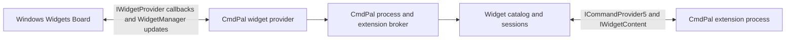

# Widgets Board provider implementation plan

## Status

Proposed. This plan implements [Addenda V: Widgets Board](./initial-sdk-spec.md#addenda-v-widgets-board).

## Goal

Make Command Palette a Windows widget provider. CmdPal extensions expose
Adaptive Card forms through the Command Palette SDK, while CmdPal owns Windows
registration, widget instance management, rendering updates, actions,
persistence, and recovery.

The first release should let a user:

1. Add a generic Command Palette widget from the Windows Widgets picker.
2. Choose an extension-provided widget from the widget's customization UI.
3. Interact with that widget and receive live updates without opening CmdPal.
4. Recover the same binding after either process or Windows restarts, while the
   extension restores its own per-instance state.

## Non-goals

* Requiring each extension to implement `IWidgetProvider` or add widget entries
  to its package manifest.
* Dynamically adding one Windows picker definition per installed extension
  widget. Windows definitions are static package-manifest data.
* Supporting CmdPal-specific Adaptive Card custom elements on the Widgets
  Board.
* Giving all `CommandResultKind` values widget-specific behavior in the first
  release.
* Generating, modifying, or re-signing the CmdPal package at runtime.

## Platform constraints

Windows discovers widget providers and widget definitions from the installed
package manifest. Definition IDs, picker text, icons, screenshots, sizes, and
`AllowMultiple` are fixed when the package is registered. Extension inventory,
on the other hand, changes at runtime.

The scalable design is therefore one static definition:

| Field | Initial value |
| --- | --- |
| Definition ID | `CmdPalExtensionWidget` |
| Display name | Command Palette |
| Description | Generic description explaining extension widgets |
| `AllowMultiple` | `true` |
| `IsCustomizable` | `true` |
| Sizes | small, medium, large |
| Assets | CmdPal-owned icon and representative screenshot |

Every pinned instance starts unbound and is then associated with one logical
extension widget. CmdPal enforces an extension widget's own multiplicity and
size declarations after that association. It cannot change the generic entry's
picker or resize UI.

The Windows provider must implement the `IWidgetProvider` lifecycle:
`CreateWidget`, `DeleteWidget`, `OnActionInvoked`, `OnWidgetContextChanged`,
`Activate`, and `Deactivate`. Customization uses `IWidgetProvider2` and
`OnCustomizationRequested`.

## Proposed architecture



### Widget provider

Host the Windows widget provider in the existing packaged CmdPal executable. It
should:

* implement `IWidgetProvider` and `IWidgetProvider2`;
* register its COM class factory and observe correct server-process lifetime;
* copy callback values immediately instead of retaining Windows callback
  objects;
* return quickly from callbacks and do extension work asynchronously;
* own calls to `WidgetManager.GetDefault()`, `GetWidgetInfos()`, and
  `UpdateWidget()`;
* display a host-owned placeholder when an extension is unavailable; and
* run without creating or displaying `MainWindow` for widget-only activation.

The package launches the executable with a dedicated widget-provider argument.
That mode initializes the application services and COM class factory, but does
not create the CmdPal window. A normal activation received later creates the
window on the UI thread and reuses the same process.

The implementation is split into three testable layers:

* `CmdPalWidgetProvider` is a thin COM callback shim that copies callback data
   and dispatches asynchronous operations.
* `WidgetCoordinator` owns bindings, sessions, lifecycle, validation,
   customization cards, timeouts, and update coalescing.
* `IWidgetPlatform` isolates `WidgetManager`; production uses
   `WindowsWidgetPlatform`, while unit tests use an in-memory implementation.

### Extension broker

The CmdPal process remains the sole owner of extension connections, avoiding
conflicting `InitializeWithHost` and `Dispose` lifetimes.

Add a headless widget-broker startup mode to the existing process:

* Headless mode initializes services and extensions but does not create or show
  `MainWindow`.
* A later normal activation creates the window on the UI thread and reuses the
  same process and extension objects.
* Existing policy checks, extension enablement, crash guards, and shutdown
   handling remain in force.

### Widget catalog and sessions

Add a UI-neutral catalog service that consumes provider wrappers and exposes:

* the current set of validated widget definitions;
* lookup by extension ID, provider ID, and widget ID;
* creation and recovery of serving instances;
* notifications when definitions are added, removed, or changed; and
* active sessions keyed by the Windows widget instance ID.

A session owns one materialized `IWidgetContent`, event subscriptions, current
size, activation state, last valid update, and persisted binding state. It must
unsubscribe and dispose its references on deletion, provider removal,
extension replacement and shutdown.

Widget enumeration is separate from `LoadTopLevelCommands()`. The widget
catalog reuses providers already known to `TopLevelCommandManager` and loads
missing built-in or external providers without invoking the destructive
`ReloadAllCommandsAsync()` path. Windows-specific objects stay out of the
catalog and coordinator.

## Workstreams

### 1. SDK and Toolkit

1. Add `WidgetSize`, `IWidgetContent`, and `ICommandProvider5` to the extension
   IDL.
2. Keep `IWidgetContent` metadata separate from form content:
   * `IWidgetContent` requires only `INotifyPropChanged`.
   * `IWidgetContent.Content` returns the lazily-created `IFormContent`.
   * `ICommandProvider5` requires `ICommandProvider4`.
3. Regenerate and validate C#/C++ projections.
4. Add Toolkit `WidgetContent : BaseObservable` with observable metadata, a
   `Content` property, and no-op lifecycle methods.
5. Make Toolkit `CommandProvider` implement `ICommandProvider5` and add default
   `GetWidgets()` and `GetWidget()` implementations.
6. Document stable-ID, persistence ownership, supported-size, Adaptive Card,
   and action requirements in Toolkit XML comments and extension author
   documentation.
7. Add a Sample Pages widget based on the existing sample form.

No new `ProviderType` is needed. The command provider remains the extension's
single entry point, as it is for dock bands.

### 2. Host catalog

1. Extend `CommandProviderWrapper` to query `ICommandProvider5` after API stub
   pre-caching and enumerate `GetWidgets()` off the UI thread.
2. Validate each definition:
   * non-empty stable ID;
   * no duplicate ID within the provider;
    * non-null title, description, and icon metadata normalized to safe defaults;
   * known, non-duplicated sizes; and
   * payloads below configured limits.
3. Use the composite logical key
   `(ExtensionUniqueId, ProviderId, WidgetId)`.
4. Treat the provider's inherited `ItemsChanged` as a full widget inventory
   invalidation.
5. Forward `PropChanged` from the widget for metadata or `Content` replacement,
   and subscribe separately to the current form for template/data changes.
6. Materialize pinned instances with
   `GetWidget(widgetId, instanceId)` and reject objects whose ID does not match
   the requested definition.
7. Apply the same extension timeout and failure-isolation model used by command
   loading. One bad definition must not disable the rest of the provider.

### 3. State and recovery

Persist a versioned host binding envelope in Windows custom state. The logical
shape is:

```json
{
  "version": 1,
  "extensionId": "extension identity",
  "providerId": "provider identity",
   "widgetId": "extension widget identity"
}
```

Never trust IDs read from custom state until they have been matched to an
installed and enabled provider.

CmdPal does not persist extension-owned widget state. Extensions are
responsible for storing per-instance configuration and application state,
keyed by the Windows widget instance ID passed to `GetWidget()`. Recreating a
session gives the extension the same instance ID so it can restore its own
state.

On provider startup:

1. Call `WidgetManager.GetWidgetInfos()`.
2. Reconcile those instances from their host-owned custom-state bindings.
3. Publish a loading card immediately.
4. Restore each bound session through `GetWidget()`.
5. Publish the last valid cached content while a slow extension starts.
6. Show a recoverable unavailable card if the extension is disabled, removed,
   times out, or cannot initialize the instance.

Binding writes should be atomic and coalesced. Do not place credentials,
tokens, extension-owned state, or sensitive user content in Windows custom
state or logs.

### 4. Rendering and updates

Read `IWidgetContent.Content` without using the WinUI form renderer:

| SDK property | Windows update field |
| --- | --- |
| `TemplateJson` | `WidgetUpdateRequestOptions.Template` |
| `DataJson` | `WidgetUpdateRequestOptions.Data` |
| `Title` and `Icon` | Runtime `header.text` and `header.iconUrl` |

The Windows adapter converts local raster/SVG images, image streams, and Fluent
glyphs into 32x32 PNG data URLs; HTTPS images pass through. It initially uses the
light icon variant, with a dark fallback when light is absent. Failed or
unsupported icons use the packaged CmdPal logo. Icon conversion is cached per
icon object and has a bounded wait so it cannot indefinitely block an update.

Send the template and data separately; do not pre-expand the Adaptive Card.
Support `$host.widgetSize` so one template can adapt to all sizes.

Subscribe to both the serving widget and its current form. Replace the form
subscription when `IWidgetContent.Content` changes. Queue updates rather than
calling `WidgetManager.UpdateWidget()` on the extension's callback thread,
debounce bursts, and serialize callbacks per Windows widget instance.

Before forwarding an update:

* validate that template and data are valid JSON;
* enforce byte-size and nesting limits;
* reject unsupported or unsafe URI schemes;
* reject CmdPal-only custom elements; and
* replace invalid content with a bounded host-owned error card.

If the current Windows size is not listed in `SupportedSizes`, publish a
host-owned unsupported-size card. The Board's generic resize menu cannot be
changed dynamically.

### 5. Actions and customization

Widget extension templates must use `Action.Execute`. For a Windows action:

1. Copy the widget instance ID, verb, and JSON data during the callback.
2. Resolve the bound session.
3. Call `SubmitForm(inputs, data)` on a worker with a timeout, where:
   * `inputs` is the JSON payload supplied by Windows; and
   * `data` is host JSON containing the verb and
     `"surface": "windowsWidgets"`.
4. Re-read all form properties after submission.
5. Publish content changes.

Initially, only `KeepOpen` has defined behavior. Log and ignore other command
results. Any future support for `GoToPage` must require a direct user action and
must route through CmdPal's normal activation mechanism.

For an unbound instance, immediately publish a host-owned selector card. For
`OnCustomizationRequested`, publish the same compact `Input.ChoiceSet` dropdown
with the current binding preselected. Label options "Extension: Widget" and
provide one "Use widget" action with `associatedInputs: auto` so the selected
`widget` input is submitted. Leave new instances unselected with a placeholder
and required-input validation. Do not render icons, description lists, or paging
controls. Preserve the binding until confirmation and suppress live form updates
while customization is open. A selection action validates
the composite widget key, enforces `AllowMultiple` across running and persisted
instances, creates the serving instance, persists the binding, and replaces the
selector. Loading, empty-catalog, unavailable-extension, unsupported-size, and
invalid-content states all provide a refresh or reselection action.

The COM provider publishes host-only runtimeclass metadata listing both
`IWidgetProvider` and `IWidgetProvider2`. Advertising only one interface as the
runtime class name prevents remote metadata-based marshaling from discovering
the other. A packaged integration test must activate the provider and query both
interfaces. Coordinator tests also cover Customize followed by Create, Activate,
and resize callbacks after restart: none may replace the open dropdown.

### 6. Lifecycle

Map Windows callbacks to sessions as follows:

| Windows callback | Broker behavior |
| --- | --- |
| `CreateWidget` | Create an unbound session or recover a valid binding; publish initial content |
| `Activate` | Mark active, call `IWidgetContent.Activate()`, request a fast refresh |
| `Deactivate` | Mark inactive and call `IWidgetContent.Deactivate()` |
| `OnWidgetContextChanged` | Copy the new size and refresh or publish the unsupported-size card |
| `OnActionInvoked` | Dispatch the action to `SubmitForm()` |
| `OnCustomizationRequested` | Publish the host-owned selection card |
| `DeleteWidget` | Call `Delete()`, unsubscribe, remove the local binding and cached content |

Treat duplicate and out-of-order lifecycle callbacks as normal. Lifecycle
methods must be idempotent. Never block a Windows callback on extension startup
longer than a small bounded deadline.

### 7. Packaging and startup

1. Add the widget provider executable to the CmdPal build and package output.
2. Add a stable CLSID and packaged `windows.comServer` registration.
3. Add the `com.microsoft.windows.widgets` app extension and generic definition
   to both production and development manifests.
4. Add localized picker strings, provider icon, widget icon, and picker
   screenshot assets.
5. Ensure the loose development package registration contains the provider
   executable and all assets.
6. Add feature and OS/API availability gates so unsupported systems continue to
   run CmdPal without widget initialization failures.
7. Verify the repository's Windows App SDK version exposes all required
   provider and customization APIs before changing package dependencies. Upgrade
   only if the spike proves it necessary.
8. Extend startup handling for headless broker mode and later visible
   activation without weakening the existing STA/UI requirements.

## Security and reliability requirements

* Treat extension templates, data, action payloads, icons, and URIs as
  untrusted input.
* Bound every extension call with cancellation and a timeout.
* Bound JSON sizes, nesting, update rates, catalog counts, and cached data.
* Never retain `WidgetContext` or callback argument objects after a Windows
  callback returns.
* Never launch CmdPal, another app, a URI, or a process without a direct user
  gesture.
* Pause avoidable polling when all instances of a widget are deactivated.
* Redact content and action payloads from telemetry and normal logs.
* Isolate malformed content, duplicate IDs, and extension crashes to the
   affected definition or instance.
* Keep a last-known-good card and always have host-owned loading, unavailable,
  unsupported-size, and error cards.

## Testing plan

### SDK and ABI

* Generate C# and C++ projections for the new linear interfaces.
* Verify old `ICommandProvider4` implementations continue to load unchanged.
* Marshal `ICommandProvider5` and `IWidgetContent` across the real
  out-of-process extension boundary.
* Verify Toolkit defaults and every observable metadata property.

### Catalog and session unit tests

* Empty and duplicate IDs, null values, unknown sizes, and oversized payloads.
* Provider enable/disable, `ItemsChanged`, install, update, removal, timeout,
  and crash.
* `GetWidget()` identity validation and idempotent recovery.
* Distinct instance IDs for two allowed instances and extension-owned state
   recovery for each.
* Rejection of a second binding when `AllowMultiple` is false.
* Complete event unsubscription on delete and provider replacement.

### Rendering and action unit tests

* Initial full update and template/data partial updates.
* `PropChanged` bursts are coalesced and identical updates are deduplicated.
* Malformed and hostile JSON produces a bounded error card.
* Unsupported sizes produce the fallback card.
* Verb and input mapping to `SubmitForm()`.
* Submit timeout, exception, content change, and unsupported command result.

### Provider integration tests

* COM cold activation, warm activation, shutdown, and server locking.
* CmdPal already running, widget-only cold start, and extension failure during
   an operation.
* Widget-only activation does not create or show `MainWindow`.
* Normal activation after headless startup creates the UI correctly.
* Current-user/package ACLs reject an unrelated client.
* Production and development package manifests register independently.

### End-to-end tests

* Generic picker discovery and initial selector card.
* Bind, customize, resize, activate/deactivate, interact, and unpin.
* Multiple generic instances bound to different extension widgets.
* Board restart, provider restart, extension restart, and Windows restart.
* Extension disable, uninstall, update, reinstall, and changed widget ID.
* x64 and ARM64 loose-package deployment.

The existing Performance Monitor pages are the preferred real-world pilot
because they already update `FormContent.DataJson` and have activation counting
for expensive sampling. The Sample Pages extension should remain the compact
SDK/ABI test fixture.

## Delivery phases

### Phase 0: platform spike

* Build a minimal provider executable with one static card.
* Prove package registration, COM lifecycle, customization, action callbacks,
   binding recovery, loose deployment, x64, and ARM64.
* Confirm the minimum Windows and Windows App SDK versions.
* Validate single-instance and class-factory behavior when CmdPal is already
   running.

### Phase 1: SDK and in-memory adapter

* Land IDL and Toolkit APIs.
* Add Sample Pages and Performance Monitor widget definitions.
* Implement catalog/session logic against a fake widget platform.
* Complete SDK, catalog, lifecycle, and rendering unit tests.

### Phase 2: provider and packaging

* Land the provider class, headless startup, manifests, assets, and feature
   gates.
* Connect real Windows callbacks to the tested session adapter.
* Add provider and package integration tests.

### Phase 3: customization and resilience

* Add dynamic selector/customization cards and binding persistence.
* Add last-known-good caching, unavailable/reselection flows, rate limiting,
  telemetry, and diagnostics.
* Complete restart, update, uninstall, x64, and ARM64 end-to-end validation.

### Phase 4: author experience

* Publish extension author documentation and templates.
* Add validation diagnostics for unsupported Adaptive Card features.
* Evaluate static picker definitions for selected built-in widgets without
  changing the generic third-party model.

## Likely code areas

| Area | Expected change |
| --- | --- |
| `extensionsdk/Microsoft.CommandPalette.Extensions` | IDL and generated projections |
| `extensionsdk/Microsoft.CommandPalette.Extensions.Toolkit` | `WidgetContent` and provider defaults |
| `Microsoft.CmdPal.UI.ViewModels/CommandProviderWrapper.cs` | Widget enumeration and instance factory access |
| `Microsoft.CmdPal.UI.ViewModels/Services` | Catalog, sessions, persistence, validation, and broker service |
| `Microsoft.CmdPal.UI/Program.cs` and `App.xaml.cs` | Headless broker startup and later UI activation |
| `Microsoft.CmdPal.UI/Widgets` | COM provider, Windows callbacks, sessions, and `WidgetManager` |
| `Microsoft.CmdPal.UI/Package.appxmanifest` | Production COM and widget registration |
| `Microsoft.CmdPal.UI/Package-Dev.appxmanifest` | Development COM and widget registration |
| `ext/SamplePagesExtension` | Minimal authoring sample |
| `ext/Microsoft.CmdPal.Ext.PerformanceMonitor` | Live-data pilot |
| `Tests` | ABI, catalog, session, provider, and end-to-end coverage |

## Open decisions

1. Whether the first SDK requires all widgets to support all three sizes.
2. Exact template/data byte limits and update-rate limits.
3. Theme-specific header icons and additional icon formats beyond the initial adapter.
4. Whether a user-initiated widget action may return `GoToPage` in v1.
5. Whether lifecycle methods belong on the first `IWidgetContent` interface or
   a later linear `IWidgetContent2` revision.
6. Whether a fixed set of built-in widgets should also receive dedicated static
   picker definitions.

## Completion criteria

The feature is ready when a packaged CmdPal build can discover an
extension-provided `IWidgetContent`, bind it to the generic Windows widget,
render and update its Adaptive Card, dispatch actions, honor activation,
recover its binding after restart, survive extension failure/removal, and pass the
x64 and ARM64 test matrix without displaying CmdPal during widget-only
activation.
