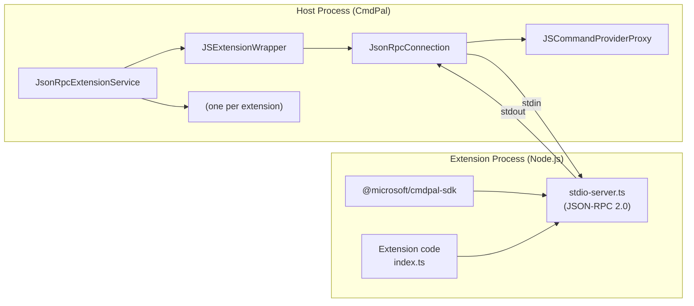
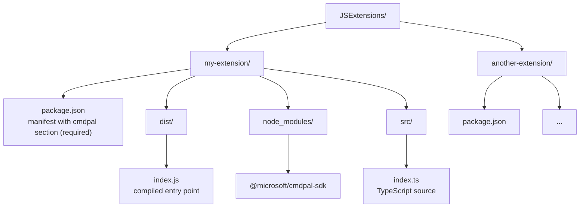
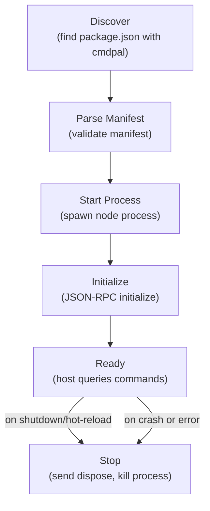
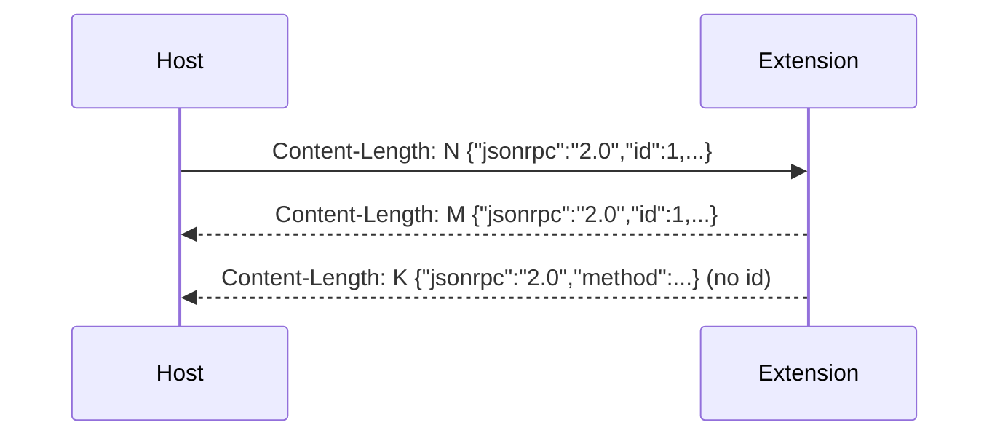
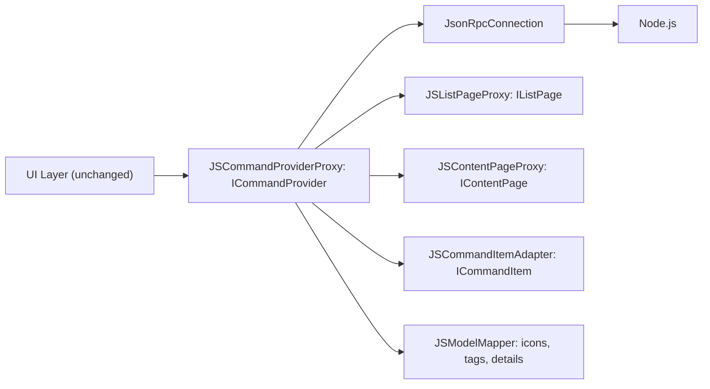

# 01 - Architecture Overview

## Process Model

Each JavaScript/TypeScript extension runs as an **isolated Node.js process**. The CmdPal host manages these processes through `JsonRpcExtensionService`, which implements the same `IExtensionService` interface used by WinRT and built-in extensions.



### Why Per-Process?

1. **Crash isolation.** A runaway extension cannot crash CmdPal. If an extension process dies, only that extension stops working.
2. **Resource isolation.** Each extension has independent memory, CPU, and event loop.
3. **Independent debugging.** Attach a debugger to a specific extension's Node.js process via `--inspect`.
4. **Clean lifecycle.** Stop or restart an extension by killing and re-spawning its process.
5. **Security boundary.** Extensions cannot access host memory or other extensions' state.

### Crash Recovery

The host tracks consecutive crashes per extension:

| Crash Count | Behavior |
|-------------|----------|
| 1 to 3 | Extension marked as disconnected, available for restart |
| > 3 | Extension marked as **unhealthy**, disabled until manual re-enable |

## Extension Discovery

Extensions are discovered from a well-known directory:

```
%LOCALAPPDATA%\Microsoft\PowerToys\CmdPal\JSExtensions\
```

Each subdirectory containing a valid `package.json` with a `cmdpal` section is treated as an extension:



### Directory Watching

The service watches the `JSExtensions` directory for:

| Event | Behavior |
|-------|----------|
| **New subdirectory created** | Scans for `package.json` with `cmdpal` section, loads extension if valid |
| **Subdirectory deleted** | Stops the extension process, removes from provider list |
| **`*.js` file changed** (within an extension) | Hot-reloads the extension (debounced 500ms) |

Source file watchers ignore `node_modules/` changes.

## Extension Lifecycle



### Startup Sequence

1. `JsonRpcExtensionService.LoadProvidersAsync()` scans `JSExtensions/`
2. For each valid `package.json` containing a `cmdpal` section:
   - Creates `JSExtensionWrapper`
   - Spawns `node <entrypoint>` with stdio redirection
   - Creates `JsonRpcConnection` over the process's stdin/stdout
   - Sends `initialize` request and waits for response
   - Creates `JSCommandProviderProxy` as the `ICommandProvider` implementation
   - Wraps in `CommandProviderWrapper` and returns to `TopLevelCommandManager`

### Hot-Reload (Development)

When a `*.js` file changes in an extension directory:

1. Change detected by `FileSystemWatcher`
2. Debounced 500ms to coalesce rapid saves
3. Current process receives `dispose` notification
4. Process is killed after 2s grace period
5. New process is spawned and initialized
6. Crash counter is reset on successful initialization

### Debug Mode

Set `"debug": true` in the `cmdpal` section of `package.json` to start the Node.js process with `--inspect`:

```json
{
  "cmdpal": {
    "debug": true,
    "debugPort": 9230
  }
}
```

The host logs a Chrome DevTools URL for attaching:

```
chrome-devtools://devtools/bundled/js_app.html?experiments=true&v8only=true&ws=127.0.0.1:9230
```

If `debugPort` is not specified, ports are auto-assigned starting at 9229.

## Transport Layer

### Framing

All messages use **LSP-style framing** (Language Server Protocol):

```http
Content-Length: <byte-count>\r\n
\r\n
<UTF-8 JSON body>
```

This is the same framing used by VS Code's Language Server Protocol, making it compatible with existing JSON-RPC tooling.

### Connection Details

| Property | Value |
|----------|-------|
| Transport | Process stdio (stdin for writes, stdout for reads) |
| Encoding | UTF-8 |
| Framing | `Content-Length` header (LSP-style) |
| Protocol | JSON-RPC 2.0 |
| Request timeout | 10 seconds |
| Concurrency | Serialized writes (lock-protected), async reads |
| Error channel | stderr (logged by host, not part of protocol) |

### Message Flow



## C# Host-Side Architecture

### Key Classes

| Class | Role |
|-------|------|
| `JsonRpcExtensionService` | Discovers, loads, and manages JS extension processes |
| `JSExtensionManifest` | Parses and validates `package.json` with `cmdpal` section |
| `JSExtensionWrapper` | Manages a single Node.js process lifecycle (implements `IExtensionWrapper`) |
| `JsonRpcConnection` | Low-level JSON-RPC 2.0 transport over stdio |
| `JSCommandProviderProxy` | Translates `ICommandProvider` interface calls to JSON-RPC requests |
| `JSCommandItemAdapter` | Adapts JSON command item data to `ICommandItem` |
| `JSInvokableCommandAdapter` | Adapts JSON command data to `IInvokableCommand` and parses invoke results |
| `JSListPageProxy` | Adapts JSON list page data to `IListPage` interface |
| `JSDynamicListPageProxy` | Adapts a dynamic (search-driven) list page to `IDynamicListPage` |
| `JSContentPageProxy` | Adapts JSON content page data to `IContentPage` interface |
| `JSModelMapper` | Translates JSON payloads into toolkit data types (icons, tags, details, content, grid layouts, filters) |
| `JSCmdPalSection` | Groups list items into a named `ISection` |

### Adapter Pattern

The host-side uses an **adapter/proxy pattern** to present JSON-RPC responses as native `ICommand`, `IListPage`, `IContentPage`, and related interfaces. This allows the existing CmdPal UI (built for WinRT extensions) to consume JS extensions without any changes to the UI layer.



### Icon Data Pipeline

JS extensions can provide icons in three formats:

| Format | `IconData` field | C# handling |
|--------|------------------|-------------|
| **Font glyph** | `icon: "\uE91B"` | `IconPathConverter.IconSourceMUX` produces a `FontIconSource` |
| **File/URI path** | `icon: "C:\\path\\icon.png"` | `IconPathConverter.IconSourceMUX` produces a `BitmapImage` |
| **Base64 data** | `data: "iVBOR..."` | `JSModelMapper.ParseIconData` produces an `InMemoryRandomAccessStream` backing a `BitmapImage` |
| **Data URI** | `data: "data:image/png;base64,..."` | `JSModelMapper.ParseIconData` parses the data URI, decodes it, and streams the result |

For base64 images, the TS extension fetches/encodes the image data at runtime. The SDK provides helper functions (`iconFromUrl`, `iconFromFile`, `iconFromBase64`) to simplify this.

## Security Considerations

### Current State (v1)

JS extensions run as **unsandboxed Node.js processes** with the same permissions as the user running CmdPal. This is equivalent to running any Node.js application.

### Mitigations

- **Process isolation.** Extensions cannot access host process memory.
- **No elevated privileges.** Extensions run at the user's permission level, never elevated.
- **Crash containment.** Runaway extensions are auto-disabled after 3 consecutive crashes.
- **No network exposure.** Communication is via stdio, not network sockets.

### Future Considerations

- Permission model for filesystem, network, and clipboard access
- Extension signing and trust verification
- Sandboxed execution environments (e.g., V8 isolates)
