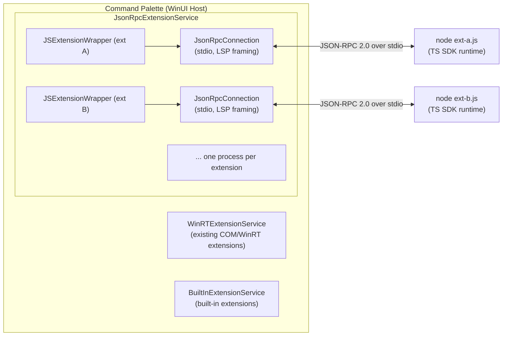

# Command Palette JavaScript Extension System Design Specification

> **Status:** Draft — seeking community and internal feedback 
> **Last updated:** 2006-06-17

## Table of Contents

| Document | Description |
|----------|-------------|
| [01 — Architecture Overview](01-architecture.md) | Process model, extension lifecycle, transport, and security |
| [02 — TypeScript SDK Reference](02-typescript-sdk.md) | Full API surface: types, base classes, helpers, and runtime |
| [03 — JSON-RPC Protocol](03-jsonrpc-protocol.md) | Complete protocol specification: methods, notifications, framing |
| [04 — Extension Manifest & Packaging](04-manifest-packaging.md) | `package.json` schema, project structure, distribution |

---

## Executive Summary

Command Palette (CmdPal) is extending its extension model beyond in-process WinRT/COM extensions to support **JavaScript and TypeScript extensions** that run as isolated Node.js processes, communicating with the host over JSON-RPC 2.0 via stdio.

### Goals

1. **Developer accessibility** — Let web developers build CmdPal extensions using familiar tools (TypeScript, npm, Node.js)
2. **Process isolation** — Extension crashes don't take down CmdPal; extensions can't corrupt host state
3. **Type-safe SDK** — Full TypeScript type definitions mirroring the C# toolkit surface
4. **Developer experience** — Hot-reload on file changes, debugger attachment, familiar project structure
5. **Feature parity** — JS extensions can create list pages, content pages, forms, grids, settings, and more

### Non-Goals (v1)

- Browser/WebView-based extension UI rendering
- Sandboxed filesystem access or permission model
- Extension marketplace / auto-update infrastructure
- Multi-language JSONRPC support beyond JavaScript/TypeScript (Python, Go, etc.)

### Architecture at a Glance

Each JS extension runs in its own Node.js process. The host spawns the process, establishes a JSON-RPC 2.0 connection over stdin/stdout with LSP-style `Content-Length` framing, sends an `initialize` request, and then queries the extension for commands, pages, and content as the user navigates.

### Key Design Decisions

| Decision | Choice | Rationale |
|----------|--------|-----------|
| Process model | One Node.js process per extension | Isolation, independent crash recovery, independent debugging |
| Transport | stdio with LSP framing | No port conflicts, no network exposure, proven by LSP ecosystem |
| Protocol | JSON-RPC 2.0 | Standard, well-tooled, bidirectional |
| SDK language | TypeScript | Type safety, npm ecosystem, familiar to web developers |
| Entry point | `cmdpal` field in `package.json` | Simple, declarative, same pattern as VS Code's contributions |
| Icon data | Base64-encoded in JSON | No filesystem sharing needed, works with generated/fetched images |
| Hot-reload | FileSystemWatcher on `*.js` | Immediate feedback during development |

---

## Feedback Requested

We are seeking feedback on the following areas:

1. **API surface** — Are the base classes and types intuitive? What's missing?
2. **Extension lifecycle** — Is the initialize → query → dispose model sufficient?
3. **Manifest schema** — What additional fields would be useful?
4. **Distribution** — Should we support npm-based installation? Local-only? Both?
5. **Security** — What permission boundaries should exist for JS extensions?
6. **Developer experience** — What tooling (CLI scaffolding, debugging, testing) is most important?
7. **Performance** — Are there concerns about per-extension Node.js processes?

Please file issues with the tag `[CmdPal-JS-SDK]`.
