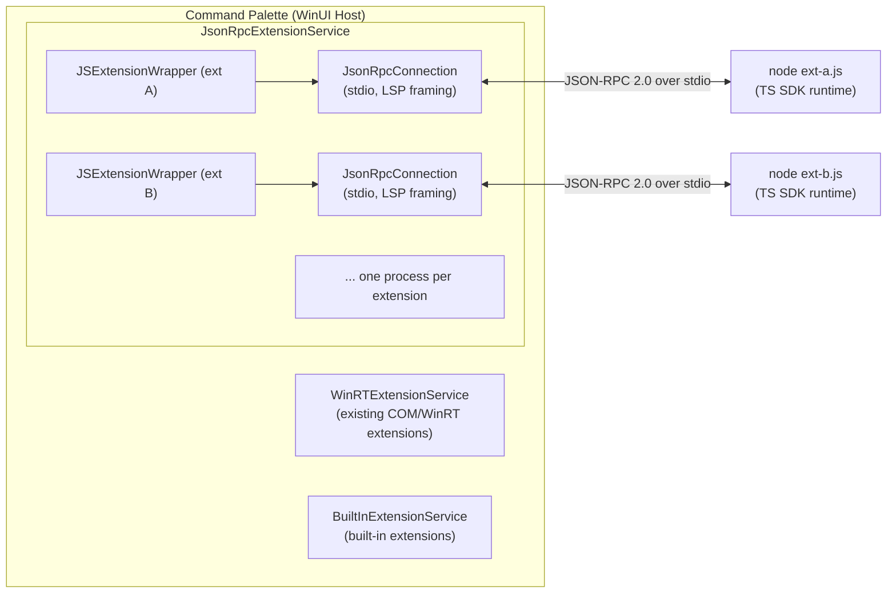

# Command Palette JavaScript Extension System Design Specification

> **Status:** Draft, seeking community and internal feedback 
> **Last updated:** 2026-07-15

## Table of Contents

| Document | Description |
|----------|-------------|
| [01. Architecture Overview](01-architecture.md) | Process model, extension lifecycle, transport, and security |
| [02. TypeScript SDK Reference](02-typescript-sdk.md) | Full API surface: types, base classes, helpers, and runtime |
| [03. JSON-RPC Protocol](03-jsonrpc-protocol.md) | Complete protocol specification: methods, notifications, framing |
| [04. Extension Manifest and Packaging](04-manifest-packaging.md) | `package.json` schema, project structure, distribution |
| [05. Getting Started](05-getting-started.md) | Build your first JS/TS extension step by step |

---

## Executive Summary

Command Palette (CmdPal) is extending its extension model beyond in-process WinRT/COM extensions to support **JavaScript and TypeScript extensions** that run as isolated Node.js processes, communicating with the host over JSON-RPC 2.0 via stdio.

### Goals

1. **Developer accessibility.** Let web developers build CmdPal extensions using familiar tools (TypeScript, npm, Node.js).
2. **Process isolation.** Extension crashes do not take down CmdPal, and extensions cannot corrupt host state.
3. **Type-safe SDK.** Full TypeScript type definitions mirroring the C# toolkit surface.
4. **Developer experience.** Hot-reload on file changes, debugger attachment, familiar project structure.
5. **Feature parity.** JS extensions can create list pages, content pages, forms, grids, settings, and more.

### Non-Goals (v1)

- Browser/WebView-based extension UI rendering
- Sandboxed filesystem access or permission model
- Extension marketplace / auto-update infrastructure
- Multi-language JSON-RPC support beyond JavaScript/TypeScript (Python, Go, and so on)

### Architecture at a Glance

Each JS extension runs in its own Node.js process. The host spawns the process, establishes a JSON-RPC 2.0 connection over stdin/stdout with LSP-style `Content-Length` framing, sends an `initialize` request, and then queries the extension for commands, pages, and content as the user navigates.

### Key Design Decisions

| Decision | Choice | Rationale |
|----------|--------|-----------|
| Process model | One Node.js process per extension | Isolation, independent crash recovery, independent debugging |
| Transport | stdio with LSP framing | No port conflicts, no network exposure, proven by LSP ecosystem |
| Protocol | JSON-RPC 2.0 | Standard, well-tooled, bidirectional |
| SDK language | TypeScript | Type safety, npm ecosystem, familiar to web developers |
| Entry point | `cmdpal` field in `package.json` | Simple, declarative, same pattern as VS Code's contributions |
| Icon data | Base64-encoded in JSON | No filesystem sharing needed, works with generated/fetched images |
| Hot-reload | FileSystemWatcher on the extension directory | Immediate feedback during development |

---

## Known Gaps and Deferred Work

The following capabilities are intentionally not part of the current JS/TS extension surface. They are documented here so contributors know the boundary and the likely shape of a future solution. Each is deferred rather than rejected.

### Per-page load and unload lifecycle

There is no per-page unload notification. A JS page learns it has become active implicitly, because the first `getItems` fetch after navigation acts as a de facto load signal, but there is no equivalent signal when the user navigates away and a page is popped from the stack. The WinRT `IPage` interface has no `OnLoad` or `OnUnload` member, so there is no C# ABI parity to mirror.

A future solution would be additive and JS-only: a host to extension JSON-RPC notification (for example `page/unloaded` carrying the page id, and optionally a symmetric `page/loaded`), emitted from the host where a page is torn down. `PageViewModel.UnsafeCleanup` is the natural single choke point, since back-navigation and other disposal paths all pass through it. The TS SDK would expose an optional `onUnload` (and optionally `onLoad`) hook on the page base classes, following the existing `loadMore` lifecycle pattern. Because it is additive with no reply expected, older extensions that do not register the hook are unaffected. The item is deferred because it introduces JS-only surface with no C# ABI equivalent, and that asymmetry needs a broader decision.

### Drag and drop (DataPackage)

There is no drag-and-drop or `DataPackage` concept anywhere in the extension ABI, in either the C# or the JS surface. The only related primitive today is the clipboard, exposed through `IExtensionHost.copyToClipboard`. Items cannot declare draggable payloads, and the host list and content controls do not act as drag sources or drop targets for extension data.

Two shapes are plausible for a future solution. The minimal path is copy-on-drag built on the existing clipboard primitive, where dragging an item that declares data places that data on the clipboard so a drop behaves like a paste; this adds no new wire surface and is low risk, but it is not true operating-system drag-and-drop and is limited to what the clipboard can carry. The fuller path is a dedicated `DataPackage`-style wire payload plus host WinUI drag source and drop target handling, which is the only option that would touch the WinRT ABI and carries the most risk. The item is deferred until there is concrete demand, at which point the choice between the two shapes can be made against real requirements (for example whether images or files must be draggable).

---

## Feedback Requested

We are seeking feedback on the following areas:

1. **API surface.** Are the base classes and types intuitive? What is missing?
2. **Extension lifecycle.** Is the initialize, query, dispose model sufficient?
3. **Manifest schema.** What additional fields would be useful?
4. **Distribution.** Should we support npm-based installation? Local-only? Both?
5. **Security.** What permission boundaries should exist for JS extensions?
6. **Developer experience.** What tooling (CLI scaffolding, debugging, testing) is most important?
7. **Performance.** Are there concerns about per-extension Node.js processes?

Please file issues with the tag `[CmdPal-JS-SDK]`.
