# Command Palette Apps

> [!NOTE]
> Work in progress. This document describes the Apps implementation on
> `feature/cmdpal-pancakes-restacked-local`.

<!-- TOC-->
  - [1 Catalog and consumers](#1-catalog-and-consumers)
  - [2 Discovery](#2-discovery)
    - [2.1 Deduplication](#21-deduplication)
  - [3 Loading, refresh and persistence](#3-loading-refresh-and-persistence)
    - [3.1 Cache and startup](#31-cache-and-startup)
    - [3.2 Source updates](#32-source-updates)
    - [3.3 Publication and durability](#33-publication-and-durability)
    - [3.4 Diagnostics and publication measurements](#34-diagnostics-and-publication-measurements)
  - [4 Browsing and search](#4-browsing-and-search)
    - [4.1 Browsing](#41-browsing)
    - [4.2 Shared matching](#42-shared-matching)
    - [4.3 Home](#43-home)
  - [5 Visibility](#5-visibility)
  - [6 Identities](#6-identities)
    - [6.1 Identity types](#61-identity-types)
    - [6.2 Fields and formats](#62-fields-and-formats)
    - [6.3 Encoding and stability](#63-encoding-and-stability)
    - [6.4 Compatibility and resolution](#64-compatibility-and-resolution)
    - [6.5 Usage history](#65-usage-history)
  - [7 Icons](#7-icons)
  - [8 Class diagram](#8-class-diagram)
<!-- TOC -->

The Apps module provides a shared application catalog for the All Apps page and Home search.

Sharing discovery, identity, matching and visibility lets both surfaces agree on the application
behind a result and whether it is hidden. Each consumer keeps its own query, ranking and
presentation.

## 1 Catalog and consumers

- **`IAppCatalog`**
  - Owns discovery, reconciliation, deduplication and visibility.
  - Retains immutable source metadata and provenance from equivalent representations.
  - Publishes visible, manually hidden and pattern-hidden applications together.
- **`IAppListItemSource`**
  - Supplies stable app commands shared by All Apps and Home.
  - Reuses unchanged rows.
  - Builds rows and command aliases from the same catalog publication.
- **All Apps and Home**
  - Own independent queries, filters and presentation.
  - Consume the shared source while retaining their own ranking and result limits.

Shared inventory keeps discovery and hiding consistent across both surfaces. Consumer-owned
query state lets them operate independently. Publishing rows and aliases together prevents a
command lookup from mixing different catalog versions.

`AppCatalog` coordinates source lifecycle and refresh scheduling. `AppCatalogPublicationBuilder`
merges source snapshots, applies filters and visibility, reuses unchanged app objects and builds
change sets. The catalog calls the builder under its existing state lock and publishes the result
atomically. Keeping the builder free of scheduling and synchronization makes projection changes
independent of retry and source-replacement policy.

## 2 Discovery

| Source                  | Default         | Content and depth                                       |
| ----------------------- | --------------- | ------------------------------------------------------- |
| Packaged applications   | Enabled         | Enabled manifest applications and package metadata.     |
| Start Menu              | Enabled         | Recursive; includes non-application entries by default. |
| Desktop                 | Enabled         | Recursive; excludes non-application entries by default. |
| Registry App Paths      | Disabled        | Optional executable discovery.                          |
| PATH                    | Disabled        | Optional command discovery.                             |
| Custom shortcut folders | User-configured | Recursive; includes non-application entries.            |
| Portable app folders    | User-configured | `.exe` files in the root and immediate subfolders.      |

Automatic Start Menu discovery excludes Windows' user and shared Startup folders and their
descendants. Startup shortcuts often add background-launch arguments, creating an extra app
entry. Explicitly configured custom folders can still include these locations.

Win32 entry titles use the Shell display name when available, including localized names supplied
by `desktop.ini`. Retain the filename-based name separately for released command IDs and as
an unavailable-name fallback. Both names remain searchable and match name exclusions; display
metadata does not change launch or catalog identity. Cached Win32 payloads retain both names;
cache schema and language validation protect their compatibility.

Registry App Paths retains each registered command filename and stem as search metadata,
including when a differently named executable or shortcut supplies the preferred row.
These names describe commands users know, but do not replace the launch target or become
command-ID aliases. They receive ordinary metadata scoring rather than executable-name priority.
Discovery returns these terms with each candidate path, so a later scan cannot replace the
metadata being indexed by an earlier scan.

Packaged discovery retains the manifest's optional `Executable` value in its snapshot.
Only its filename and stem enter search terms: relative layout folders such as `VFS` and
`ProgramFilesX64` must not make unrelated apps match ordinary queries.
AUMIDs remain the identity and activation target.
The declared value is not a resolved file path: shared launchers and externally located
executables make that assumption unsafe. It therefore does not receive executable-name priority
or become a path-based deduplication key. Existing caches remain usable until reconciliation
adds the new metadata.

Packaged discovery also reads each application's declared execution aliases during the same
manifest scan. Alias filenames and stems, such as `wt.exe` and `wt`, are ordinary search
metadata even when PATH discovery is disabled. They stay with the declaring application and
do not change its AUMID identity or activation target. A declared alias remains searchable
when Windows disables that command, and multiple apps declaring the same alias can match.
The existing match-term cache retains these names without adding another payload format.
An in-memory ownership cache watches the current user's top-level WindowsApps execution-alias
links. It starts monitoring in the background before its first scan, coalesces change notifications,
and rescans without waiting for another keystroke. Events received during a scan force a follow-up
pass, so publication cannot lose a later preference change. Searches immediately use the last
published map and request a safety refresh at most once per minute to recover missed events or
failed watcher setup. Watcher errors reconcile ownership immediately; monitoring is retried at
the next safety refresh to avoid a recovery loop. Full-map scans keep this small index simple.
The list-item source primes the cache in the background when constructed, without adding a
startup wait. Searches usually begin with ownership already available; a query arriving before
priming completes still uses the current snapshot and reranks when ownership arrives. Home does
not request additional refreshes when Apps is disabled. Search construction and scoring perform
no filesystem I/O, including in tests and benchmarks. Missing alias directories are normal and
do not generate watcher warnings. An unexpected worker failure releases the refresh gate so
later requests or notifications can retry.
The selected owner's AUMID earns a distinct priority above ordinary executable matches on
All Apps and Home, below exact titles and user-assigned command aliases. This preference
applies only to an exact metadata match. Missing or disabled aliases have no owner; a failed
cache scan retains the last map. A changed map reranks active queries without rebuilding rows,
commands or provider entries. Ownership is not persisted in the catalog.

Win32 origins enumerate candidate paths and source-specific search terms. `Win32AppReader`
reads each file into transient `Win32AppMetadata`; `Win32AppSource` captures the retained
data in an immutable `Win32AppPayload`. Identity and deduplication belong to the catalog,
so discovery metadata has no separate equality, query filtering or deduplication policy.
Shortcut launch paths, arguments and working directories remain intact; resolved targets
supply identity and search metadata rather than replacing shortcut activation.

### 2.1 Deduplication

- Merge equivalent shortcut, executable, execution-alias and packaged representations when their
  launch behavior is equivalent.
- Keep entries distinct when arguments or meaningful working directories differ.
- Deduplicate default executable-directory variants.
- Treat a Squirrel launcher's direct `app-<numeric version>` working directory as an installer
  default when its explicit Windows app ID matches the install-root and executable names.
  Preserve the original shortcut and working directory, plus previous identities as aliases.

A shortcut and an executable can describe the same app, but arguments or a meaningful working
directory can select a different profile or launch context. Deduplicate by launch behavior.
Squirrel root launchers select their installed version and its working directory themselves;
version folders left in old shortcuts do not select a different app. Explicit IDs alone are
insufficient to merge arbitrary launch profiles.
Retained provenance keeps alternate names searchable and lets path exclusions inspect every
representation.

## 3 Loading, refresh and persistence

### 3.1 Cache and startup

- Publish valid `apps.catalog.json` snapshots before watcher setup and background reconciliation.
- A complete cache makes the list ready without waiting for watcher setup or reconciliation.
- Load uncached sources immediately; keep initial loading active until their first scan attempts finish.
  Cached rows remain available during the scans. Later invalidations and cache writes do not
  extend startup loading; failed reads retry in the background.
- Validate schema, language, source configuration and age.
- The first release uses cache schema **1**. Source keys describe configuration and source state;
  development revision tags are not part of the persisted format.
- Maximum cache age: **36 hours**. Cached-source reconciliation delay: **30 seconds**.

Cached discovery makes the list usable before filesystem and manifest scans finish. Validation
bounds stale or incompatible metadata; delayed reconciliation trades temporary staleness for
less startup work. These limits are policy values to assess against startup cost and tolerated
staleness.

### 3.2 Source updates

| Event                                       | Behavior                                                                       |
| ------------------------------------------- | ------------------------------------------------------------------------------ |
| Win32 watcher changes                       | Debounce and reconcile affected paths, rename pairs and directory descendants. |
| Watcher overflow / excessive changes        | Refresh the affected source completely.                                        |
| Unavailable roots                           | Retry with bounded backoff.                                                    |
| Package install/uninstall/update completion | Rebuild the packaged source.                                                   |
| Identifiable framework event                | Ignore it.                                                                     |
| Unavailable framework metadata              | Refresh conservatively.                                                        |

- Debounce Win32 invalidations for **5 seconds** to let installers finish writing.
- Retry rejected shortcuts and failed reads up to **three times**, waiting **5, 15 and 40 seconds**
  between attempts. Keep at most **256** targeted paths per source; notifications do not renew
  an exhausted budget.
- Unavailable network paths retain affected rows without short retries; periodic or manual
  refresh checks for recovery. PATH and registry retries use full source enumeration because
  those origins do not support dirty-path scans. Unchanged Win32 candidates still reuse metadata.
- Promoted full scans clear pending retries resolved anywhere in that source. Only complete
  full scans renew cache validation; genuine incremental scans keep their narrower scope.
- Check all sources every **10 minutes** to recover missed events and discover unwatched changes.
  Win32 checks enumerate candidates and compare file and target stamps plus search terms;
  unchanged candidates reuse their parsed metadata or rejection, including excluded non-applications.
  Missing shortcut targets remain part of the stamp check so an install or reconnect is detected.
  Explicit refreshes, watcher requests and targeted retries still read those candidates.
  Execution aliases and reparse points are
  still read because ownership can change without a useful stamp change. Package checks compare
  package identities, manifest stamps and theme before parsing manifests or resolving logos again.
  Unchanged missing manifests also reuse their incomplete scan in memory; they never renew disk-cache
  validation, and an appearing manifest, package change or explicit refresh forces a new read.
  Unchanged rejected candidates do not start another retry burst. PATH discovery still uses the process environment.
- Run delayed reconciliation and retries on one background-priority worker per source, lowering
  CPU, memory and I/O priority on a dedicated thread that exits after the scan. Catalog serialization
  bounds active discovery to one worker. Manual refresh and watcher work use normal thread-pool
  scheduling; shared pool priorities are never changed. Foreground requests cancel background
  discovery at the next file, directory or package checkpoint. Targeted updates stay incremental;
  interrupted recovery resumes after the existing debounce window. An active native read must
  return before cancellation can take effect.
- Save changed cache contents immediately; renew unchanged validation timestamps at most every
  **6 hours**, keeping the cache fresh without a full-file write at each periodic check.
- Unreadable files, subtrees or package families retain only their affected representations.
  Readable siblings still publish, and confirmed deletions or retargeted shortcuts take effect
  during an incomplete scan. Missing candidates are absent; access denial retains affected rows
  without scheduling short retries. An existing shortcut with a missing target still gets bounded
  retries. Unknown failure coverage retains the source snapshot conservatively.
- Incomplete scans do not renew cache validation. A changed source key retains its previous cached
  entry until a complete scan validates the new key. Incremental updates under the same key retain
  the existing validation timestamp. Read handles are short-lived, allow sharing where the API
  supports it, and are released before retry delays.
- Shortcut discovery allows Windows link tracking to recover moved targets but disables Shell's
  heuristic search across nearby folders and other volumes. Missing targets must not trigger
  repeated filesystem searches during discovery.

Completion reflects the changed package state; progress events add scans before that state is
ready. Framework-only changes do not add launchable apps, but resource packages can change
logos. Package metadata may already be unavailable after uninstall, so failure to classify must
still refresh. A complete packaged-source rebuild is the current simplicity/cost tradeoff.

### 3.3 Publication and durability

- Background refresh keeps existing rows without a loading banner; initial loading and explicit
  Refresh expose loading state.
- No-op and provenance-only updates do not publish content changes.
- Cache/settings use temporary-file replacement.
- User preferences, exclusion patterns and manual hides remain in `apps.settings.json`.
  Durable command aliases, move redirects and ambiguity markers use `apps.aliases.json`.
- A missing alias file imports the legacy flat map from settings. The new file is written
  successfully before legacy keys are removed; a valid existing file is authoritative even
  when empty. Brief I/O failures get bounded retries; unreadable alias files are preserved
  and do not revive stale legacy mappings.
- One coalescing writer saves aliases; shutdown flushes pending saves and disposes
  subscriptions/watchers.

Routine filesystem/package activity should not flash loading UI or republish unchanged rows. A
single writer drains changes arriving during an earlier save, so a flush covers all pending
work. Temporary-file replacement avoids partially written settings; a short shutdown wait is
accepted for durability.

Alias-only updates do not serialize or rewrite user preferences. This keeps catalog activity
from overwriting settings edits and avoids writing the growing alias map on every preferences
change. Aliases are durable compatibility data, so they remain separate from the disposable
catalog cache. Migration removes legacy keys from the saved JSON without applying in-memory
preferences; hidden identities changed by an install move still use the settings writer.

### 3.4 Diagnostics and publication measurements

Enable **catalog diagnostics** in Apps settings to collect structured information-level logs
prefixed with `[AppCatalog diagnostics]`. Measurements use monotonic clocks; disabled diagnostics
do not read timing clocks or count reused rows. The setting does not schedule additional scans.

| Measurement | Scope |
| ----------- | ----- |
| Startup phases | Cache read, cached publication including notifications, and catalog initialization completion. |
| Source initialization | Watcher/subscription setup for each source, including failure or retirement. Cached sources initialize later. |
| Source queue wait | First coalesced enqueue to scan start, including debounce and earlier work. Retry backoff before enqueue is excluded. |
| Source scan | Awaited load/update, including worker scheduling and enumeration/indexing. Logs requested and actual incremental mode, completeness and item/failure/retry counts. |
| Publication delay | Completed scan to application of that source's snapshot, including retention and catalog merging. Later sources do not delay publication; unchanged snapshots can be accepted without new rows. |
| Snapshot publication | Lock acquisition, validation and publication; `BuildPublication` time is also reported separately. A missing build duration means no rebuild. |
| Observer callbacks | Synchronous `Changed` notification, including row projection. This is part of batch time and is separate from snapshot publication. |
| Cache save | Cache-context preparation and the awaited save, including a possible no-op. `cacheAttempted` reports invocation, not a confirmed disk write. |
| Metadata and row reuse | Win32 candidates parsed/reused and rows created/reused. Projection time includes aliases, sorting and resolution; excludes subsequent presentation notifications. |
| First rows and loading | First non-empty visible row snapshot since `AppListItemSource` construction, plus effective startup/manual-refresh loading spans. These are model timings, not process startup or the first painted frame. |

Batch IDs correlate scan, publication and cache timings within a catalog instance. A canceled
background scan is marked `preempted`; failed scans are distinguished from completed incomplete
scans. Startup loading can finish before cache persistence and later invalidations finish.

Compare these scenarios using the same catalog and configuration:

- First launch with no `apps.catalog.json`: identify watcher setup, slow sources and completed
  scans waiting for the batch. Preserve `apps.settings.json` and `apps.aliases.json`.
- Normal cached launch: check first rows and loading completion separately from the delayed
  reconciliation. An unchanged background scan should reuse metadata and rows.
- Launch with a newly configured uncached custom folder: cached rows should remain available
  while loading waits for that source.
- Manual Refresh: compare queue wait, source reads, publication and cache cost, including when
  a background scan is preempted.

**Publication behavior:**

Discovery remains sequential, and each completed source publishes immediately after validating
that its instance is still active. Unchanged snapshots skip merging and notification. Initial
loading waits for all initial source IDs, including replacements; explicit Refresh waits for its
own queued requests and their batch's cache save, rather than subsequent background recovery.
The cache is saved once per batch. Opt-in diagnostics also identify individual candidate reads
taking at least **250 ms**.

**Possible follow-ups, requiring measurement:**

1. Start each scan once its own watchers are ready. Register startup waits before starting work
   so an early completion cannot hide loading for later sources. Preserve watch-before-scan
   ordering and source replacement handling.
2. Consider at most two concurrent sources only if scan timings justify it. Win32 foreground
   indexing already uses two workers per source; bound total native reads and cancellation state.

Earlier publication adds merges and consumer updates. Measure `BuildPublication` and projection
with a realistic large catalog before introducing incremental merge or notification coalescing.
Cold startup may briefly show duplicates until a later source supplies a canonical alias; cached
snapshots usually supply that context already. Account for that tradeoff before changing source
order solely to improve time to first rows.

## 4 Browsing and search

### 4.1 Browsing

| Condition           | Behavior                                           |
| ------------------- | -------------------------------------------------- |
| Filters             | All, Win32, Packaged and Hidden.                   |
| Empty query         | Culture-aware alphabetical/numeric ordering.       |
| Matching query      | Exact title, exact executable, then score/title.    |
| Descriptions hidden | Presentation only; descriptions remain searchable. |

### 4.2 Shared matching

- All Apps and Home share precomputed fuzzy targets for names, descriptions, retained aliases,
  executable names, paths and package metadata.
- Positive name/description scores qualify.
- Metadata qualifies on an exact match or a positive score reaching **75% of the query's ideal
  score**.
- Queries containing a path separator or colon additionally search full paths.
- Ordinary searches omit shared discovery-directory prefixes.
- Exact executable names from the actual launch/target paths can take priority over fuzzy
  matches when the launch has no arguments. Argument-bearing shortcuts remain searchable
  without that priority; retained metadata does not imply an executable match.

The **Prioritize exact executable names** setting applies to both All Apps and Home:

| Mode                              | `cmd.exe`       | `cmd`           |
|-----------------------------------|-----------------|-----------------|
| Default                           | Exact priority  | Ordinary scoring |
| With or without extension         | Exact priority  | Exact priority  |
| Only with extension               | Exact priority  | Ordinary scoring |
| Disabled                          | Ordinary scoring | Ordinary scoring |

The default currently requires the executable extension. The Default choice is
saved as `default` and follows the built-in policy, which may change in future releases.
Explicit mode choices keep their behavior across default-policy changes.

All modes retain ordinary metadata and explicit-path matching. Requiring an extension gives
users a way to distinguish precise filename intent from common words such as `Launcher` or
`Client`. The mode is captured with the search snapshot and query. Changing it reranks an active
Home or All Apps search while reusing the lists, rows and commands. Discovery, pins and dock
entries do not need to be rebuilt for a search-rule change.

When enabled, an executable filename expresses more precise intent than a fuzzy title: `cmd.exe` finds
Command Prompt before unrelated `CmdPal` titles. Including the extension also distinguishes
`cmd.exe` from `cmd.cmd`. Execution aliases such as `wt.exe` retain the same priority even when
resolved to a differently named executable. Executable discovery paths are projected from
catalog provenance, so aliases keep that priority when a packaged payload wins deduplication.

Name/description matches remain forgiving, while stricter metadata admission limits incidental
matches. Common path prefixes would make unrelated apps match terms such as `Microsoft` or
`Programs`; explicit path queries still need access to those paths. Hiding descriptions must
not change which apps a query finds.

### 4.3 Home

- Reevaluate the complete visible catalog and explicitly pinned apps, including hidden pins.
- Preserve rank tiers, provider weights and usage ranking. Exact executable matches rank
  in the generic `ExactMetadata` tier, above title prefixes and below exact titles and user aliases.
  Selected execution-alias owners rank in `PreferredExecutionAlias`, above ordinary executable
  matches. Usage only reorders within a tier; Apps determines which metadata earns priority.
- Break equal scores by title for deterministic ordering.
- Apply stricter admission to one/two-character queries, with exact-metadata and alias
  exceptions.
- Follow Apps provider enablement.
- App-result limit: default **10**; choices are none, 1, 5 or 10. All Apps browsing is not
  capped by this limit.

Admission is not monotonic as a query grows: a longer query can pass the metadata threshold even
when its prefix failed. Restricting candidates to the previous results would lose valid apps.
Cache targets rather than narrowing the catalog; any narrowing needs both an
admission-equivalence check and measurements on a realistic catalog with full metadata.

## 5 Visibility

| Control                     | Behavior                                                                                                 |
| --------------------------- | -------------------------------------------------------------------------------------------------------- |
| Hide / Unhide               | Update the shared projection immediately; persist identities across supported renames and install moves. |
| Global name/path exclusions | Case-insensitive `*` and `?` wildcards; a match in either list excludes the app.                         |
| Path exclusions             | Inspect retained shortcut/executable paths and package locations.                                        |
| Hidden filter               | Separate manual and exclusion-pattern sections.                                                          |
| Pattern-hidden item         | Offer Edit exclusion patterns.                                                                           |
| Clearing an exclusion       | Restore the app unless it remains manually hidden.                                                       |
| Hide uninstallers           | Optionally filter recognized Win32 uninstaller entries.                                                  |

Visibility/filter changes reproject existing inventory without rescanning.

Hiding changes visibility, not discovery, so it should affect both surfaces immediately and
remain reversible. Separate manual and pattern causes explain why an app is hidden and prevent
clearing a pattern from undoing a manual hide.

## 6 Identities

### 6.1 Identity types

| Identity         | Purpose                                                               |
| ---------------- | --------------------------------------------------------------------- |
| Catalog ID       | Canonical launch identity used for deduplication and visibility.      |
| Command ID       | Persisted reference used by pins, dock bands and command resolution.  |
| Source reference | Discovery-entry identity used for provenance and incremental updates. |

### 6.2 Fields and formats

- **Catalog ID:** `AppCatalogItem.Identity`, exposed as `AppItem.CatalogId`.
  - Packaged app: `packaged:{AUMID}`.
  - Win32 app: `win32:{target}|args:{UTF8-hex}`.
  - URL launch target: `win32:url:{UTF8-hex}|args:{UTF8-hex}`.
  - Optional Win32 suffix: `|cwd:{directory}` for a distinct working directory.
- **Command ID:** `AppCommand.Id`.
  - Packaged app: `app-v1-packaged-{AUMID}`.
  - Win32 app: `app-v1-win32-{target-filename}-{SHA256-hex}`; include the extension and
    canonicalize filename casing.
  - Nameless Win32 form: `app-v1-win32-{SHA256-hex}`, also used for URL launch targets.
- **Source reference:** `AppCatalogSourceReference`, containing `(SourceId, ItemId)`; for
  example, a source ID paired with a shortcut path.

Shortcuts also retain their explicit `System.AppUserModel.ID` as metadata, including in the
catalog cache and search terms. `AppItem.UserModelId` exposes a packaged or explicit desktop
Windows app ID. Desktop IDs do not replace catalog or command IDs: several launch profiles can
share one Windows app ID while requiring distinct arguments or working directories. Discovery
remains additive; absence from Windows' app list does not invalidate an entry from another
source, and an entry in Windows' list must not be rejected solely because our sources missed it.

### 6.3 Encoding and stability

- `LaunchTarget` owns normalization, equality and hashing: filesystem paths use ordinal
  case-insensitive comparison; URLs preserve their payload and compare ordinally.
- Encode URL targets as UTF-8 hexadecimal so case-insensitive catalog keys retain distinct URLs.
- Encode arguments as UTF-8 hexadecimal, preserving argument case.
- Append `cwd` only for a distinct working directory.
- Build Win32 command IDs by hashing the UTF-8 bytes of the invariant-uppercase catalog ID.
- The optional filename comes from the target, not display text, and must match its hash or an
  explicitly retained historical alias. Parse the known prefix and trailing 64-character hash;
  filenames and AUMIDs may contain hyphens.
- Resolve typed command IDs with ordinal case-insensitive comparison, including packaged AUMIDs.
  Preserve AUMID spelling in emitted IDs and launch metadata, and preserve a requested saved ID
  when resolving an alias. Reject unknown versions/types, malformed hashes and misleading
  filename hints.
- Command IDs occupy one URL path segment. URL-encode the full ID; hyphens remain literal.
- Catalog IDs are deterministic launch identities, independent of display text and CmdPal's
  current directory.
- An install move can change a catalog ID; retained aliases redirect supported existing
  references.

Display names and subtitles can change with localization or shortcut renames, so they cannot
define the canonical identity. Hex encoding prevents argument delimiters and case-sensitive
arguments from being lost during case-insensitive identity comparisons. URI targets such as
`steam://rungameid/123` must stay URIs; resolving them as filesystem paths would make IDs depend
on CmdPal's current directory. Their sensitive bytes also need protection from blanket case
folding. Relative working directories must likewise use the launch
context.

Shortcuts and packaged discovery can supply different capitalization of the same AUMID.
Case-insensitive resolution follows Microsoft's
[packaged-app launch example](https://learn.microsoft.com/en-us/uwp/api/windows.applicationmodel.core.applistentry.appusermodelid?view=winrt-26100#examples)
and keeps existing pins working without retaining an alias for every capitalization variant.

### 6.4 Compatibility and resolution

- Merged apps retain contributing catalog and shortcut launch identities as `IdentityAliases`.
- Discovery does not synthesize obsolete catalog identities from earlier unreleased builds.
- Saved legacy aliases resolve to current commands, including supported install moves.
- Retain the released name-based IDs generated from name, subtitle and launch path.
- Reject ambiguous aliases.
- A unique visible claimant of a live command ID or alias takes precedence over hidden
  claimants, including typed IDs that differ only in case. Saved ambiguity markers remain
  blocked regardless of current visibility.
- Hiding filters discovery; explicit Home pins, dock references and command links still resolve
  hidden apps. Provider enablement and command-link permission checks continue to apply.

Existing pins and dock references must survive the ID migration. Retained shortcut launch
identities can bridge supported install moves. Released name-based IDs remain supported;
generating obsolete catalog identities would grow the alias file even when those IDs had never
been used. An ambiguous alias must fail rather than launch an arbitrary app. Saved aliases are
not pruned: only the host knows which references are still saved, including references needed
after reinstall. The accepted cost is a growing alias file.

Hiding an app does not remove a saved reference. Home pins and dock items keep the current
app's presentation and actions while it remains indexed, including manual and pattern-based
hides. The user removes those references explicitly. Hidden apps stay out of ordinary discovery.
Command links use the same explicit lookup and may launch hidden apps without a pin or dock
reference. Hiding is a discovery preference; an explicitly requested command still resolves.

### 6.5 Usage history

- Home caches a ranking projection merging legacy/current app usage, including hidden pins.
- New uses record canonical command IDs without rewriting existing history.
- History storage remains command-ID-only.

Read-time projection preserves old app usage without rewriting stored history or writing
duplicate legacy entries. Provider/command-pair history is separate work. Accepted downgrade
behavior: a main-based build does not recognize app usage recorded under the new IDs.

## 7 Icons

- Honor shortcut icon resources independently of launch targets.
- Win32 row/hero icons use shell icon protocols and fallbacks.
- Packaged icons select size/theme assets across resource packages.

A shortcut can launch one executable while using another executable's icon resource. Keep those
choices independent to preserve its artwork. Packaged logos need size/theme selection to avoid
enlarging a small asset when a suitable larger asset exists.

## 8 Class diagram

This diagram shows the main relationships in the current Apps implementation. Source profiles,
payload implementations, provenance details, policy filters, event types and icon helpers are
omitted for clarity. `1` means exactly one; `*` means zero or more.

```mermaid
classDiagram
    direction TB

    class IAppSource {
        <<interface>>
        String Id
        String CacheKey
    }
    class Win32AppSource
    class Win32AppReader
    class Win32AppMetadata
    class Win32AppPayload
    Win32AppSource ..> Win32AppReader : reads candidate files
    Win32AppReader ..> Win32AppMetadata : returns transient metadata
    Win32AppSource ..> Win32AppPayload : captures immutable launch data
    Win32AppMetadata ..> Win32AppPayload : supplies retained metadata
    class PackagedAppSource
    Win32AppSource ..|> IAppSource
    PackagedAppSource ..|> IAppSource

    class IAppSourceProvider {
        <<interface>>
        GetSources() IAppSource[]
    }
    class IAppCatalogCache {
        <<interface>>
    }
    class IAppVisibilityStore {
        <<interface>>
    }
    class IAppCatalog {
        <<interface>>
        Boolean IsRefreshing
        GetSnapshot() AppCatalogSnapshot
        InitializeAsync() Task
        RefreshAsync() Task
    }
    class AppCatalog
    AppCatalog ..|> IAppCatalog
    AppCatalog --> "1" IAppSourceProvider : obtains configured sources
    AppCatalog "1" *-- "*" IAppSource : owns
    AppCatalog --> "1" IAppCatalogCache : persists source snapshots
    AppCatalog --> "1" IAppVisibilityStore : applies visibility
    class AppCatalogPublicationBuilder
    AppCatalog "1" *-- "1" AppCatalogPublicationBuilder : builds projections under catalog lock

    class AppCatalogItem {
        String Identity
        String[] IdentityAliases
        String[] CommandIds
        AppCatalogProvenance Provenance
        IAppCatalogPayload Payload
        ToAppItem() AppItem
    }
    class AppCatalogSnapshot {
        AppItem[] Items
        AppItem[] HiddenItems
        AppItem[] PatternHiddenItems
    }
    class AppItem {
        String CatalogId
        String[] CommandIds
        String Name
        String LaunchTarget
    }
    IAppSource ..> AppCatalogItem : discovers
    AppCatalogPublicationBuilder o-- "*" AppCatalogItem : merges and deduplicates
    AppCatalog --> "1" AppCatalogSnapshot : publishes atomically
    AppCatalogItem ..> AppItem : materializes
    AppCatalogSnapshot o-- "*" AppItem : visible and hidden projections

    class IAppListItemSource {
        <<interface>>
        Boolean IsLoading
        Int32 TopLevelResultLimit
        GetSnapshot() AppListItemSnapshot
        RequestExecutionAliasRefresh() void
        RefreshAsync() Task
    }
    class AppListItemSource
    class AppExecutionAliasCache {
        Changed Event
        RequestRefresh() void
    }
    class AllAppsSettings
    class AppListItemSnapshot {
        AppListItem[] VisibleItems
        AppListItem[] HiddenItems
        AppListItem[] PatternHiddenItems
        GetExecutionAliasOwner(String query) String?
        GetCommandItem(String commandId) ICommandItem?
    }
    class AppListItem {
        AppItem App
        String Title
        String Subtitle
    }
    class AppCommand {
        String Id
    }
    AppListItemSource ..|> IAppListItemSource
    AppListItemSource --> "1" IAppCatalog : projects catalog snapshots
    AppListItemSource --> "1" AllAppsSettings : retains command aliases
    AppListItemSource --> "1" AppExecutionAliasCache : captures background ownership
    AppListItemSource --> "1" AppListItemSnapshot : publishes rows and alias lookup
    AppListItemSnapshot o-- "*" AppListItem : reuses stable rows
    AppListItem --> "1" AppItem : presents
    AppListItem "1" *-- "1" AppCommand : launches

    class AllAppsPage
    class AllAppsCommandProvider
    class MainListPage
    AllAppsPage --> "1" IAppListItemSource : browses and searches
    AllAppsCommandProvider --> "1" IAppListItemSource : resolves saved command IDs
    AllAppsCommandProvider --> "1" AllAppsPage : exposes standalone page
    MainListPage --> "1" IAppListItemSource : searches and ranks on Home

    class LaunchTarget {
        <<struct>>
        String Value
        LaunchTargetKind Kind
        String IdentityToken
    }
    class AppIdentity {
        <<static>>
        ForCommand(String catalogIdentity) String
    }
    Win32AppSource ..> LaunchTarget : builds case-aware identities
    AppCatalogItem ..> AppIdentity : projects compatible command IDs
    AppCommand ..> AppIdentity : creates canonical command ID
    AppListItemSnapshot ..> AppIdentity : normalizes command-ID syntax
```

