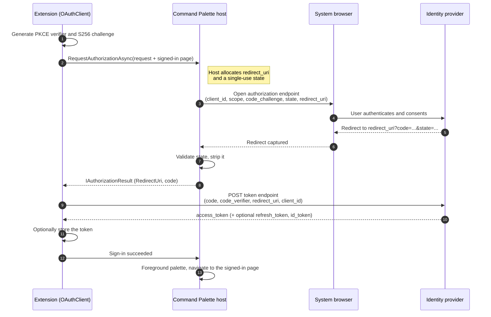
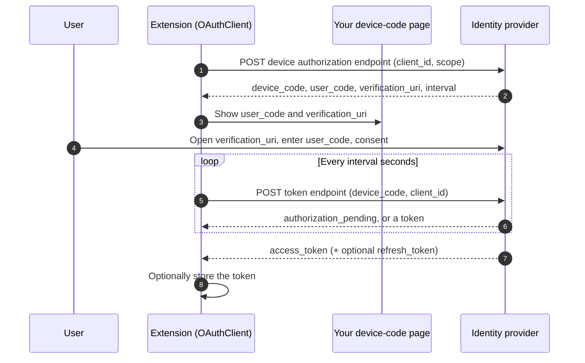

# Command Palette authentication

If your extension talks to an API that needs a user to sign in, this is for you.
Command Palette gives you a built-in, hardened OAuth flow so you don't have to stand
up your own loopback listener, register a URI scheme, juggle `state`, and figure out
how to pull the palette back to the front after the browser hands control back.

You bring the provider details. The Toolkit does the work. The host handles the one
piece you can't do safely from inside your extension: the browser redirect.

## What you get

- A single `OAuthClient` in `Microsoft.CommandPalette.Extensions.Toolkit` that runs
  Authorization Code with PKCE, refreshes tokens, and drives device-code sign-in.
- A thin, shared redirect broker in the host so every extension gets the same tested
  path through the browser instead of each rolling its own.
- Optional token storage backed by the Windows Credential Manager, all inside your
  process.

## When not to use this

- You already have a working sign-in and no reason to move. This is not a mandate.
- You need a confidential client with a shipped secret. Don't. An installed extension
  is a public client, and a secret in a package is a secret you gave away. See
  [Non-goals](#non-goals).
- You need machine-to-machine auth with no human in the loop. Client-credentials is
  out of scope for this pass.

## The split: who owns what

The design is a hybrid, and the line between the two halves is the whole point.

The **host** owns the risky, shared parts of the browser round trip. It opens the
system browser, allocates and hosts the `redirect_uri`, generates and validates
`state`, captures the redirect, and pulls the palette back to the front. That's it.
It never sees your tokens.

Your **extension** owns everything private to you. The Toolkit generates the PKCE
verifier, exchanges the code for a token, refreshes it, and stores it if you want.
All of that happens in your process. The verifier and the tokens never cross the ABI.

| Responsibility | Host | Extension (Toolkit) |
|---|---|---|
| Open the system browser | yes | no |
| Allocate and host `redirect_uri` | yes | no |
| Generate and validate `state` | yes | no |
| Capture the redirect | yes | no |
| Re-foreground the palette | yes | no |
| Navigate to your signed-in page | yes (on your behalf) | no |
| PKCE verifier and challenge | no | yes |
| Token exchange and refresh | no | yes |
| Token storage | no | yes |

The guiding rule: the host only adds what the Toolkit physically cannot do itself.
If the Toolkit can do it in-process, it does. That keeps the host surface tiny and
keeps you in control of your own tokens.

## Goals

- One tested OAuth path that any extension can adopt in a few lines.
- Tokens never touch the host. Ever.
- PKCE by default, public clients only, no secrets in packages.
- Graceful behavior on older hosts that don't support the flow.

## Non-goals

- **Client-credentials.** Out of scope this pass. It needs a secret, and a public
  client can't keep one. If we take it on later, the secret has to come from runtime
  config, never the package.
- **Host-held tokens.** The host brokers the front-channel redirect and nothing more.
- **Persisted pending sign-ins.** A flow lives in memory. If the host or your
  extension dies mid-flow, the sign-in is abandoned and the user retries. See
  [Durability](#durability).
- **A general navigation API.** The host can navigate to your signed-in page as part
  of finishing a sign-in, but there is no public "go to any page" call for extensions.
  See [Navigation](#navigation).

## Redirect kinds

You pick how the browser gets back to Command Palette.

- **Loopback** (`http://127.0.0.1:{ephemeral-port}/`, RFC 8252). The host listens on
  the loopback interface on a random port. This has the broadest provider support, so
  it's the default. Reach for it first.
- **CustomScheme** (`cmdpal://auth/callback`). The redirect reactivates Command
  Palette through its registered protocol, so the palette comes back to the front on
  its own. Only works with providers that allow custom-scheme redirect URIs, so it's
  the exception, not the rule.

## The flows

### Authorization Code with PKCE

This is the interactive flow, and the only one that uses the host broker.



A few things worth calling out:

- You never set `redirect_uri` or `state`. The host owns both. You send the rest of
  your authorize parameters (`client_id`, `scope`, `code_challenge`, and so on).
- The host hands back the exact `redirect_uri` it used. RFC 6749 says you replay that
  same value at the token endpoint, and the Toolkit does it for you.
- The token exchange happens in your process. The host is already out of the picture
  by the time a token exists.

**Custom-scheme variant.** The shape is the same, with one difference at the redirect
step. Instead of a loopback capture, the browser hands the OS a `cmdpal://` URL. The
OS reactivates Command Palette, the host matches `state` back to the pending flow,
routes the code to the extension that started it, and foregrounds the palette. From
your code it looks identical. You still get an `IAuthorizationResult` and still do the
exchange in-process.

### Refresh

No browser, no host, no ceremony. When your access token is close to expiring, the
Toolkit posts your refresh token to the token endpoint and hands back a fresh
`OAuthToken`. Ask for the `offline_access` scope up front if your provider gates
refresh tokens behind it.

`OAuthToken.IsExpired(skew)` helps you decide when to refresh, so you can refresh a
little early instead of waiting for a 401.

### Device-code

Some sign-ins happen better on another device, or on a machine with no good browser.
Device-code covers that, and it's pure Toolkit. The host doesn't broker anything here
beyond opening a URL if you ask it to.



You render your own `ContentPage` with the `user_code` and the verification link. The
Toolkit polls the token endpoint on the provider's interval until the user finishes or
the code expires. If you want the palette to open the verification URL for the user,
call the host's open-URL helper. That's the only host touchpoint device-code needs.

## SDK surface

There are two layers. Most extensions only ever touch the Toolkit.

### Host ABI

The contract lives in `Microsoft.CommandPalette.Extensions.idl`. A host that speaks
the new flow implements `IExtensionHost2`, which extends `IExtensionHost`.

```c++
enum AuthorizationRedirectKind
{
    Loopback = 0,      // http://127.0.0.1:{ephemeral-port}/  (RFC 8252)
    CustomScheme = 1,  // cmdpal://auth/callback
};

interface IAuthorizationRequest
{
    String DisplayName { get; };            // shown in the "waiting to sign in" status
    String AuthorizationEndpoint { get; };  // the provider authorize URL
    // Parameters appended to the authorize URL. Do not include redirect_uri or state.
    // The host injects both.
    IReadOnlyDictionary<String, String> Parameters { get; };
    AuthorizationRedirectKind RedirectKind { get; };
    UInt32 TimeoutSeconds { get; };         // 0 means the host default (60s); host caps at 300s
    ICommand SignedInPage { get; };         // where the host navigates on success; may be null
};

interface IAuthorizationResult
{
    Boolean IsSuccessful { get; };
    String RedirectUri { get; };            // the exact redirect_uri the host used
    IReadOnlyDictionary<String, String> ResponseParameters { get; };  // e.g. code; state is stripped
    String Error { get; };                  // set when IsSuccessful is false
};

interface IExtensionHost2 requires IExtensionHost
{
    // Run the interactive redirect flow. Cancelable.
    Windows.Foundation.IAsyncOperation<IAuthorizationResult> RequestAuthorizationAsync(IAuthorizationRequest request);

    // Thin facilitation for device-code: open a URL in the system browser.
    Windows.Foundation.IAsyncAction OpenUrlAsync(String url);
};
```

### Navigation

The host navigates to your signed-in page for you, and only for you. You name that
page in `IAuthorizationRequest.SignedInPage` when you start the flow. The host checks
that the page belongs to your extension and holds onto it. After your token exchange
succeeds, the Toolkit tells the host the sign-in worked, and the host foregrounds the
palette and navigates to the page you already named.

### Toolkit

This is what you actually write against.

```csharp
var client = new OAuthClient
{
    ClientId = "<your client id>",
    AuthorizationEndpoint = "https://provider.example/oauth/authorize",
    TokenEndpoint = "https://provider.example/oauth/token",
    Scopes = ["openid", "profile"],
    RedirectKind = AuthorizationRedirectKind.Loopback,
    DisplayName = "My extension",
};

// Interactive: PKCE, host broker, token exchange, then navigate to the landing page.
OAuthToken token = await client.AuthorizeAsync(new MySignedInPage());

// Later, when the token is close to expiring:
if (token.IsExpired(TimeSpan.FromMinutes(2)) && token.RefreshToken is not null)
{
    token = await client.RefreshAsync(token.RefreshToken);
}
```

The pieces the Toolkit gives you:

- `OAuthClient`: `AuthorizeAsync`, `RefreshAsync`, and the device-code entry point.
- `Pkce`: S256 verifier and challenge, base64url helpers.
- `OAuthToken`: access token, optional refresh and id tokens, token type, scope,
  expiry, and `IsExpired(skew)`.
- `OAuthException`: thrown with a provider error when the exchange fails.
- `ITokenStore` and `CredentialManagerTokenStore`: optional storage, covered below.

### Capability detection

Not every installed Command Palette is new enough to broker a sign-in. Check before
you offer one.

```csharp
if (!ExtensionHost.SupportsAuthorization)
{
    // Show a friendly "sign-in needs a newer Command Palette" message and stop.
    return;
}
```

`ExtensionHost.SupportsAuthorization` is true only when the connected host implements
`IExtensionHost2`. If you skip the check and call `AuthorizeAsync` against an older
host, the Toolkit throws `NotSupportedException`. Prefer the check so your user sees a
message instead of an error.

## Security model

The broker is built so a mistake in one extension can't leak tokens through the host,
and so the redirect is hard to spoof.

- **PKCE is required.** `OAuthClient` always sends `code_challenge` with
  `code_challenge_method=S256`. The verifier never leaves your process.
- **Public clients only.** No client secret, ever. Treat every extension as a public
  client, because that's what it is.
- **`state` is host-owned, random, and single use.** The host generates it, matches it
  on the redirect, and strips it before handing anything back. You never touch it.
- **`redirect_uri` binding.** The host returns the exact `redirect_uri` it used, and
  the Toolkit replays that same value at the token endpoint per RFC 6749.
- **Loopback is bound to `127.0.0.1` only,** on an ephemeral port, per RFC 8252.
- **No token storage in the host.** Tokens are exchanged and stored entirely in your
  process.
- **Timeouts are capped.** `TimeoutSeconds` defaults to 60 and the host caps it at
  300, so a stuck flow can't wait forever.

One more, and it matters: don't log or display the authorization code, the access or
refresh token, or the PKCE verifier. Show generic status on failure and move on.

## Token storage

Storing a token is optional, and it happens in your process. The Toolkit gives you:

- `ITokenStore`: a small `Retrieve` / `Save` / `Remove` abstraction keyed by a string.
- `CredentialManagerTokenStore`: an `ITokenStore` backed by the Windows Credential
  Manager. Tokens are encrypted at rest per user. Use a distinct key per provider or
  account so they don't collide.

There's an important thing to note though: the Credential Manager caps a stored secret at a few
kilobytes. That's plenty for typical access and refresh tokens, but a very large JWT
can blow past it. Guard `Save` in a try/catch and treat storage as best effort. If you
routinely carry large tokens, a DPAPI-backed store is a reasonable future addition.

## Durability

A sign-in lives in memory. The host stays resident (it's a tray process), so the
pending flow and the PKCE verifier survive the browser round trip just fine. If the
host or your extension is fully terminated in the middle of a sign-in, the flow is
gone and the user starts over. We don't persist pending-auth state, because the payoff
is small and the risk of leaving half-finished secrets on disk is not.

## Bring your own provider

The Toolkit doesn't care who your provider is, as long as it speaks Authorization Code
with PKCE and lets you register a public client.
