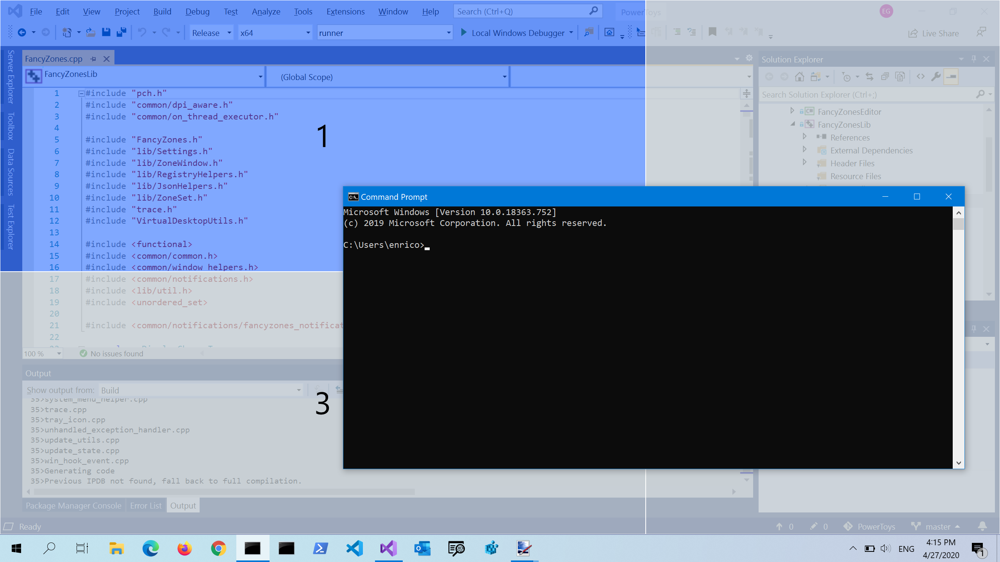
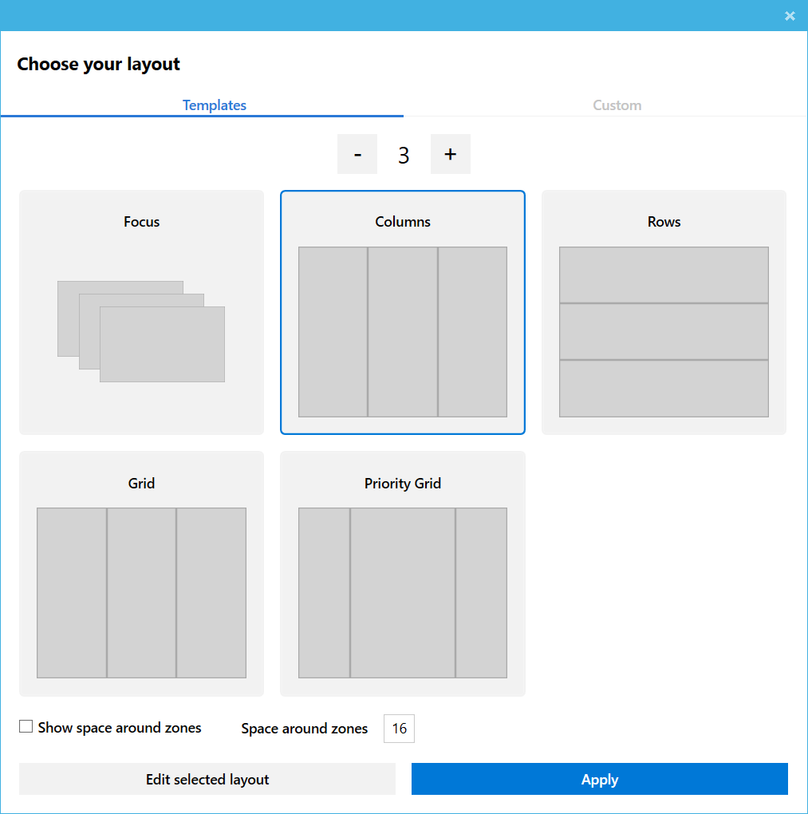
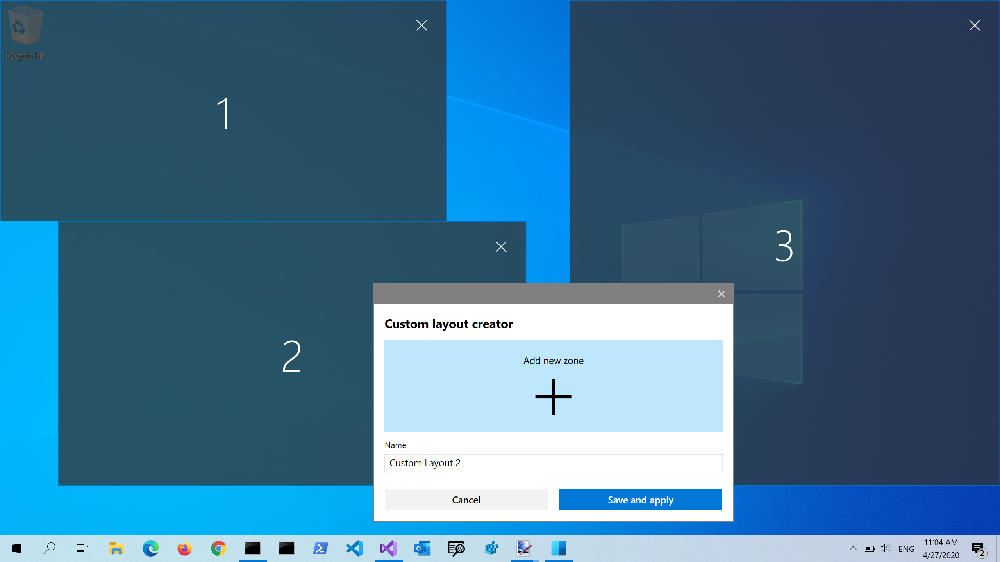
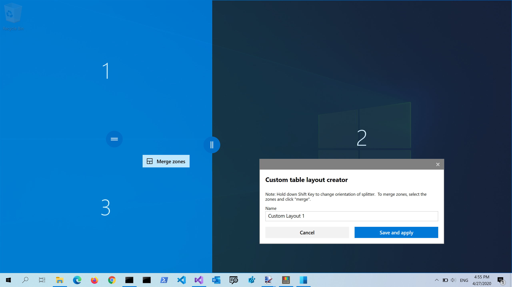
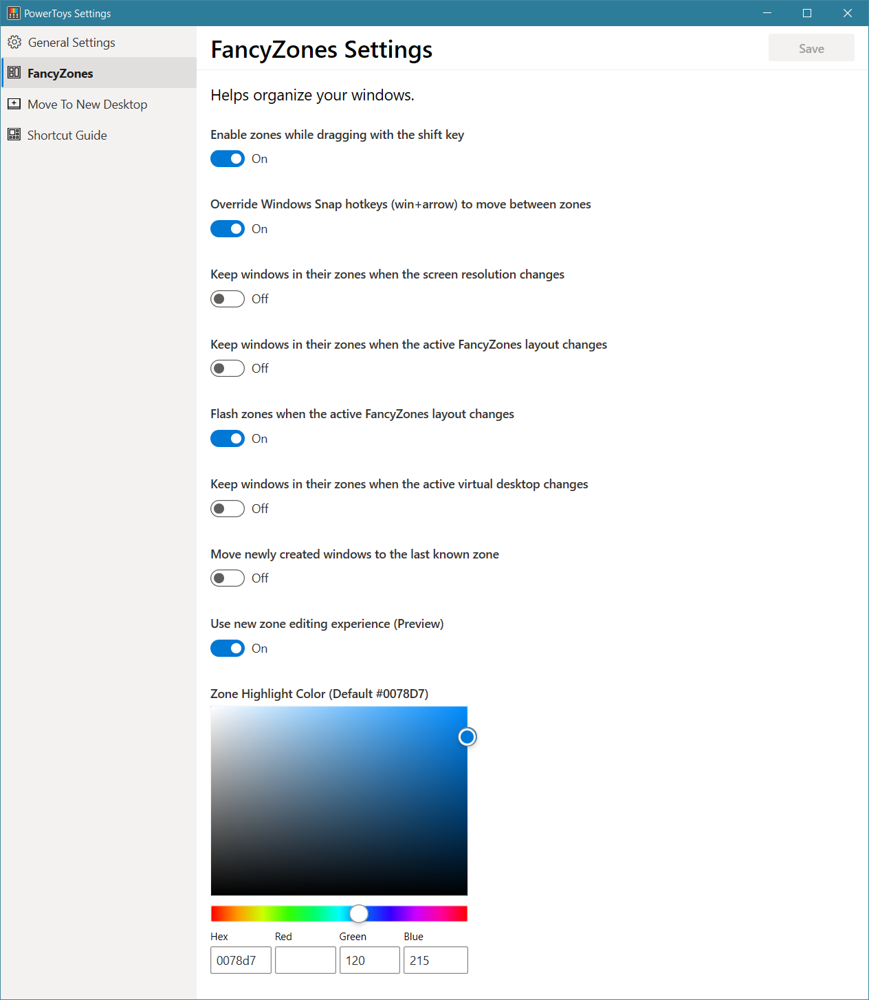

# Fancy Zones
Fancy Zones is a window manager that is designed to make it easy to arrange and snap windows into efficient layouts for your workflow and also to restore these layouts quickly.  Fancy Zones allows the user to define a set of window locations for a desktop that are drag targets for windows.  When the user drags a window into a zone, the windows is resized and repositioned to fill that zone.  

To get started with Fancy Zones, you need to enable the utility in Power Toys settings and then invoke the Fancy Zones setup UI.  There is a button in settings to invoke this UI, or you can press Win+` (note that this shortcut can be changed in the settings dialog) to launch it.  When first launched, the UI presents a list of zone layouts that can be quickly adjusted by how many windows are on the monitor.  Choosing a layout shows a preview of that layout on the monitor.  Pressing the save and close button sets that layout to the monitor.  

The editor also supports creating and saving custom layouts.  This functionality is in the “Custom” tab in the editor UI.  There are two ways to create custom zone layouts, window layout and table layout.  These can also be thought of as additive and subtractive models.  The additive window layout model starts with a blank layout and supports adding zones that can be dragged and resized similar to windows.  

The subtractive table layout model starts with a table layout and allows zones to be created by splitting and merging zones and then resizing the gutter between zones.  

The backlog for the utility can be found [here](https://github.com/Microsoft/PowerToys/tree/master/doc/planning/FancyZonesBacklog.md) and the source code is [here](https://github.com/Microsoft/PowerToys/tree/master/src/modules/fancyzones).

## Shortcut Keys
| Shortcut      | Action |
| ----------- | ----------- |
| Win + `      | Launches editor (this shortcut is editable in the settings dialog)       |
| Win+Ctrl+\<Number>   | Cycles through saved layouts with the corresponding number of zones        |
| Win+Left/Right Arrow | Move focused window between zones (only if Override snap hotkeys setting is enabled)  |

## Settings
| Setting | Description |
| --------- | ------------- |
| Enable zones while dragging with the shift key | Toggles between auto-snap mode with the shift key disabling snapping during a drag and manual snap mode where pressing the shift key during a drag enables snapping |
| Override Windows Snap hotkeys (win+arrow) to move between zones | Enables or disables Windows Aero Snapping when Fancy Zones is running |
| Keep windows in their zones when the screen resolution changes | After a screen resolution change, if this setting is enabled, Fancy Zones will resize and reposition windows into the zones they were previously in |
| Keep windows in their zones when the active FancyZones layout changes | When this option is on, Fancy Zones will resize and position windows into the new zone layout by maintaining the previous zone number location of each window |
| Flash zones when the active FancyZones layout changes | Briefly flash the zone layout when the layout changes or a new virtual desktop is activated |
| Keep windows in their zones when the active virtual desktop changes | If an application is pinned to all virtual desktops, this setting will keep that window in the same zone on all desktops |
| Zone Highlight Color (Default #0078D7) | the color that a zone becomes when it is the active drop target during a window drag 
| Use new zone editing experience (Preview) | When enabled, the new editor is enabled.  The original editor has better support for multi-mon layouts |  
| Move newly created windows to the last known zone | Automatically move a newly opened window into the last zone location that application was in |

