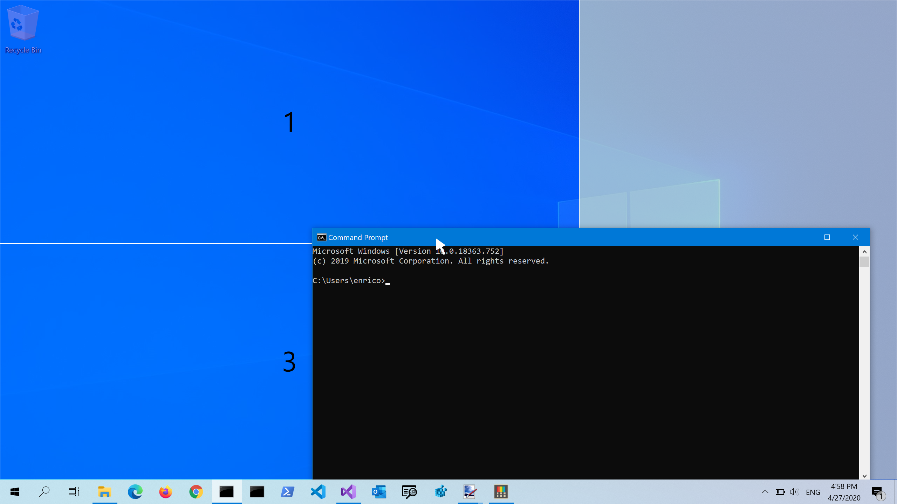
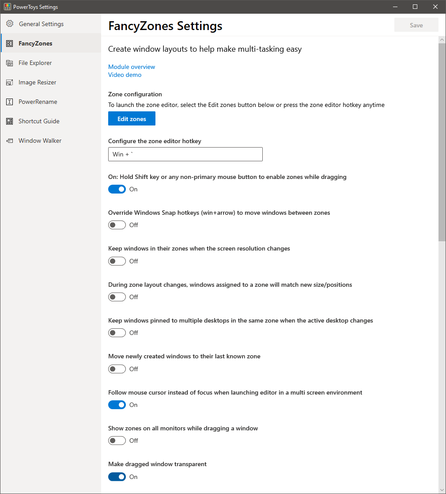
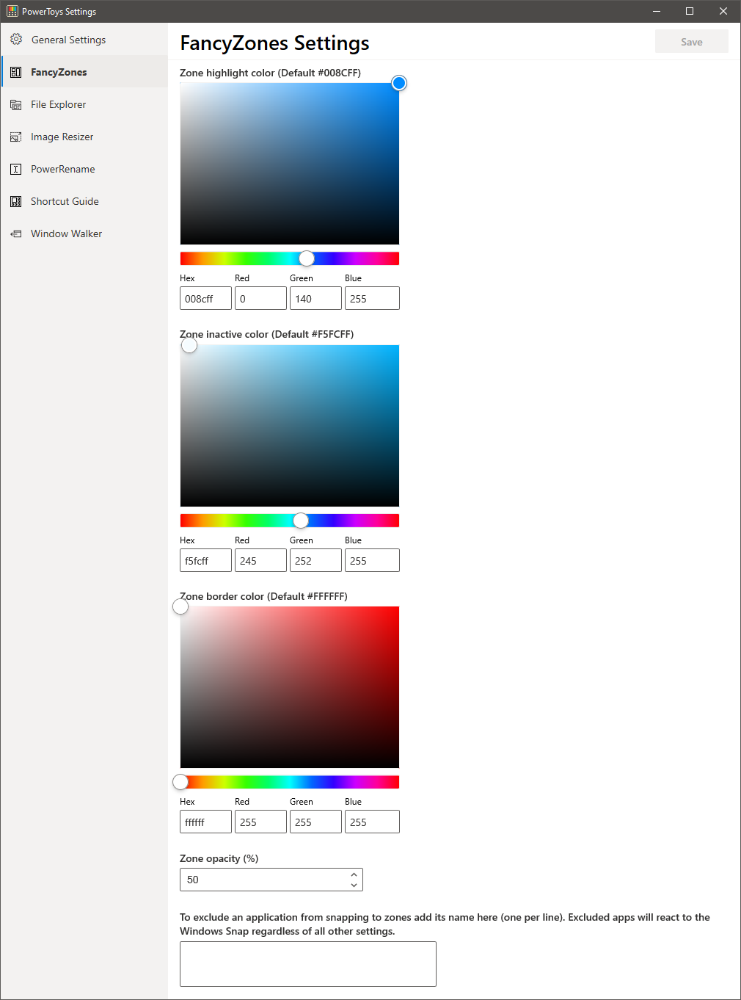

# Overview
FancyZones is a window manager that is designed to make it easy to arrange and snap windows into efficient layouts for your workflow and also to restore these layouts quickly.  FancyZones allows the user to define a set of window locations for a desktop that are drag targets for windows.  When the user drags a window into a zone, the window is resized and repositioned to fill that zone.  

To get started with FancyZones, you need to enable the utility in PowerToys settings and then invoke the FancyZones editor UI.  
There is a button in settings to invoke the editor, or you can press <code>Win+&grave;</code> (note that this shortcut can be changed in the settings dialog) to launch it.  
If you have multiple monitors, to edit the zone settings on each monitor, move the mouse to the desired monitor and then press <code>Win+&grave;</code> to launch the editor UI for that monitor, or move the PowerToys settings window to the desired monitor and then launch the editor UI using the `Edit zones` button.  

When first launched, the UI presents a list of zone layouts that can be quickly adjusted by how many windows are on the monitor.  Choosing a layout shows a preview of that layout on the monitor.  Pressing the save and close button sets that layout to the monitor.  

The editor also supports creating and saving custom layouts.  This functionality is in the `Custom` tab in the editor UI.  
There are two ways to create custom zone layouts, window layout and table layout.  These can also be thought of as additive and subtractive models.  
The additive window layout model starts with a blank layout and supports adding zones that can be dragged and resized similar to windows.  

The subtractive table layout model starts with a table layout and allows zones to be created by splitting and merging zones and then resizing the gutter between zones.  
To merge two zone, press and hold the left mouse button and drag the mouse until a second zone is selected, then release the button and a popup menu will show up.

The backlog for the utility can be found [here](https://github.com/Microsoft/PowerToys/tree/master/doc/planning/FancyZonesBacklog.md) and the source code is [here](https://github.com/Microsoft/PowerToys/tree/master/src/modules/fancyzones).

# Snapping a window to two zones (EXPERIMENTAL)

If two zones are adjacent, a window can be snapped to the sum of their area (rounded to the minimum rectangle that contains both). When the mouse cursor in near the common edge of two zones, both zones are activated simultaneously, allowing to drop the window on both.  
**NOTE:** when snapping a window to two zones, restoring the window when the app is restarted is not supported yet.

# Shortcut Keys
| Shortcut      | Action |
| ----------- | ----------- |
| Win + `      | Launches editor (this shortcut is editable in the settings dialog)       |
| Win+Left/Right Arrow | Move focused window between zones (only if `Override Windows Snap hotkeys` setting is turned on, in that case only the `Win+Left Arrow` and `Win+Right Arrow` are overridden, while the `Win+Up Arrow` and `Win+Down Arrow` keep working as usual)  |

FancyZones doesn't override the Windows 10 `Win+Shift+Arrow` to quickly move a window to an adjacent monitor.

# Settings
| Setting | Description |
| --------- | ------------- |
| Configure the zone editor hotkey | To change the default hotkey, click on the textbox (it's not necessary to select or delete the text) and then press on the keyboard the desired key combination |
| Enable zones while dragging with the shift key | Toggles between auto-snap mode with the shift key disabling snapping during a drag and manual snap mode where pressing the shift key during a drag enables snapping |
| Override Windows Snap hotkeys (Win+Arrow) to move between zones | When this option is on and FancyZones is running, it overrides two Windows Snap keys: `Win+Left Arrow` and `Win+Right Arrow` |
| Keep windows in their zones when the screen resolution changes | After a screen resolution change, if this setting is enabled, FancyZones will resize and reposition windows into the zones they were previously in |
| Keep windows in their zones when the active FancyZones layout changes | When this option is on, FancyZones will resize and position windows into the new zone layout by maintaining the previous zone number location of each window |
| Keep windows in their zones when the active virtual desktop changes | If an application is pinned to all virtual desktops, this setting will keep that window in the same zone on all desktops |
| Move newly created windows to the last known zone | Automatically move a newly opened window into the last zone location that application was in |
| Follow mouse cursor instead of focus when launching editor in a multi-monitor  environment | When this option is on, the editor hotkey will launch the editor on the monitor where the mouse cursor is, when this option is off, the editor hotkey will launch the editor on monitor where the current active window is  |
| Show zones on all monitors while dragging a window | By default FancyZones shows only the zones available on the current monitor, this feature may have performance impact when turned on |
| Show zones on all monitors while dragging a window | When the zones are activated, the dragged window is made transparent to improve the zones visibility |
| Zone highlight color (Default #008CFF) | The color that a zone becomes when it is the active drop target during a window drag |
| Zone Inactive color (Default #F5FCFF) | The color that zones become when they are not an active drop during a window drag |
| Zone border color (Default #FFFFFF) | The color of the border of active and inactive zones |
| Zone opacity (%) (Default 50%) | The percentage of opacity of active and inactive zones |
| Exclude applications from snapping to zones | Add the applications name, or part of the name, one per line (e.g., adding `Notepad` will match both `Notepad.exe` and `Notepad++.exe`, to match only `Notepad.exe` add the `.exe` extension) | 

