# GIF Maker

## Animated GIF Recorder

PM: [Emma Gray](https://github.com/em-gray)
Devs: [Armianto Sumitro](https://github.com/armiantos), [Nancy Zhao](https://github.com/zhaonancy)

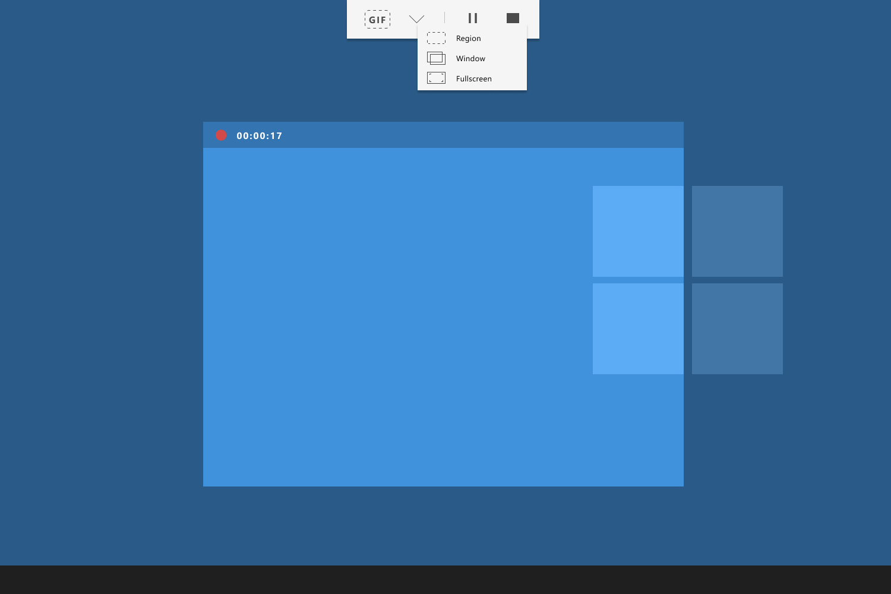

Code merge is still in progress from `interns/users/t-arsumi/dev-animated-gif/dragonsden` to `interns/dev-animated-gif`

### Getting Started

1. Open `PowerToys.sln` at the root of this repo
2. Navigate to `modules/AnimatedGIFRecorder` 
3. Set AnimatedGIFRecorder as Startup Project 

    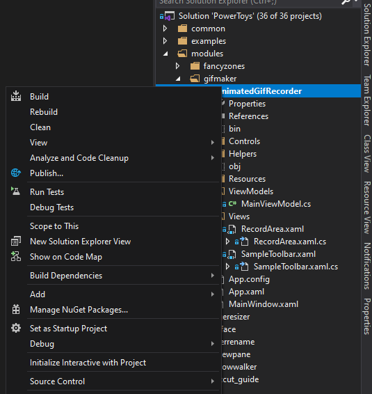

4. Hit `F5` (or `Ctrl + F5` ) to start the program

### Contents

1. [Scenario Description](#scenario-description)
2. [Solution Overview](#solution-overview)
3. [Requirements](docs/requirements.md)
4. [Next Steps](docs/nextsteps.md)
5. [Appendix](docs/appendix.md)

### Scenario Description

#### Elevator Pitch

As the digital communication landscape becomes more and more visual, GIFs have emerged as key tools in design, development, and conversation. However, current methods for creating custom GIFs can be counterintuitive, time-consuming, or just too feature-heavy for basic everyday use.
Drawing inspiration from the Windows Snip & Sketch tool, we aim to create a streamlined tool that builds on existing user intuition to provide a clean, accessible, and easy-to-learn screen GIF capture experience. 

Success for this hackathon was defined as the completion of a functional proof-of-concept, a UX overview with useful insights, and clear next steps for the PowerToys team to finish implementation of the project.

#### Problem Statement and User Profiles

Users want a lightweight, intuitive GIF screen capture solution for basic everyday use. We defined three user profiles that allowed us to break our problem into several target project features.

| User         | Uses GIFS for                                                                                | Wants                                                                                                                                                   | Notes                                                                                                                                                                                                                           | Quote                                                                                                                                                                                                                                                                                                                        |
| ------------ | -------------------------------------------------------------------------------------------- | ------------------------------------------------------------------------------------------------------------------------------------------------------- | ------------------------------------------------------------------------------------------------------------------------------------------------------------------------------------------------------------------------------- | ---------------------------------------------------------------------------------------------------------------------------------------------------------------------------------------------------------------------------------------------------------------------------------------------------------------------------- |
| Meme Master  | Comedy and quick sharing on social media and in group chats.                                 | - Speed   - Ease-of-access   - Custom region capture                                                                                            | This user would benefit from direct-to-clipboard exports, keyboard shortcut to launch, and the default region capture mode.                                                                                                     | *“I'm mainly thinking about using the GIF for sharing on Twitter - so a size that's good for sharing…”* ([Source](https://github.com/microsoft/PowerToys/issues/143))                                                                                                                                                          |
| Designer     | Uses GIFs to communicate user experience flows and as design elements along with other media | - Regional capture accuracy   - Ability to adjust parameters that affect file size   - Control over gif “smoothness”   - Fine editing tools | This user would benefit from finer editing tools and a capture region that snaps to window or frame edges for cleaner margins.   Control over compression options and frames-per-second of the capture would be beneficial. | *“The main technical challenge is keeping them below the file size limitations of each social media platform”    "It's really fun to make a two-second animation that plays infinitely and looks like it's different at every loop."* ([Source](https://www.creativebloq.com/advice/the-ultimate-guide-to-gif-design)) |
| Developer/PM | Demonstrating workflows, features, bugs; easily add to demo slides                           | - Start/finish editing capabilities   - Pause button to record key steps of longer processes                                                        | Fullscreen capture for workflows could be useful, as could editing tools to trim useless frames off the start/finish of a capture                                                                                               | *“I love the idea of this PowerToy. It's something I've wanted in the Snipping Tool for ages. My use case would be recording software interactions for the purpose of making tickets or training etc.”* ([Source](https://github.com/microsoft/PowerToys/issues/143))                                                          |

*Target user personas and priorities.*

For our product, we hypothesize that customers will expect a tool that is:

- Easy-to-access
- Seamlessly integrated in shell
- Free from the bulkier features of existing solutions

#### Existing Solutions

Currently, users have several options to generate GIFs from the contents of their screens. 

##### [ScreenToGif](https://www.screentogif.com/)

Comments from Power Users, Garage Interns and developers on the Snip & Sketch team point to ScreenToGif being the most widely acclaimed open-source solution for easy screen capture. ScreenToGif offers selection of dimension, frames per second, three ways to record (screen, webcam, sketch board), exporting as GIF/video/project to edit later. ScreenToGif additionally offers an editor, with features including crop, resize, add watermarks/text, and setting transitions.

##### [ShareX](https://getsharex.com/)

ShareX is another open source platform that allows users to capture GIFs from regions of their screens, as well as videos a standa screenshots -- it has been noted by users that ShareX's wide array of features (including Optical Character Recognition, a QR code scanner, and more advanced editing tools) often offers more functionality than is needed for simple GIF capture tasks where a standalone solutoin would be preferred. Another comment noted difficulty with setup ([source](https://github.com/microsoft/PowerToys/issues/143)).

##### Multi-step Local → Web Pipeline

The most time-consuming approach to capturing GIFs from on-screen content involves making use of more widely-available screen video capture tools ([QuickTime](https://quicktime.en.softonic.com/), [Xbox Game Bar](https://www.microsoft.com/en-ca/p/xbox-game-bar/9nzkpstsnw4p?activetab=pivot:overviewtab), and [Debut Screen Recorder](https://www.nchsoftware.com/capture/index.html?theme=screen&msclkid=cb17509fad471a956a840e220caf34ef), to name a few), and then using websites like [Online Video to GIF Converter](https://www.media.io/gif-maker.html) to convert these videos into GIFs.

Other than the general drawback of increased effort and time required form the user, GIF conversion sites are often full of advertisements that disrupt the user's process by mimicking the on-site “download” buttons, which can lead to the opening of unwelcome pop-up windows. Having to download standalone video capture software in addition to using a web client represents yet another step required by the user to set up this pipeline.

### Solution Overview

#### Hackathon Summary

Under the time constraints of project, we focused on the simplest use case which involves capturing a region drawn by a user, hitting “start”,  and then exporting the GIF to the “Pictures” folder and copying it to the user’s clipboard upon completion, when the user hits the “stop” button. The application exits on hitting the escape key or stopping recording.
Further development is required for editing features, UI aesthetics (to make it fit more closely with the look-feel of the rest of the PowerToys Suite), and full screen and window-specific capture.

#### User Experience

Below is a fully-fledged user flow with all screen capture options (region, window, full screen), and a table outlining a stage-by-stage standard use case with associated UI. 

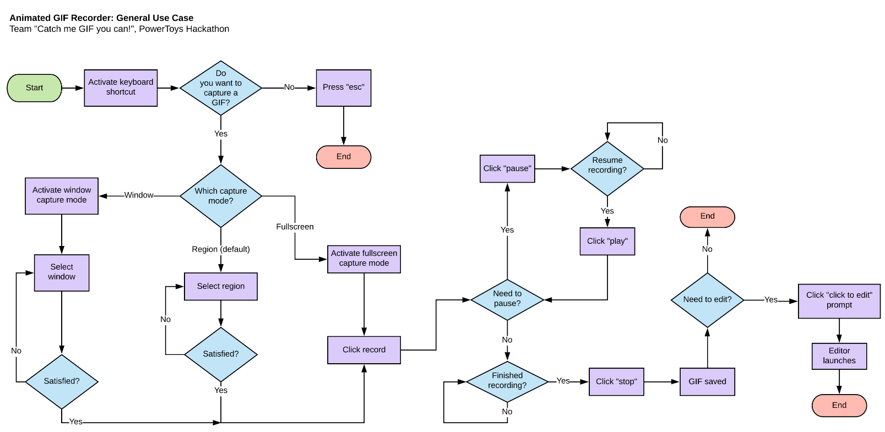

*User experience flow diagram for a general use case.*

| Interface                                                    | Stage                                                                                                                                                                                                                                                                            |
| ------------------------------------------------------------ | -------------------------------------------------------------------------------------------------------------------------------------------------------------------------------------------------------------------------------------------------------------------------------- |
| 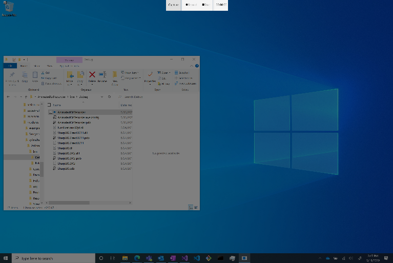          | Stage 1: User accesses tool via keyboard shortcut, the screen darkens, and a toolbar appears. “Record” and “stop” buttons are disabled.   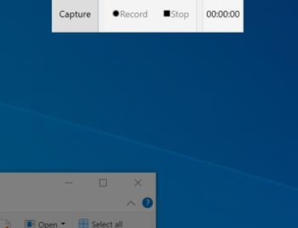                                                                |
| 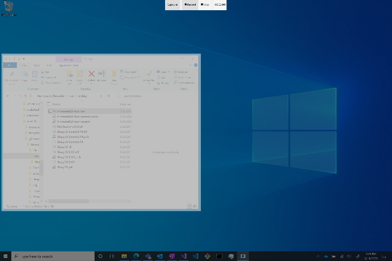 | Stage 2: The user defines a rectangular region for capture by dragging & dropping on a diagonal. This enables the “record” button.   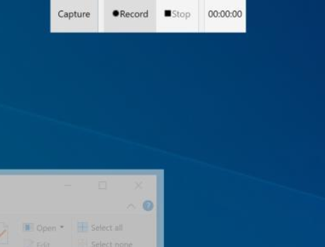                                                            |
| 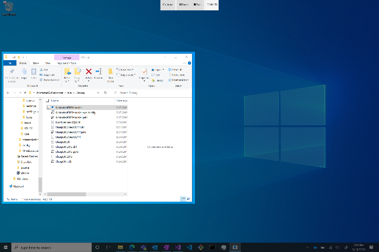        | Stage 3: The user presses “record”, and the toolbar “record” button changes to say “pause”. The “stop” button is now enabled.   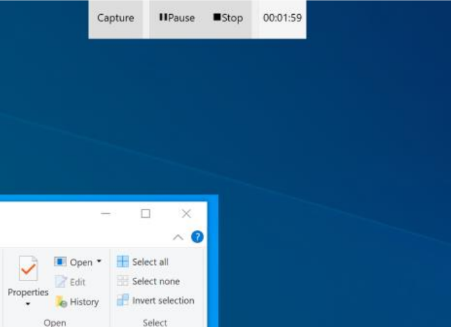                                                                        |
| 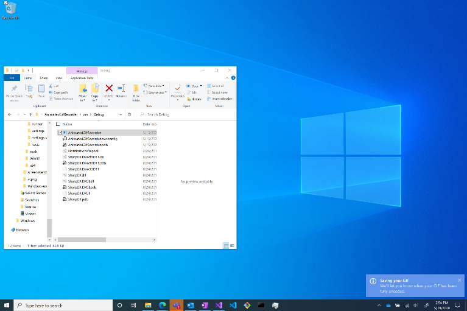   | Stage 4: After the user selects the “stop” button, the toolbar and translucent screen overlay vanish. A “Saving your GIF” notification appears to inform the user that their GIF is processing.   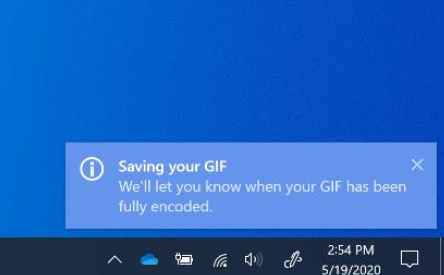 |
| 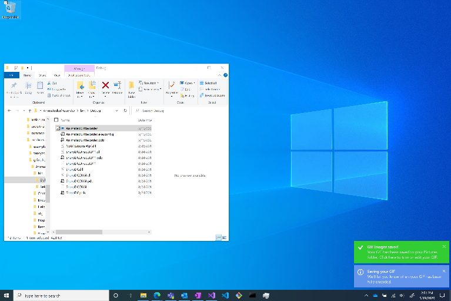    | Stage 5: GIF image save confirmation appears, with the option to navigate to the editor for further customization.   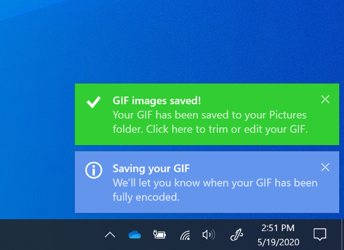                                                                               |

*Step-by-step user interface.*

#### Technical Summary

The GIF format is put simply a sequence of images with a given delay metadata added on each frame. The open source project, ScreenToGif, has been a go-to-app for enthusiasts that want this capability, so we based our back-end implementation off this project. We’re shipping our product with DirectX Desktop Duplication engine instead of Native BitBLT (default in ScreenToGif) for better performance. The app itself is multithreaded in all UI, saving and capturing. 

To achieve the dark overlay UI, we had to go with a WPF application as opposed to UWP. UWP does have Windows.Graphics.Capture API which offers the same functionality with less code; however, it is much more difficult to create the transparent overlay across multiple monitors. Working with open source code also means we can contribute back to community.

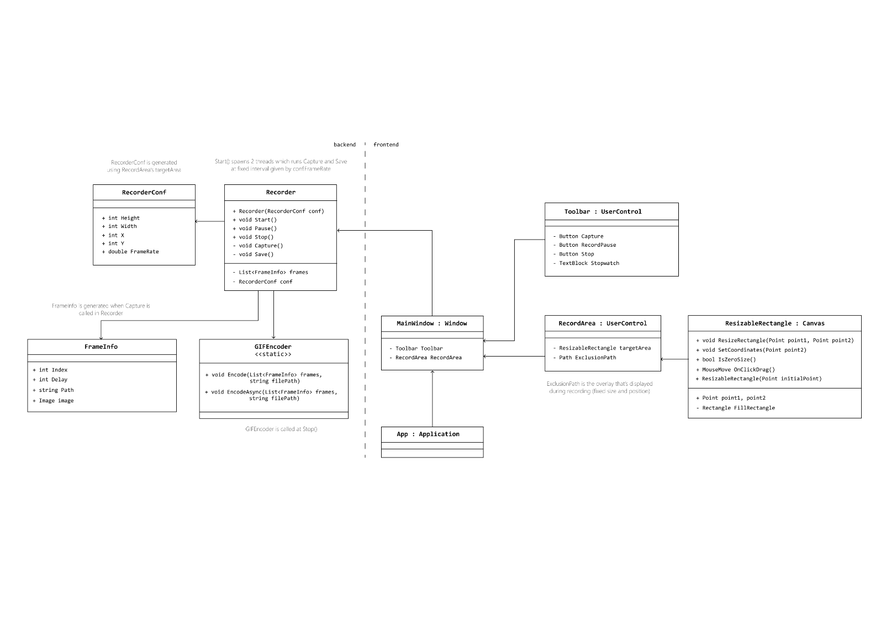

*Class diagrams. Original file can be found in in [SharePoint](https://microsoft.sharepoint.com/:i:/t/GarageInternship/EWVke5x7YiJJrlxC3YAyi8gBQKXNbnN3k624EXlobvfUtg?e=edIIuc).*
