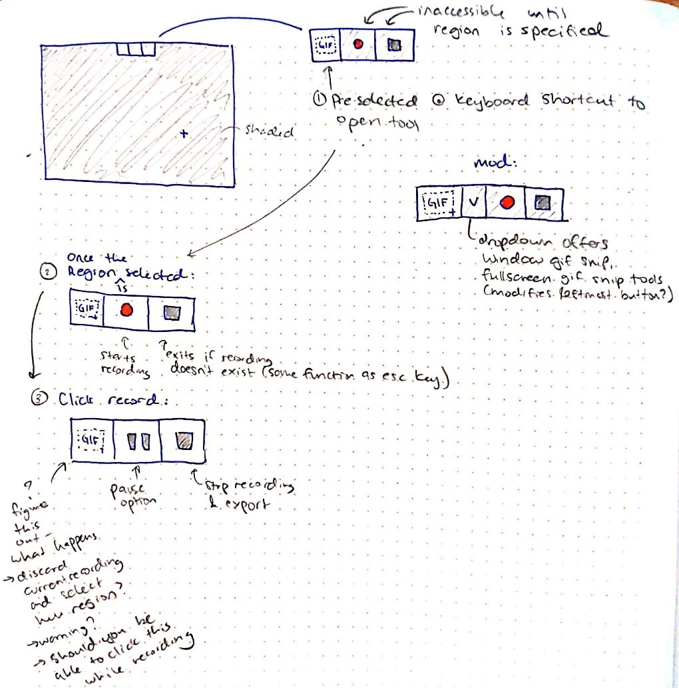
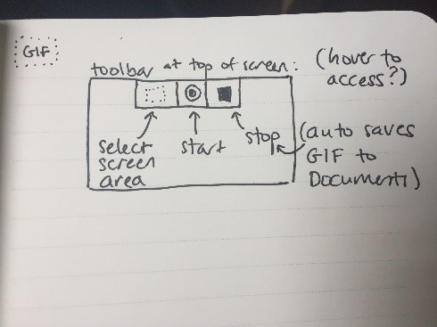
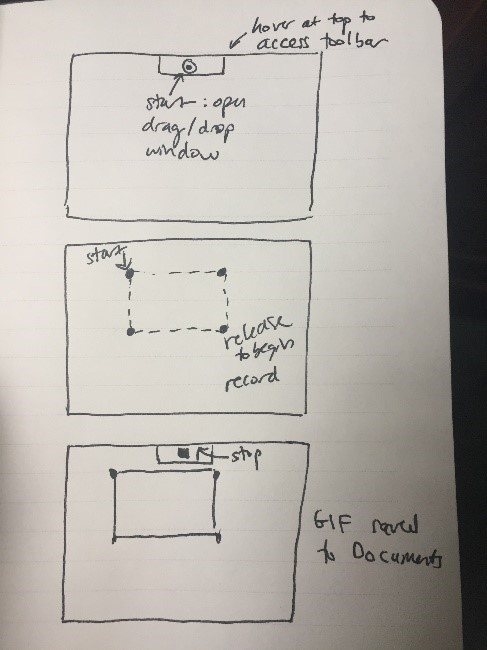
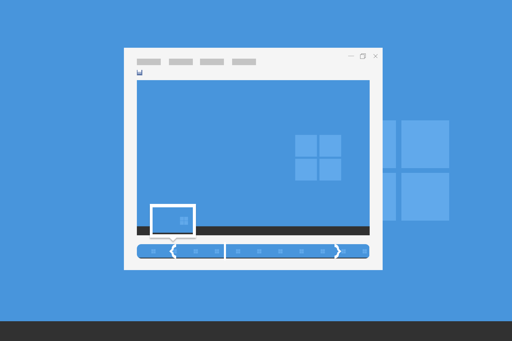
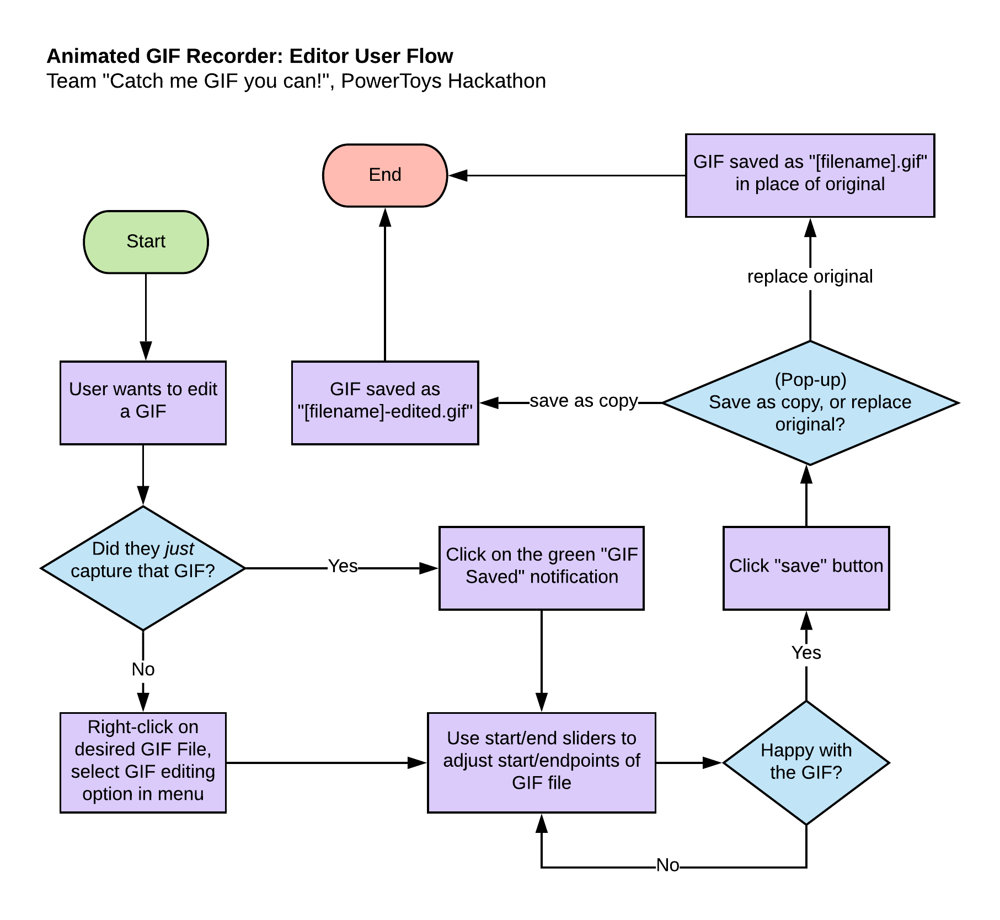

# GIF Maker

## Animated GIF Recorder

PM: [Emma Gray](https://github.com/em-gray)
Devs: [Armianto Sumitro](https://github.com/armiantos), [Nancy Zhao](https://github.com/zhaonancy)

### Appendix

#### A: Project Timeline

| Milestone/ Deliverable   | Date      | Status / Comments                                                                                                    |
| ------------------------ | --------- | -------------------------------------------------------------------------------------------------------------------- |
| Project Kick-Off         | 5/6/2020  | Compete                                                                                                              |
| Week 1 Demo              | 5/9/2020  | Complete / With user experience overview, video demo of planned functionality                                        |
| Functional Prototype     | 5/13/2020 | Complete                                                                                                             |
| UX Overview              | 5/13/2020 | Complete / With input from Snip & Sketch team                                                                        |
| Dragons Den Pitch        | 5/15/2020 | Complete / With 30 second introduction video and functional prototype demonstration with significant UI improvements |
| Final Report/Handoff Doc | 5/19/2020 | Complete                                                                                                             |

*Timeline of events from the PowerToys Hackathon*

#### B: Assorted Sketches from OneNote

## C: Animated GIF Editor

*GIF Editor mockup.*

Basic capability to specify start and end frames of an existing GIF. Sampled frames are to be shown to visualize the GIF timeline. A user should be able to bring up this window via the “GIF Saved” notification, or a right-click on any GIF file. 
Being able to trim the start/end points should be sufficient for an initial iteration.

*GIF Editor user flow*
