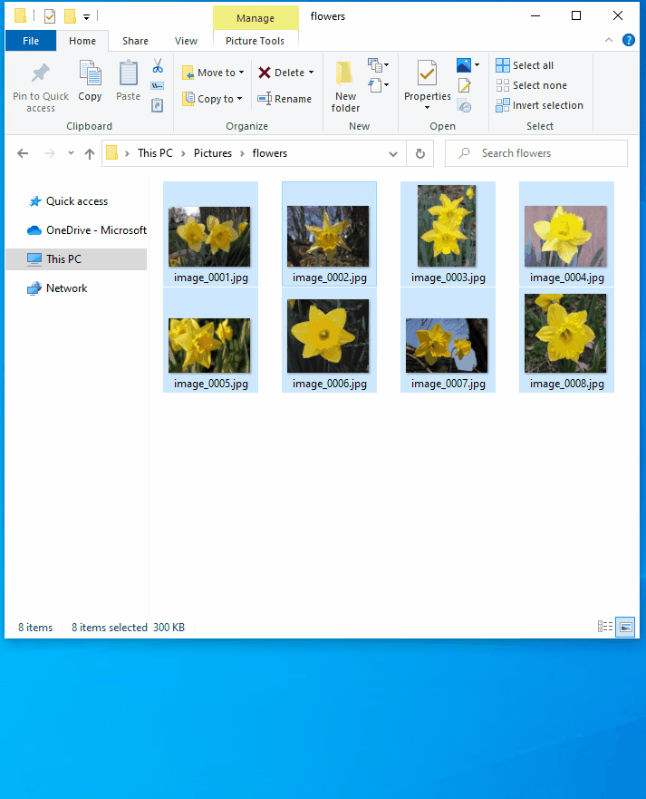
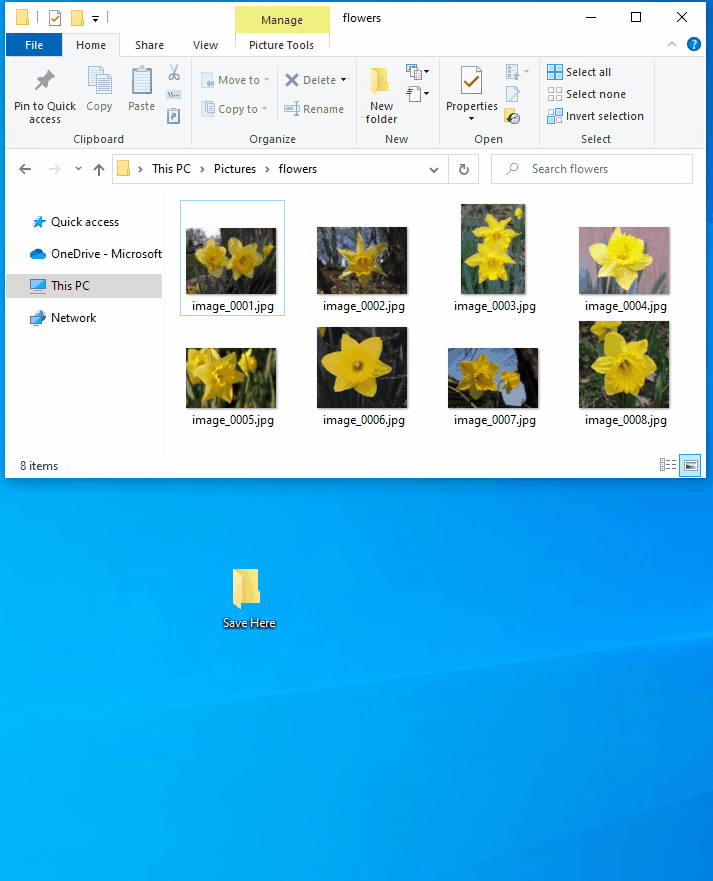
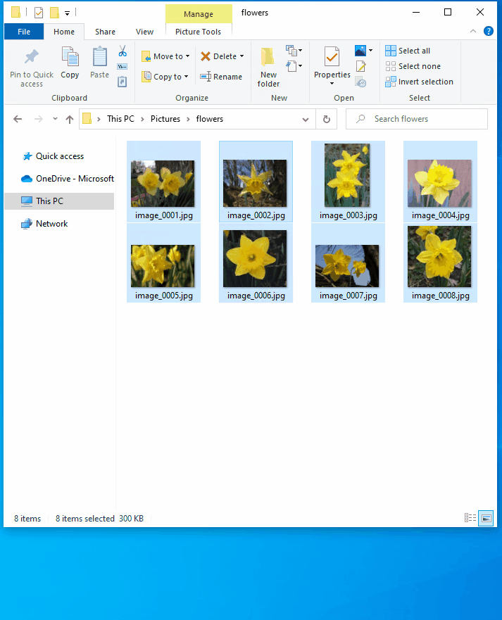

# Image Resizer
> A Windows Shell Extension for bulk image resizing

[**Overview**](#overview) · 
[**Settings**](#settings)

## Overview
Image Resizer is a windows shell extension for bulk image resizing. After installing PowerToys, right-click on one or more selected image files in File Explorer, and then select _Resize pictures_ from the menu.

Image Resizer also allows you to resize images by dragging and dropping your selected files with the right mouse button. This allows you to save your resized pictures in another folder.

## Settings

Image Resizer allows the user to configure the following settings:

### Sizes
The user can add new preset sizes. Each size can be configured as Fill, Fit or Stretch. The dimension to be used for resizing can also be configured as Centimeters, Inches, Percent and Pixels.

### Encoding
The user can change the fallback encoder and modify PNG, JPEG and TIFF settings.

### File
The user can modify the format of the file name of the resized image. They can also choose to retain the original _last modified_ date on the resized image.