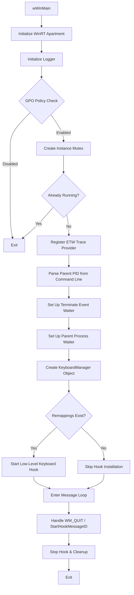
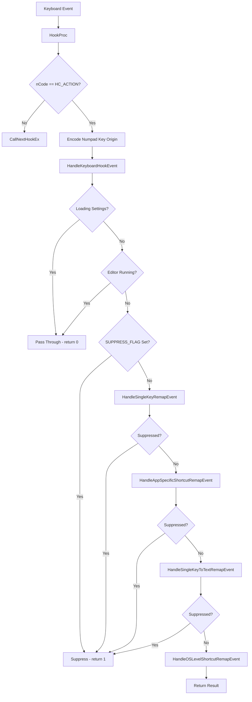

# KeyboardManagerEngine

The **KeyboardManagerEngine** is the background process component of PowerToys' Keyboard Manager module. It intercepts keyboard input at the system level using Windows low-level keyboard hooks, applies user-configured remappings, and sends the remapped input back to the system.

## Table of Contents

- [Architecture Overview](#architecture-overview)
- [Startup Flow](#startup-flow)
- [Core Classes](#core-classes)
- [Hook Processing Pipeline](#hook-processing-pipeline)
- [Remapping Data Structures](#remapping-data-structures)
- [Settings and Configuration](#settings-and-configuration)
- [IPC and Communication](#ipc-and-communication)
- [Special Handling and Edge Cases](#special-handling-and-edge-cases)
- [Further Reading](#further-reading)

---

## Architecture Overview

The Keyboard Manager module is split into several projects, each with a distinct responsibility:

```
src/modules/keyboardmanager/
├── KeyboardManagerEngine/         # Standalone EXE entry point
├── KeyboardManagerEngineLibrary/  # Core remapping logic, hook management, state
├── common/                        # Shared utilities, data structures, helpers
├── dll/                           # PowerToys module DLL interface for runner
├── KeyboardManagerEditor/         # UI for configuring remappings
└── KeyboardManagerEditorLibrary/  # UI logic library
```

| Component | Purpose |
|-----------|---------|
| **KeyboardManagerEngine** | Entry point executable (`main.cpp`). Handles process lifecycle, message loop, and coordinates with the runner. |
| **KeyboardManagerEngineLibrary** | Contains `KeyboardManager` class for hook installation, `KeyboardEventHandlers` for remapping logic, and `State` for runtime state. |
| **common** | Shared data structures (`Shortcut`, `MappingConfiguration`, `RemapShortcut`), utilities, and constants used across engine and editor. |
| **dll** | Implements `PowertoyModuleIface` to integrate with the PowerToys runner. Launches/terminates the engine process. |

---

## Startup Flow

The engine starts in `wWinMain()` located in [main.cpp](main.cpp). Here's the initialization sequence:



### Key Initialization Steps

1. **WinRT Initialization**: Calls `winrt::init_apartment()` for COM apartment setup.

2. **GPO Policy Check**: Respects Group Policy settings. If Keyboard Manager is disabled via GPO, the engine exits immediately.

3. **Instance Mutex**: Creates `PowerToys_KBMEngine_InstanceMutex` to prevent multiple engine instances from running simultaneously.

4. **Parent Process Monitoring**: Receives the runner's PID via command line. Sets up a `ProcessWaiter` to automatically exit when the parent process terminates.

5. **Terminate Event**: Listens for `PowerToys_KeyboardManager_Terminate_Event_Name` to handle graceful shutdown requests from the runner.

6. **KeyboardManager Creation**: Instantiates the core `KeyboardManager` object, which:
   - Loads settings from JSON configuration
   - Sets up a file change watcher for settings updates
   - Creates a handle to detect when the editor UI is running

7. **Hook Installation**: If remappings are configured, installs the low-level keyboard hook via `SetWindowsHookEx`.

8. **Message Loop**: Runs a standard Windows message loop, processing `WM_QUIT` and custom `StartHookMessageID` messages.

---

## Core Classes

### KeyboardManager (KeyboardManagerEngineLibrary)

The central class that manages the low-level keyboard hook and coordinates remapping.

**Responsibilities:**
- Installs/removes the keyboard hook via `SetWindowsHookEx(WH_KEYBOARD_LL, ...)`
- Provides the static `HookProc` callback that receives all keyboard events
- Dispatches events to `KeyboardEventHandlers` for processing
- Loads settings on construction and reloads when settings change
- Suspends remapping when the editor UI is running

**Key Methods:**
```cpp
void StartHook();
void StopHook();
static LRESULT CALLBACK HookProc(int nCode, WPARAM wParam, LPARAM lParam);
intptr_t HandleKeyboardHookEvent(LowlevelKeyboardEvent* data) noexcept;
```

### State (KeyboardManagerEngineLibrary)

Extends `MappingConfiguration` with runtime state for remapping operations.

**Key Methods:**
```cpp
bool CheckShortcutRemapInvoked(const std::optional<std::wstring>& appName);
std::optional<KeyShortcutTextUnion> GetSingleKeyRemap(DWORD key);
std::optional<std::wstring> GetSingleKeyToTextRemap(DWORD key);
void SetCurrentlyRemappingApp(const std::optional<std::wstring>& appName);
```

### MappingConfiguration (common)

Stores all remap tables and handles JSON configuration loading/saving.

**Remap Tables:**
- `singleKeyReMap` — Key-to-key or key-to-shortcut remaps
- `singleKeyToTextReMap` — Key-to-Unicode-text remaps
- `osLevelShortcutReMap` — Global shortcut remaps
- `appSpecificShortcutReMap` — Per-application shortcut remaps

### Shortcut (common)

Represents a keyboard shortcut with modifiers and an action key.

**Structure:**
```cpp
class Shortcut {
    ModifierKey winKey;      // Windows key state
    ModifierKey ctrlKey;     // Ctrl key state
    ModifierKey altKey;      // Alt key state
    ModifierKey shiftKey;    // Shift key state
    DWORD actionKey;         // Non-modifier key (e.g., 'A', F1, etc.)
    DWORD secondKey;         // For chord sequences
};
```

**Features:**
- Supports left/right/both modifier variants
- Supports two-key chord sequences
- Special operations: `Shortcut::DisableKey`, `Shortcut::CreateRunProgramObject()`
- Keyboard state validation methods

### RemapShortcut (common)

Wraps a target shortcut/key with runtime state flags.

**Key Fields:**
```cpp
struct RemapShortcut {
    KeyShortcutTextUnion targetShortcut;  // The remapped target
    bool isShortcutInvoked;               // Whether remap is currently active
    ModifierKey winKeyInvoked;            // Tracks invoked modifier state
    // ... other modifier tracking fields
};
```

---

## Hook Processing Pipeline

When a keyboard event occurs, it flows through the following pipeline:



### Processing Priority

Events are processed in this order (highest priority first):

1. **Single Key Remaps** — Direct key-to-key or key-to-shortcut mappings
2. **App-Specific Shortcut Remaps** — Shortcuts that only apply to specific applications
3. **Single Key to Text Remaps** — Key-to-Unicode-string mappings
4. **OS-Level Shortcut Remaps** — Global shortcut remappings

Each handler returns whether the event should be suppressed (consumed) or passed through.

### Event Handlers (KeyboardEventHandlers.cpp)

| Handler | Purpose |
|---------|---------|
| `HandleSingleKeyRemapEvent` | Processes key-to-key and key-to-shortcut remaps |
| `HandleAppSpecificShortcutRemapEvent` | Handles per-application shortcut remaps based on foreground window |
| `HandleSingleKeyToTextRemapEvent` | Converts key presses to Unicode text output |
| `HandleOSLevelShortcutRemapEvent` | Processes global shortcut remappings |

---

## Remapping Data Structures

```cpp
// Single key remaps: virtual key code → target (key, shortcut, or text)
using SingleKeyRemapTable = std::unordered_map<DWORD, KeyShortcutTextUnion>;

// Shortcut remaps: source shortcut → RemapShortcut (target + state)
using ShortcutRemapTable = std::map<Shortcut, RemapShortcut>;

// App-specific: lowercase app name → ShortcutRemapTable
using AppSpecificShortcutRemapTable = std::map<std::wstring, ShortcutRemapTable>;

// Union type for remap targets
using KeyShortcutTextUnion = std::variant<DWORD, Shortcut, std::wstring>;
```

### Remap Types Supported

| Type | Description | Example |
|------|-------------|---------|
| Key → Key | Remap one key to another | CapsLock → Escape |
| Key → Shortcut | Remap key to key combination | F12 → Ctrl+Shift+I |
| Key → Text | Remap key to Unicode string | F5 → "Hello World" |
| Shortcut → Shortcut | Remap shortcut to another | Alt+Tab → Win+Tab |
| Shortcut → Key | Remap shortcut to single key | Ctrl+A → Home |
| App-Specific | Any of above, for specific app | Ctrl+W → Ctrl+F4 (in notepad) |

---

## Settings and Configuration

### Configuration Files

Settings are stored in the PowerToys settings directory:

```
%LOCALAPPDATA%\Microsoft\PowerToys\Keyboard Manager\
├── settings.json          # Active configuration name, profile list
└── default.json           # Actual remapping definitions (or named profile)
```

### JSON Format

**settings.json:**
```json
{
    "properties": {
        "activeConfiguration": {
            "value": "default"
        },
        "keyboardConfigurations": {
            "value": ["default"]
        }
    }
}
```

**default.json:**
```json
{
    "remapKeys": {
        "inProcess": [
            {
                "originalKeys": "20",
                "newRemapKeys": "27"
            }
        ]
    },
    "remapKeysToText": {
        "inProcess": [
            {
                "originalKeys": "116",
                "newRemapString": "Hello World"
            }
        ]
    },
    "remapShortcuts": {
        "global": [
            {
                "originalKeys": "164;9",
                "newRemapKeys": "91;9"
            }
        ],
        "appSpecific": [
            {
                "originalKeys": "162;87",
                "newRemapKeys": "162;115",
                "targetApp": "notepad"
            }
        ]
    }
}
```

### Settings Change Detection

- The engine watches for the named event `PowerToys_KeyboardManager_Event_Settings`
- When signaled, settings are reloaded from disk
- Hook is dynamically started/stopped based on whether remappings exist

---

## IPC and Communication

| Mechanism | Event/Resource Name | Purpose |
|-----------|---------------------|---------|
| **Terminate Event** | `PowerToys_KeyboardManager_Terminate_Event_Name` | Runner signals engine to shut down |
| **Settings Event** | `PowerToys_KeyboardManager_Event_Settings` | Signals configuration file changes |
| **Editor Event** | `KeyboardManager_EditorRunning` | Indicates editor UI is active (suspends remapping) |
| **Instance Mutex** | `PowerToys_KBMEngine_InstanceMutex` | Prevents multiple engine instances |
| **Parent PID** | Command line argument | Engine exits when parent (runner) terminates |

### Runner Integration (dll/dllmain.cpp)

The DLL implements `PowertoyModuleIface`:

- **`enable()`**: Launches `KeyboardManagerEngine.exe` with runner PID as argument
- **`disable()`**: Sets terminate event, waits for process exit, then force-terminates if needed
- Sets engine process priority to `ABOVE_NORMAL_PRIORITY_CLASS` for responsive input handling

---

## Special Handling and Edge Cases

| Scenario | Solution |
|----------|----------|
| **Extended Keys** (arrows, Home, End, etc.) | Sets `KEYEVENTF_EXTENDEDKEY` flag in `SendInput` |
| **Scan Codes** | Uses `MapVirtualKey` to compute correct scan codes |
| **Dummy Key Events** | Sends placeholder keys to prevent unintended Start Menu or Alt+Menu activation |
| **Num Lock Suppression** | Toggles back to previous state when Num Lock is suppressed |
| **Japanese IME Keyboards** | Resets modifier state to avoid Caps Lock conflicts |
| **Full-Screen UWP Apps** | Uses `GetGUIThreadInfo` for correct foreground process detection |
| **Injected Events** | Skips remapping for events already flagged as injected |

---

## Further Reading

For more detailed documentation, see:

- [Module Architecture](../../../doc/devdocs/modules/keyboardmanager/keyboardmanager-architecture-deep-dive.md) — Comprehensive architecture deep-dive
- [Remapping Logic](../../../doc/devdocs/modules/keyboardmanager/keyboardmanager-remapping-logic.md) — Detailed remapping implementation
- [Common Library](../../../doc/devdocs/modules/keyboardmanager/keyboardmanager-common-library.md) — Shared utilities and data structures
- [Editor Documentation](../../../doc/devdocs/modules/keyboardmanager/keyboardmanager-editor.md) — UI component documentation
- [Debugging Guide](../../../doc/devdocs/modules/keyboardmanager/keyboardmanager-debugging.md) — Tips for debugging the engine
