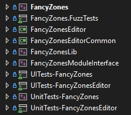

# Markdown Preview - Local Images Test

This file tests the local image rendering feature of the PowerToys Markdown preview handler.

## Expected Behavior

| Setting State | Local Images | Remote Images | Info Bar |
|---------------|-------------|---------------|----------|
| Toggle OFF | Blocked | Blocked | "Some pictures have been blocked..." |
| Toggle ON | Shown | Blocked | "Some online images have been blocked..." |
| GPO Enabled | Shown | Blocked | "Some online images have been blocked..." |
| GPO Disabled | Blocked | Blocked | "Some pictures have been blocked..." |

## Local Image (relative path)

This image should render when "Show local images" is enabled:

## Local Image (HTML img tag)

## Remote Image (should always be blocked)

This image should never render (online URL):

## UNC Path Image (for network testing)

When the markdown file is on a network share, the following would render:

<!-- Uncomment and adjust for your network environment:

-->

Note: UNC images are allowed when:
- The markdown file itself is on a UNC share, AND
- The image is on the same share root (e.g., same `\\server\share\`)

## Path Traversal (should always be blocked)

This attempts to escape the document directory and should be blocked:

