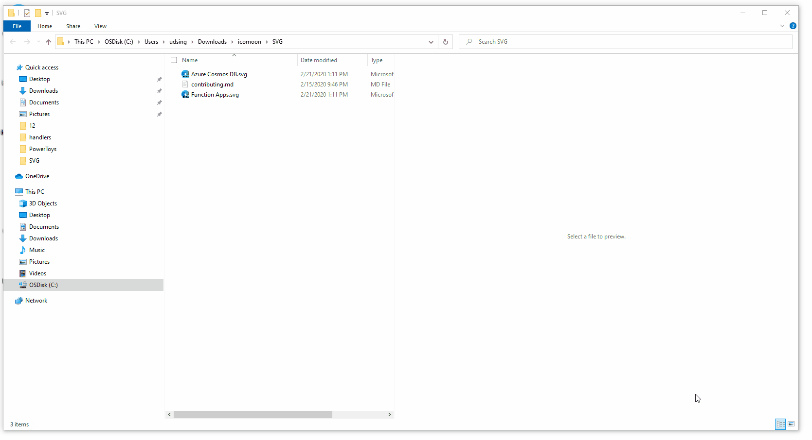
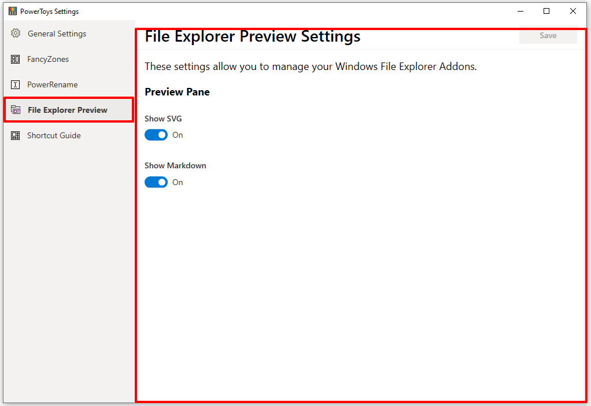
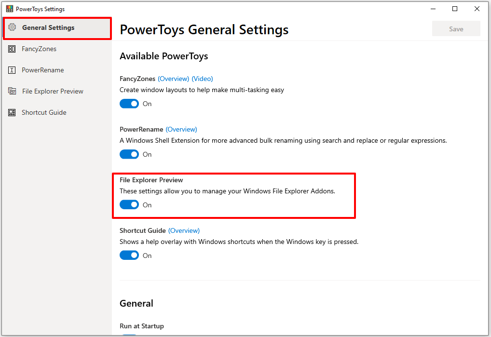

# File Explorer

File Explorer add-ons, right now are just limited to Preview Pane additions for File Explorer.


## Preview Pane

Preview Pane is an existing feature in the File Explorer which shows a lightweight, rich, read-only preview of the file's contents in the view's reading pane. To enable it, you just click the View tab in the ribbon and then click `Preview Pane`. Below is an example of Markdown and Svg files previews in File Explorer with PowerToys.



> Adding Custom Preview Handlers to Windows File Explorer Preview Pane.

[**Overview**](#overview) · 
[**Developing**](#Developing) · 
[**Installation**](#Installation) ·

## Overview

Preview handlers are called when an item is selected to show a lightweight, rich, read-only preview of the file's contents in the view's reading pane. This is done without launching the file's associated application. Please follow this [documentation](https://docs.microsoft.com/en-us/archive/msdn-magazine/2007/january/windows-vista-and-office-writing-your-own-preview-handlers) to start developing a preview handler, when done, continue with this documentation to learn how to integrate a preview handler into PowerToys.

## Developing

We have already done most of the development work in the [PreviewHandlerCommon](./common/cominterop/IPreviewHandler.cs) common project. To add a preview for the file type of .xyz:

-  Add a new .NET project in the preview pane folder.
-  Add a reference to the `PreviewHandlerCommon` common project.
-  Create your preview handler class and extend the FileBasedPreviewHandler class. See an example below:

```csharp
using System;
using System.Runtime.InteropServices;
using Common;

namespace XYZPreviewHandler
{
    /// <summary>
    /// Implementation of preview handler for .xyz files.
    /// GUID = CLSID / CLASS ID.
    /// </summary>
    [Guid("xxxxxxxx-xxxx-xxxx-xxxx-xxxxxxxx")]
    [ClassInterface(ClassInterfaceType.None)]
    [ComVisible(true)]
    public class XYZPreviewHandler : FileBasedPreviewHandler
    {
        private XYZPreviewHandlerControl xyzPreviewHandlerControl;

        /// Call your rendering method here.
        public override void DoPreview()
        {
            this.xyzPreviewHandlerControl.DoPreview(this.FilePath);
        }

        protected override IPreviewHandlerControl CreatePreviewHandlerControl()
        {
            this.xyzPreviewHandlerControl = new xyzPreviewHandlerControl();
            return this.xyzPreviewHandlerControl;
        }
    }
}
```

Create a separate Preview Handler Control class and extend the `FormHandlerControl` Class.

```csharp
using Common;

namespace XYZPreviewHandler
{
    public class XYZPreviewHandlerControl : FormHandlerControl
    {
        public XYZPreviewHandlerControl()
        {
            // ... do your initializations here.
        }

        public override void DoPreview<T>(T dataSource)
        {
            // ... add your preview rendering code here.
        }
    }
}
```


#### Integrate the Preview Handler into PowerToys Settings:

Navigate to the [powerpreview](../previewpane/powerpreview/powerpreview.h) project and edit the `powerpreview.h` file. Add the following Settings Object instance to `m_previewHandlers` settings objects array in the constructor initialization:

```cpp
// XYZ Preview Handler Settings Object.
FileExplorerPreviewSettings(
    false,
    L"<--YOUR_TOGGLE_CONTROL_ID-->",
    L"<--A description of your preview handler-->",
    L"xxxxxxxx-xxxx-xxxx-xxxx-xxxxxxxx", // your preview handler CLSID.
    L"<--A display name for your preview handler-->") 
```

## Installation

### MSI

To add a new Previewer update the `Product.wxs` file in `PowerToysSetup` similar to existing Previewer to register the Preview Handler. More details about registration of Preview Handlers can be [found here.](https://docs.microsoft.com/en-us/windows/win32/shell/how-to-register-a-preview-handler)

```xml
<Component Id="Module_PowerPreview" Guid="FF1700D5-1B07-4E07-9A62-4D206645EEA9" Win64="yes">
        <!-- Files to include dll's for new Previewer and it's dependencies -->
        <File Source="$(var.BinX64Dir)\modules\XYZPreviewer.dll" />
        <File Source="$(var.BinX64Dir)\modules\Dependency.dll" />
      </Component>
      <Component Id="Module_PowerPreview_PerUserRegistry" Guid="CD90ADC0-7CD5-4A62-B0AF-23545C1E6DD3" Win64="yes">
        <!-- Added a separate component for Per-User registry changes -->
        <!-- Registry Key for Class Registration of new Preview Handler -->
        <RegistryKey Root="HKCU" Key="Software\Classes\CLSID\{ddee2b8a-6807-48a6-bb20-2338174ff779}">
          <RegistryValue Type="string" Value="XYZPreviewHandler.XYZPreviewHandler" />
          <RegistryValue Type="string" Name="DisplayName" Value="XYZ Preview Handler" />
          <RegistryValue Type="string" Name="AppID" Value="{CF142243-F059-45AF-8842-DBBE9783DB14}" />
          <RegistryValue Type="string" Key="Implemented Categories\{62C8FE65-4EBB-45e7-B440-6E39B2CDBF29}" Value=""/>
          <RegistryValue Type="string" Key="InprocServer32" Value="mscoree.dll" />
          <RegistryValue Type="string" Key="InprocServer32" Name="Assembly" Value="SvgPreviewHandler, Version=$(var.Version).0, Culture=neutral" />
          <RegistryValue Type="string" Key="InprocServer32" Name="Class" Value="XYZPreviewHandler.XYZPreviewHandler" />
          <RegistryValue Type="string" Key="InprocServer32" Name="RuntimeVersion" Value="v4.0.30319" />
          <RegistryValue Type="string" Key="InprocServer32" Name="ThreadingModel" Value="Both" />
          <RegistryValue Type="string" Key="InprocServer32" Name="CodeBase" Value="file:///[ModulesInstallFolder]XYZPreviewHandler.dll" />
          <RegistryValue Type="string" Key="InprocServer32\$(var.Version).0" Name="Assembly" Value="XYZPreviewHandler, Version=$(var.Version).0, Culture=neutral" />
          <RegistryValue Type="string" Key="InprocServer32\$(var.Version).0" Name="Class" Value="XYZPreviewHandler.XYZPreviewHandler" />
          <RegistryValue Type="string" Key="InprocServer32\$(var.Version).0" Name="RuntimeVersion" Value="v4.0.30319" />
          <RegistryValue Type="string" Key="InprocServer32\$(var.Version).0" Name="CodeBase" Value="file:///[ModulesInstallFolder]XYZPreviewer.dll" />
        </RegistryKey>
        <!-- Add new previewer to preview handlers list -->
        <RegistryKey Root="HKCU" Key="Software\Microsoft\Windows\CurrentVersion\PreviewHandlers">
          <RegistryValue Type="string" Name="{Clsid-Guid}" Value="Name of the Previewer" />
        </RegistryKey>
        <!-- Add file type association for the new Previewer -->
        <RegistryKey Root="HKCU" Key="Software\Classes\.xyz\shellex">
          <RegistryValue Type="string" Key="{8895b1c6-b41f-4c1c-a562-0d564250836f}" Value="{Clsid-Guid}" />
        </RegistryKey>
      </Component>
```

### MSIX

Warning: There are known issues([Issue - 1446](https://github.com/microsoft/PowerToys/issues/1446), [Issue - 1545](https://github.com/microsoft/PowerToys/issues/1545)) with MSIX Installation of Preview Handlers and it's not fully supported.
 
To add a new Previewer with MSIX update the `appxmanifest.xml` file to add file type association for preview handler and add `SurrogateServer` element with class registration. MSIX currently doesn't support .Net Assembly activation with `SurrogateServer` the logic used is shim the activation by using native dll. `dllmain.cpp` in `powerpreview` project expose the `DLLGetClassObject` method which is used to activate .net Assembly by using `CoGetClassObject`.

Changes required in `appxmanifest.xml`:

```xml
        <!-- File Type Association for new Preview Handler -->
        <!-- More details: https://docs.microsoft.com/en-us/uwp/schemas/appxpackage/uapmanifestschema/element-desktop2-desktoppreviewhandler -->
        <uap:Extension Category="windows.fileTypeAssociation">
          <uap3:FileTypeAssociation Name="xyzpreviewhandler" desktop2:AllowSilentDefaultTakeOver="true">
            <uap:SupportedFileTypes>
              <uap:FileType>.xyz</uap:FileType>
            </uap:SupportedFileTypes>
            <desktop2:DesktopPreviewHandler Clsid="74619BDA-A66B-451D-864C-A7726F5FE650"/>
          </uap3:FileTypeAssociation>
        </uap:Extension>
        <com:Extension Category="windows.comServer">
          <com:ComServer>
            <com:SurrogateServer DisplayName="Preview Handler" AppId="E39A92FE-D89A-417B-9B9D-F0B6BD564B36" SystemSurrogate="PreviewHost">
              <com:Class Id="Shim-Activator-Clsid-Guid" Path="modules\powerpreview.dll" ThreadingModel="Both"/>
            </com:SurrogateServer>
          </com:ComServer>
        </com:Extension>
```
Update the `PackagingLayout.xml` to include dll's required by the new Preview Handler.

```xml
        <File DestinationPath="modules\XYZPreviewHandler.dll" SourcePath="..\..\x64\Release\modules\XYZPreviewHandler.dll"/>
        <File DestinationPath="modules\XYZDependency.dll" SourcePath="..\..\x64\Release\modules\XYZDependency.dll"/>
```

Add the actual Clsid of the new preview handler in `CLSID.h` in `powerpreview` project and class registration registry changes in `registry.dat` similar to existing preview handler. To update the `registry.dat` mount the registry hive on a empty key in registry by using `reggedit.exe` and add registry key for class registartion for the new preview handler similar to MSI class registration and existing preview handlers. And export the updated `registry.dat` hive also export the `registry.reg` file for making the contents in `registy.dat` visible in source code.

```cpp
// CLSID used in manifest file for Preview Handler.
const CLSID CLSID_SHIMActivateXYZPreviewHandler = { valid - guid };

// Actual Clsid Guid.
const CLSID CLSID_XYZPreviewHandler = { valid - guid };

// Pairs of NativeClsid vs ManagedClsid used for preview handlers.
const std::vector<std::pair<CLSID, CLSID>> NativeToManagedClsid({
    { CLSID_SHIMActivateXYZPreviewHandler, CLSID_XYZPreviewHandler }
});
```

## Managing Preview Handlers

After successful integration, your preview handler should appear in the PowerToys settings UI under the `File Explorer Preview` Tab. In here you should be able to enable and disable your preview handler.



In the general settings of the Settings UI, you should be able to disable and enable all the preview handlers all at once.


