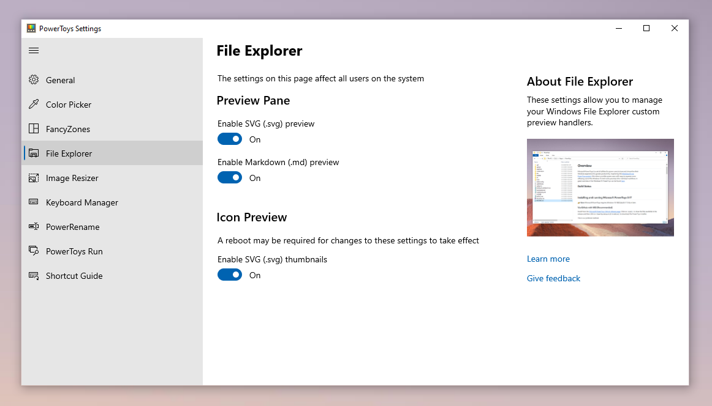

# File Explorer

## End user facing:

[Please visit our overview](https://aka.ms/PowerToysOverview_FileExplorerAddOns)

## Developing

-  Add new C++ DLL project in the preview pane folder. This DLL is actual preview handler, i.e. implements IPreviewHandler/IThumbnailProvider interface. 
-  Add new .NET EXE project in the preview pane folder. This EXE is being spawned by C++ DLL to generate preview/thumbnail.

## Installation

### MSI (Recommended)

To add a new Previewer update the `Product.wxs` file in `PowerToysSetup` similar to existing Previewer to register the Preview Handler. More details about registration of Preview Handlers can be [found here.](https://learn.microsoft.com/windows/win32/shell/how-to-register-a-preview-handler) - implemented in [modulesRegistry.h](../../common/utils/modulesRegistry.h).

### Directly registering/unregistering DLL's
**[Important] This method of registering Preview Handler DLL's is not recommended. It could lead to registry corruption.**
#### Registering Preview Handler
1. Restart Visual studio as administrator. 
2. Sign `XYZPreviewHandler` and it's dependencies. To sign an assembly in VS, follow steps given [here](https://learn.microsoft.com/dotnet/standard/assembly/sign-strong-name#create-and-sign-an-assembly-with-a-strong-name-by-using-visual-studio).
3. Build `XYZPreviewHandler` project.
4. Open developer command prompt from `Tools > Command Line > Developer Command Prompt`.
5. Run following command for each nuget and project dependency to add them to Global Assembly Cache(GAC). 
```
gacutil -i <path to dependency>
```
6. Run following commands to register preview handler.
```
cd C:\Windows\Microsoft.NET\Framework64\4.0.x.x
gacutil -i <path to XYZPreviewHandler.dll>
RegAsm.exe /codebase <path to XYZPreviewHandler.dll>
```
7. Restart Windows Explorer process.

#### Unregistering Preview Handler
1. Run following commands in elevated developer command prompt to unregister preview handler. 
```
cd C:\Windows\Microsoft.NET\Framework64\4.0.x.x
RegAsm.exe /unregister <path to XYZPreviewHandler.dll>
gacutil -u XYZPreviewHandler
```

## Debugging
Since in-process preview handlers run under a surrogate hosting process (prevhost.exe by default), to debug a preview handler, you need to attach the debugger to the host process. 
1. Click on a file with registered extension to start host process.
2. Attach debugger in Visual studio from `Debug->Attach to Process` and select `prevhost.exe` with type `Managed(version), x64`.

## Managing Preview Handlers

After successful integration, your preview handler should appear in the PowerToys settings UI under the `File Explorer Preview` Tab. In here you should be able to enable and disable all the preview handles.


