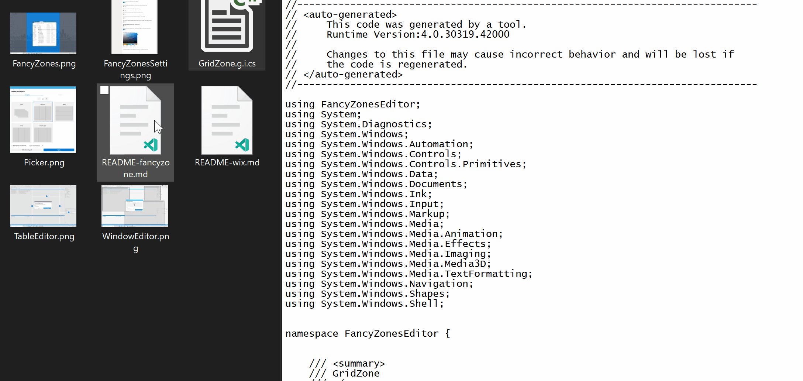

<center>


# PowerPreview
> Adding Custom Preview Handlers to Windows File Explorer Preview Pane.

[**Overview**](#overview) · 
[**Developing**](#Developing) · 
[**MSIX Integration**](#Install-With-MSIX) · 
[**Contributing »**](#Contributing)
</center>

## Overview

Preview handlers are called when an item is selected to show a lightweight, rich, read-only preview of the file's contents in the view's reading pane. This is done without launching the file's associated application. Figure 1 shows an example of a preview handler that preview a .md file type. Please follow this [documentation](https://docs.microsoft.com/en-us/archive/msdn-magazine/2007/january/windows-vista-and-office-writing-your-own-preview-handlers) to start developing a preview handler, when done, continue with this documentation to learn how to integrate a preview handler into PowerToys.

<center>

<figure>
  
  <figcaption>Figure 1 : Mark Down Preview Handler Demo</figcaption>
</figure>

</center>

## Developing

We have already done most of the development work in the [PreviewHandlerCommon](./common/cominterop/IPreviewHandler.cs) common project. To add a preview for the file type of .xyz:

-  Add a new .NET project in the preview pane folder.
-  Add a reference to the `PreviewHandlerCommon` common project.
-  Create your preview handler class and extend the FileBasedPreviewHandler class. See an example below:

```csharp
using System;
using System.Runtime.InteropServices;
using Common;

namespace XYZPreviewHandler
{
    /// <summary>
    /// Implementation of preview handler for .xyz files.
    /// GUID = CLSID / CLASS ID.
    /// </summary>
    [Guid("xxxxxxxx-xxxx-xxxx-xxxx-xxxxxxxx")]
    [ClassInterface(ClassInterfaceType.None)]
    [ComVisible(true)]
    public class XYZPreviewHandler : FileBasedPreviewHandler
    {
        private XYZPreviewHandlerControl xyzPreviewHandlerControl;

        /// Call your rendering method here.
        public override void DoPreview()
        {
            this.xyzPreviewHandlerControl.DoPreview(this.FilePath);
        }

        protected override IPreviewHandlerControl CreatePreviewHandlerControl()
        {
            this.xyzPreviewHandlerControl = new xyzPreviewHandlerControl();
            return this.xyzPreviewHandlerControl;
        }
    }
}
```

Create a separate Preview Handler Control class and extend the `FormHandlerControl` Class.

```csharp
using Common;

namespace XYZPreviewHandler
{
    public class XYZPreviewHandlerControl : FormHandlerControl
    {
        public XYZPreviewHandlerControl()
        {
            // ... do your initializations here.
        }

        public override void DoPreview<T>(T dataSource)
        {
            // ... add your preview rendering code here.
        }
    }
}
```


#### Integrate the Preview Handler into PowerToys Settings:

Navigate to the [powerpreview](../previewpane/powerpreview/powerpreview.h) project and edit the `powerpreview.h` file. Add the following Settings Object instance to `m_previewHandlers` settings objects array in the constructor initialization:

```cpp
// XYZ Preview Handler Settings Object.
FileExplorerPreviewSettings(
    false,
    L"<--YOUR_TOGGLE_CONTROL_ID-->",
    L"<--A description of your preview handler-->",
    L"xxxxxxxx-xxxx-xxxx-xxxx-xxxxxxxx", // your preview handler CLSID.
    L"<--A display name for your preview handler-->") 
```

## Install With MSIX

<---To Do--->
```xml

```

## Managing Preview Handlers

After successful integration, your preview handler should appear in the PowerToys settings UI under the `File Explorer Preview` Tab as shown in Figure 2 below. In here you should be able to enable and disable your preview handler.

<center>

<figure>
  
  <figcaption>Figure 2 : Settings UI - File Explorer Preview Tab</figcaption>
</figure>

</center>

In the general settings of the Settings UI, you should be able to disable and enable all the preview handlers all at once. See Figure 3.

<center>

<figure>
  
  <figcaption>Figure 3 : Settings UI - General Settings Tab</figcaption>
</figure>

</center>

## Contributing

### Coding Guidance

#### Working With Strings

**YOU SHOULD NOT** have hardcoded strings in your C++ code. Instead, use the following guidelines to add strings to your code. Add the ID of your string to the resource file. XXX must be a unique int in the list (mostly the int ID of the last string id plus one):

- `resource.h`:

```cpp
#define IDS_PREVPANE_XYZ_SETTINGS_DISPLAYNAME                    XXX
```

- `powerpreview.rc` under strings table:

```cpp
IDS_PREVPANE_XYZ_SETTINGS_DISPLAYNAME               L"XYZ Preview Handler"
```

- Use the `GET_RESOURCE_STRING(UINT resource_id)` method to consume strings in your code.
```cpp
#include <common.h>

extern "C" IMAGE_DOS_HEADER __ImageBase;

std::wstring GET_RESOURCE_STRING(IDS_PREVPANE_XYZ_SETTINGS_DISPLAYNAME)
```

#### More On Coding Guidance
Please review these brief docs below relating to our coding standards etc.

> 👉 If you find something missing from these docs, feel free to contribute to any of our documentation files anywhere in the repository (or make some new ones\!)


* [Coding Style](../../../doc/devdocs/style.md)
* [Code Organization](../../../doc/devdocs/readme.md)

